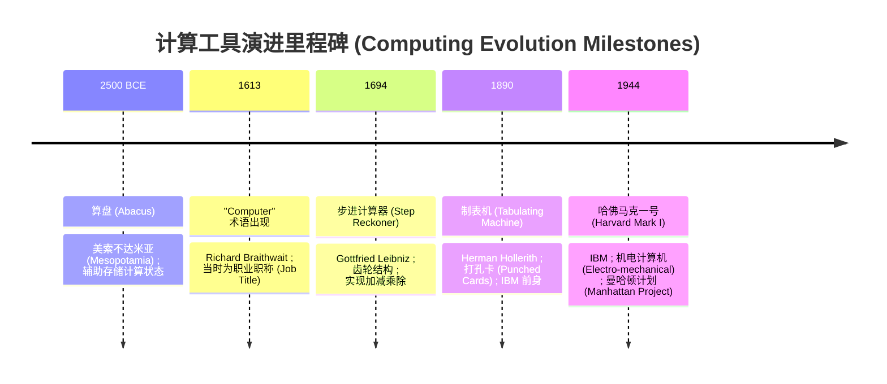
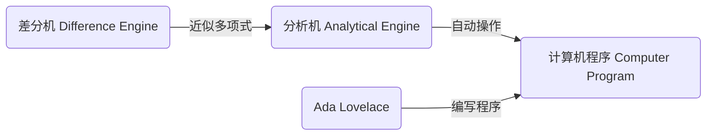
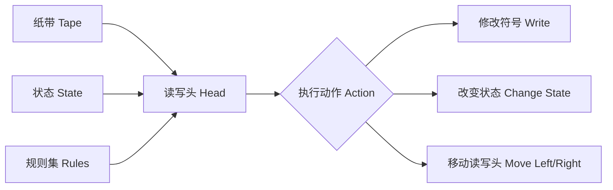
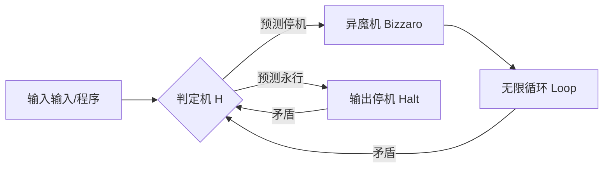
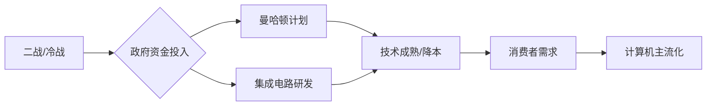
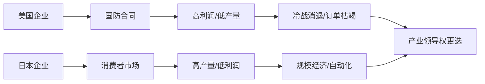
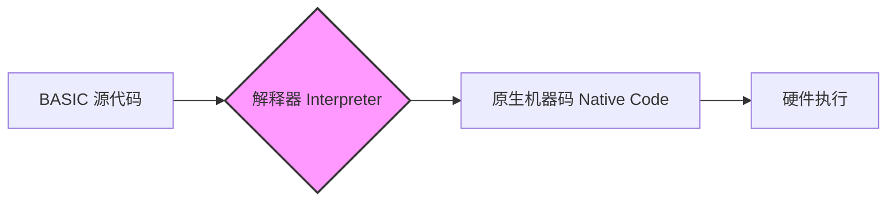
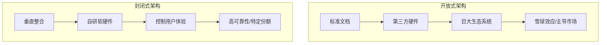

# 计算机历史

## 计算机早期历史

### 计算机科学抽象架构

计算机通过多层 **抽象 (Abstraction)** 将简单的逻辑转化为复杂操作 。

| **抽象层级 (Level of Abstraction)** |       **核心组件 (Core Components)**        | **功能描述 (Functional Description)** |
| :---------------------------------: | :-----------------------------------------: | :-----------------------------------: |
|      硬件底层 (Hardware Layer)      | 晶体管 (Transistors)、逻辑门 (Logic Gates)  |          处理基础二进制数据           |
|        系统层 (System Layer)        |        操作系统 (Operating Systems)         |        管理硬件资源与任务调度         |
|     应用层 (Application Layer)      | 虚拟现实 (Virtual Reality)、机器人 (Robots) |        执行面向用户的复杂任务         |

------

### 早期计算工具演进

在电子时代之前，计算需求主要源于社会规模的扩张，超出了人类心算的极限 。

|   **设备名称 (Device Name)**   | **起源时间 (Origin)** | **核心功能 (Core Function)** | **技术特点 (Technical Characteristics)** |
| :----------------------------: | :-------------------: | :--------------------------: | :--------------------------------------: |
|       **算盘 (Abacus)**        |   约公元前 2500 年    |          加减法运算          |             手动存储计算状态             |
|      **星盘 (Astrolabe)**      |       历史悠久        |           计算纬度           |               辅助航海制图               |
|    **计算尺 (Slide Rule)**     |        17 世纪        |          乘除法运算          |            提高计算速度与精度            |
| **步进计算器 (Step Reckoner)** |        1694 年        |           四则运算           |         基于齿轮传动的机械累加器         |

------

### 通用计算机架构

Charles Babbage 提出的概念标志着从特定用途设备向 **通用计算机 (General Purpose Computer)** 的转型 。

| **概念/设备 (Concept/Device)** | **贡献者 (Contributor)** |      **技术突破 (Technological Breakthrough)**       |
| :----------------------------: | :----------------------: | :--------------------------------------------------: |
| **差分机 (Difference Engine)** |     Charles Babbage      | 能够近似多项式 (Polynomials) 以计算对数和三角函数 。 |
| **分析机 (Analytical Engine)** |     Charles Babbage      |   具备内存 (Memory)、打印机，并能按顺序执行操作 。   |
|  **程序逻辑 (Program Logic)**  |       Ada Lovelace       |    构想了专为分析设计的语言，被视为首位程序员 。     |

------

### 计算的规模化与商业化

19 世纪末，由于人口普查等大规模数据处理需求，**电动机械 (Electro-mechanical)** 设备开始普及 。

| **关键事件 (Key Event)** | **技术实现 (Technical Implementation)** |    **社会影响 (Social Impact)**     |
| :----------------------: | :-------------------------------------: | :---------------------------------: |
| **1890 年美国人口普查**  |      Herman Hollerith 的制表机 。       |  普查周期从 13 年缩短至 2.5 年 。   |
| **打孔卡 (Punch Cards)** |         网格定位打孔代表数据 。         |  实现数据存储与自动读取的标准化 。  |
|     **IBM 公司成立**     |        制表机器公司等合并而成 。        | 标志着计算技术正式进入商业化阶段 。 |

> **计算历史注脚：** 1613 年，“计算机 (Computer)”最初是一个职业头衔，指代负责计算的人员，而非机器 。直到 19 世纪末，该词才开始转型指代计算设备 。

## 阿兰·图灵

### 计算理论起源：可判定性问题

在1935年，计算机科学的基础源于对数学逻辑极限的探索。 

| **人物 (Personnel)** |         **方法 (Methodology)**          |        **结论 (Conclusion)**         |
| :------------------: | :-------------------------------------: | :----------------------------------: |
|    David Hilbert     | 提出可判定性问题 (Entscheidungsproblem) |       寻求是否存在通用逻辑算法       |
|    Alonzo Church     |      Lambda 算子 (Lambda Calculus)      |   证明不存在通用算法；数学形式复杂   |
|     Alan Turing      |         图灵机 (Turing Machine)         | 功能等价于 Lambda 算子，但模型更简洁 |

------

### 核心机制：图灵机

图灵机是一种理论计算模型，证明了简单的物理逻辑可以实现任何形式的计算。 

| **组件 (Component)** |     **功能描述 (Functional Description)**     |
| :------------------: | :-------------------------------------------: |
|     纸带 (Tape)      |           存储符号的无限长存储媒介            |
|    读写头 (Head)     |         读取当前符号并执行写入或移动          |
|   状态变量 (State)   |  保存机器当前的内部信息（如“偶数”或“停机”）   |
|    规则集 (Rules)    | 根据“当前状态 + 符号”决定下一步动作的算法逻辑 |

------

### 计算极限：停机问题

Alan Turing 通过逻辑悖论证明了计算能力的边界，即并非所有问题都具有可计算性 (Computability)。 

| **逻辑环节 (Logical Stage)** |                  **描述 (Description)**                   |
| :--------------------------: | :-------------------------------------------------------: |
|      假设 (Hypothesis)       |    存在一台机器 H，能准确预测任何程序是否会停机 (Halt)    |
|     构造 (Construction)      |     建立“异魔机 (Bizzaro)”，其行为与 H 的预测完全相反     |
|        悖论 (Paradox)        | 当 Bizzaro 分析自身时：若预测停机则永行，若预测永行则停机 |
|      结论 (Conclusion)       |         停机问题不可解 (Unsolvable)，计算存在极限         |

??? info "数学形式"

    假如说存在一个万能程序 `H(P, I)`，它可以得出`P(I)`是会停机还是会死循环。
    
    那么，我们**用`H`构建**一个程序`C(P,I)`，`C`满足：
    
    - 如果`H(P,I)`等于“停机”，那么`C`就会死循环
    - 如果`H(P,I)`等于“死循环”，那么`C`就会停机
    
    总之，`C`总和`H`“唱反调”。
    
    那么，如果`C`的输入为它自己`C`，即执行程序`C(C,C)`，`H`的输入便是`H(C,C)`，由于`H`是一个万能程序，那么`H`便能输出正确的结果（即使程序中参数包含它自己），即正确输出：`C`会不会停机。
    
    从底层分析，如果`C`会停机，那么`H(C,C)`=="会停机"，此时`C`就会陷入死循环
    
    如果`C`不会停机，那么`H(C,C)`==“死循环”，那么`C`就会停机。
    
    逻辑上不成立，因此不存在这样的万能程序`H(P, I)`。

------

### 二战应用：密码破译

Alan Turing 在布莱切利园 (Bletchley Park) 的工作利用机电计算缩短了战争进程。 

| **设备 (Device)** |      **角色 (Role)**      |                **核心原理 (Principle)**                |
| :---------------: | :-----------------------: | :----------------------------------------------------: |
| 英格玛机 (Enigma) | 德军加密设备 (Encryption) | 通过齿轮 (Rotors) 和插板 (Plug board) 实现数十亿种组合 |
|       Bombe       |  盟军破译机 (Decryption)  |    利用“字母不会加密为自身”的缺陷，排除不可能的组合    |

------

### 机器智能：图灵测试

战后，Alan Turing 将视角转向人工智能 (Artificial Intelligence)，提出了评估机器智力的行为标准。 

- **定义 (Definition)：** 若机器能欺骗人类，使人无法分辨其与人类的区别，则视为具有智能。 
- **现代变体 (Modern Variant)：** 验证码 (CAPTCHA)，用于区分计算机与人类的自动化测试。 

------

### 历史里程碑与遗产

| **时间 (Time)** |        **事件 (Event)**        |         **影响 (Impact)**          |
| :-------------: | :----------------------------: | :--------------------------------: |
|      1936       | 提出图灵完备 (Turing Complete) |     定义了现代计算机系统的标准     |
|      1950       |   提出图灵测试 (Turing Test)   |        开创人工智能理论先河        |
|      1954       |     遭遇化学阉割后中毒去世     |     终年41岁，科学界的重大损失     |
|      至今       |     图灵奖 (Turing Award)      | 计算机领域的最高荣誉（诺贝尔奖级） |

## 冷战和消费主义

### 核心动力学：从冷战科研到商业化循环

计算技术的发展并非线性，而是由政府资金支撑技术成熟后，再由消费者市场推动主流化的过程 。

| **驱动阶段 (Stage)** | **核心目标 (Core Objective)** | **代表性成果 (Representative Results)** |
| :------------------: | :---------------------------: | :-------------------------------------: |
|    战时/冷战初期     |       增强物理/破译能力       |        曼哈顿计划, 纳粹通讯破解         |
|    1950s - 1960s     |    增强人类智力与空间探索     |       Univac 1, Memex, 阿波罗计划       |
|      1970s 以后      |      降低成本与规模经济       |     微处理器, 家用游戏机, 个人电脑      |

------

### 技术范式转移：阿波罗导航计算机 (AGC) 与集成电路

阿波罗导航计算机 (Apollo Guidance Computer) 是集成电路 (Integrated Circuits) 从实验室走向大规模生产的关键转折点 。

|   **设计要求 (Requirement)**   | **核心挑战 (Challenge)** |    **技术解决方案 (Solution)**     |
| :----------------------------: | :----------------------: | :--------------------------------: |
|        **速度 (Fast)**         |     处理复杂轨道计算     | 采用集成电路 (Integrated Circuits) |
| **轻量 (Small & Lightweight)** |  航天器载重空间极度有限  |       淘汰真空管/离散晶体管        |
|    **可靠性 (Reliability)**    | 应对震动、辐射与极端温差 |           全固态电路设计           |

------

### 全球化逻辑：美国防御合同 vs 日本消费者市场

1950-1970年代，美日两国半导体产业因战略重心不同，导致了后续市场格局的根本性差异 。

| **维度 (Dimension)** |           **美国 (United States)**           |            **日本 (Japan)**             |
| :------------------: | :------------------------------------------: | :-------------------------------------: |
|    **早期切入点**    | 军事工业综合体 (Military Industrial Complex) |     晶体管收音机 (Transistor Radio)     |
|     **代表企业**     |            Intel, Fairchild, IBM             |       Sony, Sharp, Casio, Hitachi       |
|     **核心优势**     |       尖端技术研发 (Cutting-edge R&D)        |       生产效率、质量控制与自动化        |
|  **1970s 标志产品**  |         超级计算机 (Supercomputers)          | 便携式电子计算器 (Handheld Calculators) |

------

### 个人计算机时代的黎明 (1970s)

集成电路成本的骤降与微处理器 (Microprocessors) 的诞生，使得计算设备从政府实验室进入家庭。

- **里程碑 1：** Intel 4004 (1971) —— 应日本 Busicom 公司要求开发的微处理器 。
- **里程碑 2：** Altair 8800 (1975) —— 第一批成功的家用电脑 (Home Computers) 。
- **里程碑 3：** Atari 2600 (1977) —— 标志着家用游戏机 (Home Gaming Consoles) 市场的开启 。

## 个人计算机革命

### 微型计算机 (Microcomputer) 的硬件前提

在 1970 年代初，组件成本的下降使得从大型机向单人使用的微型计算机转变成为可能。

|   **核心组件 (Core Components)**    |          **技术演进 (Evolution)**          |       **影响 (Impact)**        |
| :---------------------------------: | :----------------------------------------: | :----------------------------: |
|  **单芯片 CPU (Single-chip CPU)**   |              强大、小型且廉价              |      最具影响力的转变因素      |
| **固态存储器 (Solid-state Memory)** |       集成电路进步提供低成本 RAM/ROM       | 允许整台计算机集成在单块电路板 |
|  **计算机存储 (Computer Storage)**  | 磁带 (Magnetic Tape) 与 软盘 (Floppy Disk) |  提供便宜且可靠的非易失性存储  |
|        **显示器 (Display)**         |           由电视机 (TV) 改装而成           |    极大降低了输出设备的成本    |

------

### 软件层的突破：解释器 (Interpreter) 逻辑

为了让非专业人士能使用 Altair 8800 等机器，Bill Gates 与 Paul Allen 开发了 BASIC 解释器，这成为微软 (Microsoft) 的首个产品。

- **定义 (Definition)**：将高级指令在程序运行时（而非运行前）转换为机器码的程序 。
- **开发背景**：Bill Gates 与 Paul Allen 在没有实体机器的情况下，于几周内赶工完成 。
- **意义**：使不精通机器码的爱好者也能编写复杂程序 。

------

### 1977 年“三位一体” (1977 Trinity) 与商业化

1977 年标志着计算机从“套件 (Kit)”转变为“家电 (Appliance)”，面向普通消费者、学校和小企业 。

| **计算机型号 (Model)** | **生产商 (Manufacturer)** |            **核心特征 (Key Features)**            |
| :--------------------: | :-----------------------: | :-----------------------------------------------: |
|      **Apple II**      |           Apple           |           专业设计、彩色图形、声音输出            |
|   **TRS-80 Model I**   |    Tandy (RadioShack)     |        成本仅为 Apple II 的一半，销量极大         |
|      **PET 2001**      |         Commodore         | 一体化设计 (All-in-one)，模糊了计算机与电器的界限 |

- **杀手级应用 (Killer App)**：1979 年推出的 VisiCalc（首个电子表格程序），确立了个人计算机在办公领域的地位 。

------

### 产业格局：开放式 vs. 封闭式架构

IBM 进场后，两种截然不同的商业战略塑造了现代 PC 产业的格局 。

| **战略维度 (Strategy)** | **开放式架构 (Open Architecture)**  | **封闭式架构 (Closed Architecture)** |
| :---------------------: | :---------------------------------: | :----------------------------------: |
|      **代表产品**       |               IBM PC                |           Macintosh (1984)           |
|      **核心逻辑**       | 许可第三方制造“兼容机 (Compatible)” | 控制从硬件到软件的全栈 (Full Stack)  |
|      **操作系统**       |      Microsoft DOS (授权模式)       |    自研专属操作系统 (Proprietary)    |
|        **优势**         |    成本低、软件丰富、规模化极快     |    体验一致、易用性强（图形界面）    |

- **结局**：IBM PC 及其兼容机迅速占领商业市场，而 Apple 凭借 Macintosh 引入的图形用户界面 (GUI) 保持了竞争地位 。

  

  
