# 体系结构

## 电子计算机

### 核心组件技术架构

|   **维度**   |             **继电器 (Relay)**              |          **真空管 (Vacuum Tube)**          |        **晶体管 (Transistor)**         |
| :----------: | :-----------------------------------------: | :----------------------------------------: | :------------------------------------: |
| **物理本质** |    机电开关 (Electro-mechanical Switch)     |        热电子阀 (Thermionic Valve)         | 固体半导体 (Solid-state Semiconductor) |
| **运行原理** |            电磁铁吸引金属臂闭合             |             控制电极控制电子流             |           半导体材料受控导通           |
| **切换速度** |                  ~50 次/秒                  |                 数千次/秒                  |            每秒数百万次以上            |
| **主要缺陷** | 有质量 (Mass)；机械磨损；易受昆虫干扰 (Bug) |          易碎；易烧毁；初始成本高          |              初期制造复杂              |
| **核心优势** |            早期实现自动化的基础             | 无移动部件 (No moving parts)；速度大幅提升 |            极小；极快；长寿            |

### 开关逻辑与故障诊断

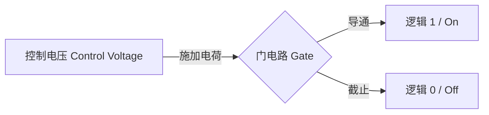

- **硬件缺陷 (Hardware Defects)：** 早期机械系统易受环境干扰，1947 年在 **Harvard Mark II** 继电器中发现的飞蛾导致了术语 **Bug (虫子)** 的诞生 。
- **固态组件 (Solid State)：** 晶体管作为固态组件，消除了真空管的易碎性与继电器的机械延迟，单体尺寸已缩小至 50 纳米以下 。

### 电子计算系统里程碑

硬件系统从特定用途向通用可编程架构演进，计算密度呈指数级增长 。

| **设备名称 (Machine Name)** | **年份 (Year)** | **核心组件 (Core Component)** |       **逻辑特性 (Logical Characteristics)**        |
| :-------------------------: | :-------------: | :---------------------------: | :-------------------------------------------------: |
|     **Harvard Mark I**      |      1944       |    3,500个 继电器 (Relay)     |     针对 曼哈顿计划 (Manhattan Project) 的模拟      |
|      **Colossus MK 1**      |      1943       | 1,600个 真空管 (Vacuum Tube)  | 首台可编程电子计算机，用于 密码破译 (Code-breaking) |
|          **ENIAC**          |      1946       |     真空管 (Vacuum Tube)      |     首台通用 (General Purpose) 可编程电子计算机     |
|         **IBM 608**         |      1957       |  3,000个 晶体管 (Transistor)  |           首台完全基于晶体管的商用计算机            |

### 产业连锁反应

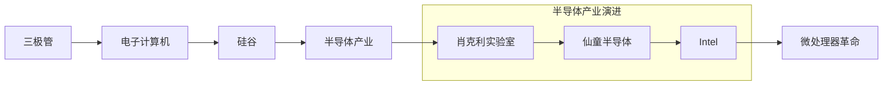

半导体技术的发展导致了加州 **圣克拉拉谷 (Santa Clara Valley)** 的产业转型 。

| **企业/机构 (Entity)** |           **关键人物 (Key Figures)**            |         **行业贡献 (Contribution)**         |
| :--------------------: | :---------------------------------------------: | :-----------------------------------------: |
|  **Bell Laboratory**   | John Bardeen, Walter Brattain, William Shockley |       1947 年发明 晶体管 (Transistor)       |
|   **Bletchley Park**   |           Tommy Flowers, Alan Turing            | 开发 **Colossus** 与 **Bombe** 破解纳粹通信 |
|   **Silicon Valley**   |               William Shockley 等               | 确立 硅 (Silicon) 作为半导体核心材料的地位  |
|       **Intel**        |          仙童半导体 (Fairchild) 前员工          |       成为全球领先的计算机芯片制造商        |

### 关键先驱

|   **人物姓名 (Name)**    | **核心贡献 (Contribution)** |        **核心观点/影响 (Critical Signal)**         |
| :----------------------: | :-------------------------: | :------------------------------------------------: |
|   **Charles Babbage**    |    计算机先驱 (Pioneer)     |          提出“新工具诞生，人工劳力即缩减”          |
|  **Gottfried Leibniz**   | 步进计算器 (Step Reckoner)  | 认为优秀的人不应浪费时间在农民也能算准的数值计算上 |
|   **Herman Hollerith**   |     制表机器公司创始人      |        提升人口普查效率10倍，后续演变为 IBM        |
|     **Grace Hopper**     |         早期程序员          |         发现死蛾子导致故障，定义了术语 Bug         |
| **John Ambrose Fleming** |    真空管 (Vacuum Tube)     |        发明二极管 (Diode)，实现电流单向流动        |
|    **Lee de Forest**     |       三极管 (Triode)       |         加入控制电极，使真空管具备开关功能         |

## 布尔逻辑与二进制

### 从物理信号到逻辑表达

从底层机电设备演进到电子计算机，核心在于通过“抽象 (Abstraction)”屏蔽底层复杂性 。

|    **维度**    | **十进制系统 (Decimal System)** |        **二进制系统 (Binary System)**         |
| :------------: | :-----------------------------: | :-------------------------------------------: |
|  **物理实现**  |          齿轮上的齿数           |          晶体管 (Transistor) 的开/关          |
|   **逻辑值**   |              0 - 9              |        真 (True) / 假 (False) 或 1 / 0        |
| **信号稳定性** | 状态多，易受电噪音或低电量干扰  | **开/关 (On/Off)** 信号间隔大，抗干扰能力最强 |
|  **数学基础**  |   常规代数 (Regular Algebra)    |        **布尔代数 (Boolean Algebra)**         |

### 基础逻辑运算矩阵

| **逻辑门 (Logic Gate)** | **输入 (Input)** |    为真(True)条件    | **晶体管物理实现 (Physical Implementation)** |
| :---------------------: | :--------------: | :------------------: | :------------------------------------------: |
|       **NOT 门**        |       1 个       |     输入为“假”时     |          将输出接在晶体管接地端之前          |
|       **AND 门**        |       2 个       | **所有**输入都为“真” |          晶体管**串联 (In Series)**          |
|        **OR 门**        |       2 个       |  **任一**输入为“真”  |         晶体管**并联 (In Parallel)**         |

### 进阶逻辑运算：异或 (XOR)

| **特性** |                         **详细说明**                         |
| :------: | :----------------------------------------------------------: |
| **定义** |  **异或 (Exclusive OR)**：仅当两个输入不相同时，输出为真 。  |
| **区别** | 若输入均为真 (True)，常规 OR 输出真，而 XOR 输出**假 (False)** 。 |

### 计算机工程的抽象

通过逻辑门，计算机从处理“电流信号”跨越到处理“逻辑语句” 。

> **结论：** 无论是专业程序员还是硬件工程师，都无需时刻关注底层电子如何流过半导体，而是通过操作逻辑门构成的抽象块来构建复杂的计算系统 。正如 Margaret Hamilton 或 Carrie Anne 所展示的，这种层层递进的抽象才是计算机科学的精髓 。

## 二进制

计算机通过二进制位 (Bits) 的排列组合表示复杂数据，其逻辑核心在于进位制转换与算术规则 。

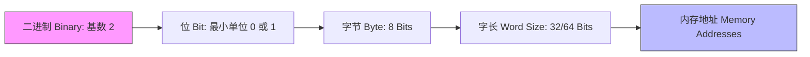

| **进制类型 (Notation)** | **乘数逻辑 (Multiplier Logic)** |              **示例 (101)**               | **十进制等值 (Decimal Value)** |
| :---------------------: | :-----------------------------: | :---------------------------------------: | :----------------------------: |
|    十进制 (Decimal)     |       $10^n$ (100, 10, 1)       | $1 \times 100 + 0 \times 10 + 1 \times 1$ |              101               |
|     二进制 (Binary)     |         $2^n$ (4, 2, 1)         |  $1 \times 4 + 0 \times 2 + 1 \times 1$   |               5                |

------

### 数据单位与规模

计算机以字节 (Byte) 为基础单位进行量级扩展，现代架构普遍采用 64 位 (64-bit) 处理块 。

| **单位 (Unit)** | **字节数 (Bytes)** | **位数 (Bits)** | **备注 (Notes)** |
| :-------------: | :----------------: | :-------------: | :--------------: |
|   字节 (Byte)   |         1          |        8        |   基础存储单位   |
|   千字节 (KB)   |   1,000 / 1,024    |  8,000 / 8,192  | $2^{10}$ = 1024  |
|   兆字节 (MB)   |       $10^6$       | $8 \times 10^6$ |     百万字节     |
|   吉字节 (GB)   |       $10^9$       | $8 \times 10^9$ |     十亿字节     |
|   太字节 (TB)   |     $10^{12}$      |     8 万亿      | 现代硬盘常用容量 |

------

### 复杂数值表示

针对非正整数，计算机通过特定协议划分二进制位的用途 。

|  **数值类型 (Number Type)**  | **表示方法 (Representation Method)** |             **结构分配 (Structure)**              |
| :--------------------------: | :----------------------------------: | :-----------------------------------------------: |
| 有符号整数 (Signed Integers) |      第一位为符号位 (Sign Bit)       |                 1: 负数, 0: 正数                  |
|   浮点数 (Floating Point)    |            IEEE 754 标准             | 符号位 + 指数 (Exponent) + 有效位数 (Significand) |

- **32 位整数范围**: 约 $\pm$ 21 亿 。
- **64 位整数范围**: 约 $9.2 \times 10^{18}$ 。
- **浮点数原理**: 类似科学计数法 (Scientific Notation)，如 $625.9 = 0.6259 \times 10^3$ 。

------

### 文本与多媒体编码

文本通过数字映射实现编码，经历了从单一语言到全球通用的演变 。

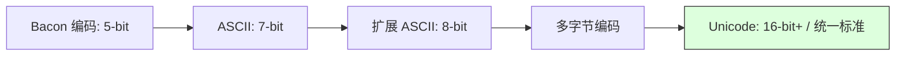

| **编码标准 (Standard)** | **位数 (Bits)** | **容量 (Capacity)** | **局限性/特点 (Characteristics)** |
| :---------------------: | :-------------: | :-----------------: | :-------------------------------: |
|   Francis Bacon 编码    |        5        |         32          |         仅 26 个英文字母          |
|      ASCII (1963)       |        7        |         128         |       仅支持英文及基础符号        |
|       扩展 ASCII        |        8        |         256         |   不同国家编码不兼容 (Mojibake)   |
|     Unicode (1992)      |       16+       |     > 1,000,000     |  支持所有语言、数学符号及 Emoji   |

- **互操作性 (Interoperability)**: 不同厂商设备交换数据的能力 。
- **多媒体映射**: 二进制序列同样用于编码音轨 (MP3) 或图像像素颜色 (GIF) 。

## 算数逻辑单元

### 核心定义

算术逻辑单元 (Arithmetic Logic Unit) 是计算机的数学大脑 (Mathematical Brain) 。它是负责执行所有计算操作的核心组件 (Component) 。

|        **属性**         |                 **说明**                  |
| :---------------------: | :---------------------------------------: |
| **主要功能 (Function)** | 处理算术 (Arithmetic) 与逻辑 (Logic) 运算 |
|   **基础构成 (Base)**   |     布尔逻辑门 (Boolean Logic Gates)      |
|  **抽象符号 (Symbol)**  |               “V” 字型符号                |

------

### 算术单元

算术单元 (Arithmetic Unit) 负责数值操作，其核心是加法逻辑 。

|    **组件 (Component)**     | **输入 (Inputs)** |    **输出 (Outputs)**    |  **逻辑构成 (Logic)**  |
| :-------------------------: | :---------------: | :----------------------: | :--------------------: |
|   **半加器 (Half Adder)**   |  2个比特 (Bits)   | 总和 (Sum), 进位 (Carry) | XOR (总和), AND (进位) |
|   **全加器 (Full Adder)**   | 3个比特 (含进位)  | 总和 (Sum), 进位 (Carry) |   2个半加器 + OR 门    |
| **8位加法器 (8-bit Adder)** |    2个8位数字     |   8位总和 + 进位/溢出    |  级联 (Chain) 全加器   |

- **溢出 (Overflow)：** 计算结果超出位数限制 。
- **优化：** 现代计算机使用超前进位加法器 (Carry-Look-Ahead Adder) 以提升处理速度 。
- **乘除法：** 简单算术逻辑单元 (ALU) 通过多次加减法实现；高级处理器具备专用电路 。

------

### 逻辑单元与状态标志

逻辑单元 (Logic Unit) 执行布尔操作及数值测试。

|       **标志 (Flag)**        |     **逻辑触发 (Logic)**     | **应用场景 (Usage)** |
| :--------------------------: | :--------------------------: | :------------------: |
|    **零标志 (Zero Flag)**    |    输出全为 0 时置为 True    |   判断两数是否相等   |
|  **负标志 (Negative Flag)**  |   计算结果为负时置为 True    |     比较数值大小     |
| **溢出标志 (Overflow Flag)** | 加法器最后一位产生进位时触发 |     检测计算错误     |

------

### 历史里程碑：Intel 74181

Intel 74181 是计算机硬件史上的重要突破 。

- **发布年份：** 1970年 。
- **技术地位：** 首个集成在单芯片内的完整算术逻辑单元 (ALU) 。
- **规格：** 4位输入，包含约 70 个逻辑门 。
- **意义：** 推动了计算机小型化与低成本化 。

## 寄存器&内存

### 存储逻辑演进

存储电路通过将输出回连至输入，形成回向电路 (Loop Back Circuit) 以保留状态 。

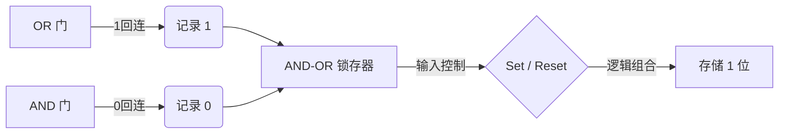

|     **组件 (Component)**     |      **核心输入 (Key Inputs)**       | **功能描述 (Functional Description)** |
| :--------------------------: | :----------------------------------: | :-----------------------------------: |
|  **AND-OR 锁存器 (Latch)**   |       设置 (Set), 复位 (Reset)       |        锁定并保持 1 位状态 。         |
| **门控锁存器 (Gated Latch)** | 数据 (Data), 允许写入 (Write Enable) |     通过“门”控制数据存入或锁定 。     |
|    **寄存器 (Register)**     |           组并行允许写入线           |    多个锁存器并排，存储多位数字 。    |

------

### 矩阵寻址与多路复用

为减少物理接线数量，大规模存储采用网格矩阵布局 。

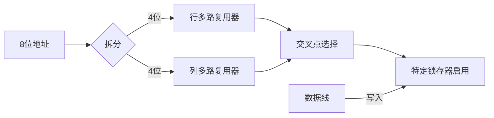

| **技术细节 (Technical Detail)** | **规格/功能 (Spec / Function)** |     **逻辑优势 (Advantage)**      |
| :-----------------------------: | :-----------------------------: | :-------------------------------: |
|     **16x16 矩阵 (Matrix)**     |         256 位存储容量          |    将 513 根线简化为 35 根 。     |
|  **多路复用器 (Multiplexer)**   |          1 到 16 转换           | 将二进制地址转换为特定行列选择 。 |
|   **写入启用 (Write Enable)**   |   行线 + 列线 + 允许线均为 1    |   精确选中单个目标锁存器写入 。   |

------

### 抽象层级扩展

计算机内存通过层级化嵌套 (Nested Hierarchy) 实现从位到千兆字节的扩展 。

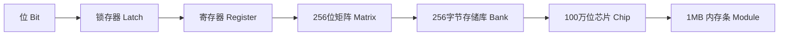

- **字节 (Byte):** 8 位数字单元 。
- **寻址能力 (Addressing Capacity):** 8 位地址对应 256 字节；32 位地址可支持 10 亿字节 (GB) 级寻址 。
- **随机存取存储器 (RAM):** 可随时以随机顺序访问任意内存位置 。

------

### 技术分类与实现

|         **类型 (Type)**          | **存储原理 (Storage Mechanism)** | **特性 (Characteristics)** |
| :------------------------------: | :------------------------------: | :------------------------: |
|  **静态随机存取存储器 (SRAM)**   |         锁存器 (Latches)         |  易失性，通电保持数据 。   |
|  **动态随机存取存储器 (DRAM)**   | 电容器等电路 (Capacitors, etc.)  |    常见内存实现方式 。     |
| **持久存储 (Persistent Memory)** |  闪存、NVRAM 等 (Flash, NVRAM)   |    断电后数据不丢失 。     |

## 内存&存储介质

### 内存与存储器 (Memory & Storage) 核心定义

计算机系统通过两种主要形式保留数据：内存（Memory）与存储器（Storage）。两者的核心区别在于数据的持久性与访问逻辑。

| **类别 (Category)**  | **特性 (Characteristic)** | **电源依赖 (Power Dependency)** | **典型硬件 (Typical Hardware)** |
| :------------------: | :-----------------------: | :-----------------------------: | :-----------------------------: |
|  **内存 (Memory)**   |     易失性 (Volatile)     |          断电数据丢失           |      随机存取存储器 (RAM)       |
| **存储器 (Storage)** |  非易失性 (Non-volatile)  |          断电数据保留           |   硬盘 (HDD)、固态硬盘 (SSD)    |

------

### 存储介质演进逻辑链

存储技术的发展遵循从“顺序访问”向“随机访问”进化，同时不断优化存储密度与访问延迟。

------

### 早期机械与声学存储方案

在集成电路普及前，计算机依赖物理介质（纸张、液体脉冲、磁性颗粒）记录数据。

|     **介质名称 (Media)**      | **关键技术 (Key Technology)** | **读写特性 (R/W Feature)** | **局限性 (Limitation)** |
| :---------------------------: | :---------------------------: | :------------------------: | :---------------------: |
|  **打孔纸卡 (Punch Cards)**   |         80列x12行网格         |       只读/单次写入        |   速度极慢，不可修改    |
| **延迟线存储器 (Delay Line)** |        水银管/声波脉冲        |       顺序/循环访问        |   只能即时读取特定位    |
|   **磁带 (Magnetic Tape)**    |      磁化极性 (Polarity)      |   顺序访问 (Sequential)    |   需前进/倒带，速度慢   |
|   **磁鼓 (Magnetic Drum)**    |         旋转金属圆筒          |        连续旋转读取        |  物理磨损，70年代停产   |

------

### 磁芯存储器 (Magnetic Core Memory)

1950年代中期出现，是首个成熟的**随机存取存储器 (Random Access Memory)** 技术 。

- **物理构造：** 由小型磁性环（磁芯 Core）组成的网格，通过电线编织而成 。
- **读写原理：**
  1. **磁化：** 电流通过电线，将磁芯极性设定为特定方向代表 1 或 0。
  2. **持久性：** 电流关闭后，磁芯保持磁化状态（非易失性，但在当时主要用作内存）。
- **随机访问特性：** 允许在任何时间访问任意位 (Bit)，无需等待循环或倒带。
- **成本演变：** 从1950年代的 1美元/bit 下降至1970年代的 1美分/bit。

------

### 现代大容量存储：HDD 与 SSD

存储器技术通过几何结构优化（磁盘堆叠）和固态化（集成电路）实现了容量的指数级增长。

| **技术 (Technology)** | **物理机制 (Mechanism)** | **寻道时间 (Seek Time)** |       **成本 (Cost)**       |
| :-------------------: | :----------------------: | :----------------------: | :-------------------------: |
|    **硬盘 (HDD)**     |   旋转磁盘 + 移动磁头    |        ~1/100 秒         | 极低 (0.0000000005美分/bit) |
|  **固态硬盘 (SSD)**   |      集成电路 (IC)       |       < 1/1000 秒        |   较高（但正逐渐取代HDD）   |

------

### 内存层次结构 (Memory Hierarchy)

由于无法同时兼顾“高速度”、“低成本”与“大容量”，现代计算机采用混合架构以取得平衡。

- **逻辑：** 使用少量昂贵的高速内存处理实时数据，辅以大量廉价的低速存储器保存长期数据。
- **经济效益：** 这种分层结构使系统在保持性能的同时，将存储成本降至最低。

## CPU

### CPU 微体系架构

中央处理单元 (Central Processing Unit) 负责执行由指令 (Instructions) 组成的程序 。其内部由多个功能单元相互连接构成 。

|  **组件名称**  |  **英文名称 (Technical Term)**  |                    **功能描述**                    |
| :------------: | :-----------------------------: | :------------------------------------------------: |
|  算术逻辑单元  | Arithmetic and Logic Unit (ALU) |         执行二进制数值的算术与逻辑运算 。          |
|     寄存器     |      Register (A, B, C, D)      | 临时存储与操作 8 位 (8-bit) 数据值的线性内存块 。  |
| 指令地址寄存器 |  Instruction Address Register   |           追踪当前指令在内存中的地址 。            |
|   指令寄存器   |      Instruction Register       |           存储当前正在处理的指令内容 。            |
|    控制单元    |        Control Unit (CU)        |      解码指令并协调 CPU 各组件执行相应操作 。      |
| 随机存取存储器 |   Random Access Memory (RAM)    | 位于 CPU 外部，存储程序数据与指令的大容量存储器 。 |

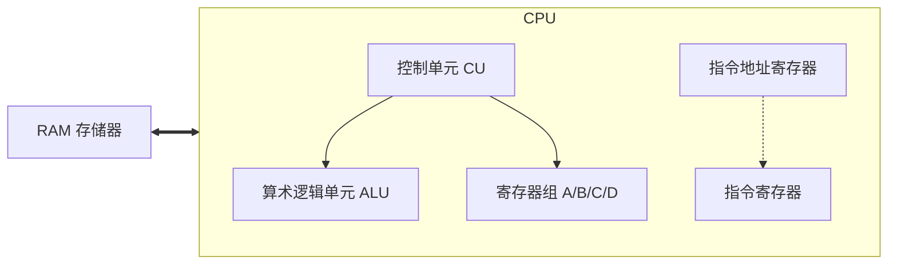

------

### 指令集架构

在本假设模型中，指令由 8 位二进制组成，分为操作码 (Opcode) 与操作数 (Operand) 两部分 。

| **指令类型** | **操作码 (Opcode)** | **后 4 位定义** |                  **功能说明**                   |
| :----------: | :-----------------: | :-------------: | :---------------------------------------------: |
|    LOAD_A    |        0010         |    RAM 地址     |      将 RAM 指定地址的值加载到寄存器 A 。       |
|    LOAD_B    |        0001         |    RAM 地址     |      将 RAM 指定地址的值加载到寄存器 B 。       |
|     ADD      |        1000         |    寄存器 ID    | 将两个指定寄存器的值相加，结果存入目标寄存器 。 |
|   STORE_A    |        0100         |    RAM 地址     |      将寄存器 A 的值写入 RAM 的指定地址 。      |

------

### 指令周期: 取指-解码-执行

CPU 通过重复执行“取指-解码-执行”循环来运行程序 。

1. **取指阶段 (Fetch Phase)**:
      - 指令地址寄存器将其存储的地址（如 0）发送至 RAM 。
      - RAM 返回该地址的数据并复制到指令寄存器中 。
2. **解码阶段 (Decode Phase)**:
      - 控制单元 (CU) 提取指令前 4 位操作码 。
      - 通过逻辑门 (Logic Gates) 电路识别具体指令（如识别 0010 为 LOAD_A） 。
3. **执行阶段 (Execute Phase)**:
      - 控制单元配置相关线路，如打开 RAM 的读取使能并启用目标寄存器的写入使能 。
      - 对于 ADD 指令，控制单元将两个寄存器的值输入 ALU，并在临时寄存器中保存结果后转存至目标寄存器。
      - 最后，指令地址寄存器递增 1，准备下一循环 。

------

### 时钟信号与频率管理

时钟 (Clock) 组件通过精确间隔的电信号驱动 CPU 内部操作 。

|        **概念**        |                    **定义与说明**                     |
| :--------------------: | :---------------------------------------------------: |
| 时钟速度 (Clock Speed) |   CPU 完成一个指令周期的速率，单位为赫兹 (Hertz) 。   |
|  超频 (Overclocking)   | 人为加快时钟速度以提升性能，可能导致过热或错误信号 。 |
|   动态频率调整 (DFS)   |  根据需求自动增减时钟速度以平衡性能与功耗 (Power) 。  |

历史与演进数据:

- **Intel 4004 (1971)**: 4 位微架构，时钟速度 740 kHz (74 万次/秒)。

- **现代处理器**: 常见主频为数 GHz (十亿次/秒)。

- **Carrie Anne (演示人员)**: 指令执行速度约为 0.03 Hz 。

## 指令和程序

### 指令架构与可编程性

中央处理单元 (CPU) 的核心能力在于其**可编程性 (Programmable)**，即通过不同的指令序列执行不同任务 。指令与数据在底层均以**二进制 (Binary)** 形式存储于同一内存中 。

|           **组成部分**            | **长度 (示例)** |                **功能描述**                 |
| :-------------------------------: | :-------------: | :-----------------------------------------: |
|        **操作码 (Opcode)**        |   4 位 (Bits)   | 指定要执行的具体操作类型（如加载、相加） 。 |
| **操作数/地址 (Operand/Address)** |   4 位 (Bits)   |         指定内存地址或寄存器编号 。         |

------

### 指令集与控制流

指令集定义了硬件可执行的原子操作 。通过**跳转指令 (JUMP)**，程序可以改变执行顺序，实现循环和条件逻辑 。

| **指令 (Instruction)** |  **类型**  |                  **逻辑说明**                  |
| :--------------------: | :--------: | :--------------------------------------------: |
|  **LOAD_A / LOAD_B**   |  数据传输  |           将内存值存入指定寄存器 。            |
|     **ADD / SUB**      |  算术运算  |       由 ALU 执行计算，结果存回寄存器 。       |
|        **JUMP**        | 无条件跳转 |       覆盖指令地址寄存器，改变执行流 。        |
|   **JUMP_NEGATIVE**    |  条件跳转  | 仅当**负数标志 (Negative Flag)** 为真时跳转 。 |
|        **HALT**        |  停机指令  |    区分指令序列与原始数据，防止系统崩溃 。     |

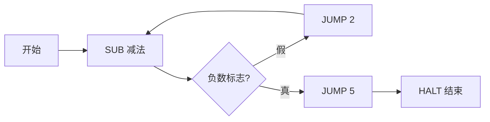

------

### 软件抽象与硬件演进

软件允许在硬件功能受限（如缺乏除法器）的情况下，通过底层指令组合实现更高级的功能 。这构成了计算机科学中的重要**抽象 (Abstraction)** 层级 。

|     **阶段/型号**     |  **特征**  |                       **技术细节**                       |
| :-------------------: | :--------: | :------------------------------------------------------: |
|    **假设性 CPU**     |  固定长度  |            8 位指令，仅支持 16 个地址/指令 。            |
| **Intel 4004 (1971)** | 单芯片 CPU | 支持 46 个指令，引入 8 位**立即值 (Immediate Value)** 。 |
|   **现代 CPU (i7)**   |  变长指令  |        支持数千种指令变体，长度范围 1-15 字节 。         |

------

### 现代寻址策略

为克服有限位数带来的寻址限制（如无法访问超过 16 个地址），现代架构采用以下策略 ：

- **指令长度 (Instruction Length)**：直接增加位数（如 32 位或 64 位）以扩大寻址范围 。

- **可变指令长度 (Variable Length Instructions)**：指令可占用多个字节，后续字节作为存储地址的**立即值 (Immediate Value)** 。

## 高级CPU设计

### 指令集与硬件演进

早期计算机性能提升主要依赖于减少芯片内晶体管 (Transistor) 的切换时间 。随着技术发展，处理器通过增加硬件复杂性来换取运算速度 (Complexity-for-speed tradeoff) 。

|   **维度**   | **早期处理器 (如 Intel 4004)** |     **现代处理器 (Modern Processors)**     |
| :----------: | :----------------------------: | :----------------------------------------: |
| **指令数量** |           46 条指令            |                 数千条指令                 |
| **时钟频率** |  千赫兹 (kHz) 至兆赫兹 (MHz)   |                吉赫兹 (GHz)                |
| **硬件功能** | 基础逻辑门与算术逻辑单元 (ALU) | 专用除法电路、图形处理、视频解码、加密电路 |
|  **兼容性**  |           无特定要求           |     向后兼容 (Backwards compatibility)     |

------

### 存储层次结构与缓存机制

由于总线 (Bus) 传输延迟和内存 (RAM) 寻址时间的限制，RAM 成为系统瓶颈 。处理器通过集成缓存 (Cache) 来减少空等时钟周期 。

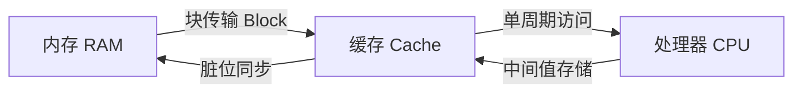

|  **术语 (Technical Term)**  |                     **定义与功能**                      |
| :-------------------------: | :-----------------------------------------------------: |
|  **缓存命中 (Cache Hit)**   |      所需数据已存在于缓存中，可立即提供给处理器 。      |
| **缓存未命中 (Cache Miss)** |        数据不在缓存中，必须从内存 (RAM) 读取 。         |
|   **缓存块 (Data Block)**   | 内存向缓存传输的连续数据单元，利用空间局部性提高效率 。 |
|    **脏位 (Dirty Bit)**     | 标记缓存数据与内存不一致的状态，用于触发数据回写同步 。 |

------

### 指令流水线与并行处理

指令流水线 (Instruction Pipelining) 通过重叠执行不同阶段的任务，将吞吐量 (Throughput) 提升至每个时钟周期执行一条指令 。

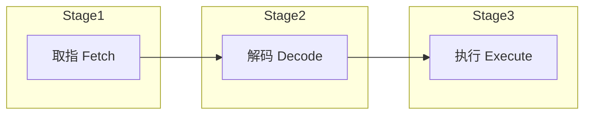

```mermaid
gantt
    title 流水线CPU指令执行时空图（指令视图）
    dateFormat  HH
    axisFormat T{clock}
    
    section 指令1 (I1)
    IF1 : IF, 00, 1h
    ID1 : ID, 01, 1h
    EX1 : EX, 02, 1h

    section 指令2 (I2)
    IF2 : IF, 01, 1h
    ID2 : ID, 02, 1h
    EX2 : EX, 03, 1h

    section 指令3 (I3)
    IF3 : IF, 02, 1h
    ID3 : ID, 03, 1h
    EX3 : EX, 04, 1h
```

|      **优化技术 (Optimization)**      |           **处理的问题 (Problem)**            |               **解决方案逻辑 (Solution)**                |
| :-----------------------------------: | :-------------------------------------------: | :------------------------------------------------------: |
| **乱序执行 (Out-of-order Execution)** |         数据依赖性 (Data dependency)          |          动态重新排序指令，最小化流水线停顿 。           |
| **推测执行 (Speculative Execution)**  | 条件跳转 (Conditional Jumps) 引起的路径不确定 |             预估分支路径并提前填充流水线 。              |
|   **分支预测 (Branch Prediction)**    |  路径猜测错误导致流水线清空 (Pipeline flush)  |    使用高级算法提高猜测准确率（现代可达 90% 以上） 。    |
|       **超标量 (Superscalar)**        |           处理单元空闲 (Idle units)           | 一个周期内完成多条指令，增加冗余 ALU 实现并行数学运算 。 |

------

### 规模化并行与超级计算

当单核性能达到上限时，通过增加核心数或独立处理器实现计算能力的指数级增长 。

|            **架构层级**            |                 **说明**                  |          **典型应用**           |
| :--------------------------------: | :---------------------------------------: | :-----------------------------: |
|    **多核处理器 (Multi-core)**     | 单芯片内集成多个独立处理单元，共享缓存 。 |     笔记本电脑、智能手机 。     |
| **多处理器系统 (Multi-processor)** |       包含多个独立 CPU 的计算机 。        | 服务器 (如 YouTube 数据中心) 。 |
|   **超级计算机 (Supercomputer)**   |            大规模处理器集群 。            |         宇宙形成模拟 。         |

## 集成电路&摩尔定律

### 硬件演化与代际更迭

早期计算受限于“数字暴政 (Tyranny of Numbers)”，即随着组件增加，手工焊接的连接点和电线复杂度呈指数级增长 。

| **计算代际 (Generation)** |   **核心组件 (Core Component)**   | **特征 (Characteristics)** | **局限性 (Limitations)** |
| :-----------------------: | :-------------------------------: | :------------------------: | :----------------------: |
|     第一代 (1st Gen)      |       真空管 (Vacuum Tubes)       |      体积庞大、高功耗      |   可靠性极低、手工焊接   |
|     第二代 (2nd Gen)      | 分立晶体管 (Discrete Transistors) |     速度提升、成本降低     |     仍受数字暴政困扰     |
|     第三代 (3rd Gen)      |  集成电路 (Integrated Circuits)   |     组件封装于单一芯片     |  早期密度受限 (5管/片)   |
|     第四代 (4th Gen)      |        超大规模集成 (VLSI)        |  自动化设计、数十亿晶体管  |      物理与光学极限      |

------

### 核心制造工艺：光刻

光刻 (Photolithography) 是实现高集成度的核心技术，通过光敏化学反应将复杂电路图案转移至半导体材料上 。

|         **步骤 (Step)**          |     **操作内容 (Action)**     |  **功能说明 (Function)**   |
| :------------------------------: | :---------------------------: | :------------------------: |
|      晶圆准备 (Wafer Prep)       |     硅片 (Silicon Wafer)      |       作为半导体基底       |
| 氧化与涂胶 (Oxidation & Coating) | 氧化层 + 光刻胶 (Photoresist) |     形成保护层与光敏层     |
|         曝光 (Exposure)          |   光掩膜 (Photomask) + 强光   |    转移电路图案至光刻胶    |
|          蚀刻 (Etching)          |      酸性化学物质 (Acid)      | 移除暴露的氧化层，显露硅层 |
|          掺杂 (Doping)           |  高温气体 (如磷 Phosphorus)   |    改变硅的导电电学性质    |
|      金属化 (Metalization)       |      沉积铝或铜 (Al/Cu)       |      形成内部连接导线      |

------

### 规模化趋势与物理极限

1965 年，Gordon Moore 观察到晶体管密度约每两年翻倍的趋势，即摩尔定律 (Moore's Law) 。

|   **维度 (Dimension)**   | **历史进展 (Historical Progress)** | **现代性能 (iPhone 7/A10 示例)** |
| :----------------------: | :--------------------------------: | :------------------------------: |
|    晶体管数量 (Count)    |          1971年 (2300个)           |      33 亿个 (3.3 Billion)       |
|  制造工艺 (Resolution)   |      10,000 纳米 (Nanometers)      |          14 纳米 (14nm)          |
| 核心开发者 (Key Figures) |     Jack Kilby & Robert Noyce      |        Intel & VLSI 软件         |

#### miniaturization 瓶颈 (Bottlenecks):

- **光学极限 (Optical Limits):** 受限于光波长，无法投影更细微的特征 。
- **量子隧穿 (Quantum Tunneling):** 当电极间距仅剩数个原子时，电子会跳过间隙导致漏电 。
