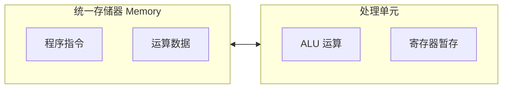
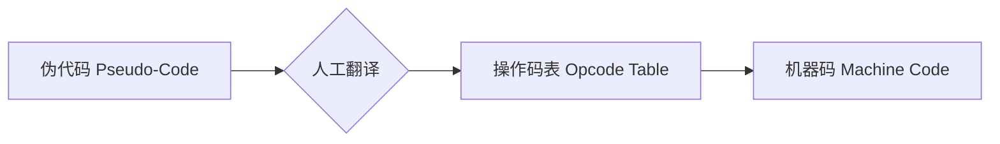
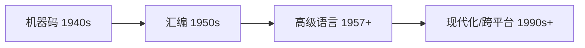
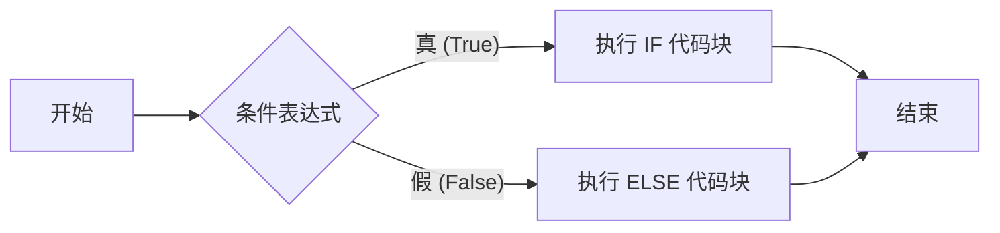
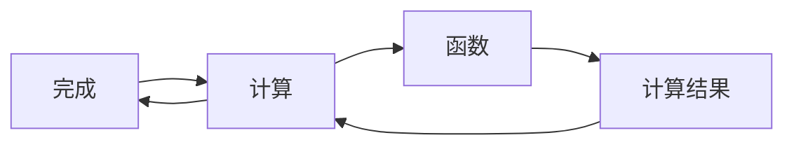

# 程序设计

## 早期编程方式

### 硬件逻辑

早期计算设备的编程本质上是物理结构的重构。程序并未以抽象代码形式存在，而是通过硬件的机械或电气连接来实现 。

|     **设备名称 (Device Name)**      | **编程机制 (Programming Mechanism)** |                **核心特征 (Core Features)**                 |
| :---------------------------------: | :----------------------------------: | :---------------------------------------------------------: |
|    雅卡尔织布机 (Jacquard Loom)     |    穿孔卡片链 (Punch Card Chain)     |      控制经线升降，形成指令序列 (Instruction Sequence)      |
| 人口普查汇总机 (Tabulating Machine) |      固定电路 (Fixed Circuitry)      |   非编程化 (Non-programmable)；仅执行汇总 (Tabulate) 任务   |
|         插线板 (Plugboards)         | 物理电缆连接 (Manual Cable Patching) | 通过插槽与电缆传递数据信号 ；需重新接线 (Rewire) 以更换程序 |

### 冯诺依曼架构

随着电子存储器 (Electronic Memory) 成本下降，计算机科学实现了从“物理接线编程”向“内存存储编程”的范式转移 。

|  **架构组件 (Component)**  |   **功能描述 (Functional Description)**    |
| :------------------------: | :----------------------------------------: |
|     算术逻辑单元 (ALU)     |           执行数学运算与逻辑判断           |
|     寄存器 (Registers)     | 包含数据寄存器、指令寄存器与指令地址寄存器 |
| 统一存储器 (Single Memory) | 同时存储指令 (Instructions) 与数据 (Data)  |

**逻辑链条：从物理到抽象的演进**

1. **灵活性提升：** 存储程序计算机 (Stored-program Computers) 允许通过软件指令快速修改逻辑，无需变动硬件物理结构 。
2. **Manchester Baby：** 1948 年构建的首台冯诺依曼架构计算机，确立了现代计算机的基本形态 。
3. **架构统一：** 冯诺依曼架构 (Von Neumann Architecture) 标志着程序与数据在共享内存中的统一 。

------

### 早期编程界面

在高级编程语言出现前，操作员必须直接处理底层硬件参数，如操作码 (Op-codes) 和寄存器宽度 。

|  **输入方式 (Input Method)**  |   **媒介/工具 (Medium/Tool)**   |             **操作逻辑 (Operational Logic)**              |
| :---------------------------: | :-----------------------------: | :-------------------------------------------------------: |
|    穿孔纸卡 (Punch Cards)     |     纸卡堆栈 (Card Stacks)      |     顺序读取并加载至内存；具备数据输入与输出双向功能      |
| 穿孔纸带 (Punched Paper Tape) |   连续纸带 (Continuous Tape)    |                  穿孔纸卡的连续形式变体                   |
| 面板编程 (Panel Programming)  | 开关与按钮 (Switches & Buttons) | 手动切换开关输入二进制操作码 (Binary Op-codes) 并存入内存 |

**商业化里程碑：Altair 8800 (1975)**

- **定位：** 首款取得商业成功的家用计算机 (Home Computer) 。
- **低成本方案：** 舍弃昂贵的读卡器，采用面板开关 (Switches) 进行手动二进制输入 。
- **用户群体：** 必须具备处理器底层知识的专家或技术控 (Technology Enthusiasts) 。

## 编程语言发展史

### 计算机底层指令

计算机硬件仅能处理二进制 (Binary) 形式的原始指令，这是处理器的母语 。在早期阶段，程序员必须手动完成从逻辑描述到二进制代码的转换 。

| **指令类型 (Instruction Type)** | **媒介 (Medium)** | **复杂度 (Complexity)** | **转换方式 (Translation)** |
| :-----------------------------: | :---------------: | :---------------------: | :------------------------: |
|      伪代码 (Pseudo-Code)       |   英语/自然语言   |   高 (Human-readable)   |          人工翻译          |
|      机器码 (Machine Code)      |   二进制 (0/1)    |  低 (Hardware-native)   |          直接执行          |

------

### 汇编语言

为了简化编程，程序员开发了汇编语言，使用助记符 (Mnemonics) 代替二进制操作码 。通过汇编器 (Assembler) 这一辅助程序，实现了从文本指令到机器码的自动转换 。

| **核心功能 (Core Feature)** |      **说明 (Description)**       | **优势 (Benefit)** |
| :-------------------------: | :-------------------------------: | :----------------: |
|     助记符 (Mnemonics)      | 为操作码分配简单名称（如 LOAD_A） |   易于理解与记忆   |
|        标签 (Labels)        | 自动计算跳转地址 (JUMP addresses) | 简化代码更新与维护 |

------

### 高级语言与编译器

Grace Hopper 博士通过设计 A-0 语言及首个编译器 (Compiler)，实现了编程层级的重大跨越 。高级语言通过变量 (Variables) 抽象了寄存器和内存地址，由编译器处理底层细节 。

- **编译器 (Compiler)：** 将高级语言编写的源代码 (Source code) 转换为低级语言（汇编或机器码）的专门程序 。
- **抽象 (Abstraction)：** 一行高级语言代码可产生数十条 CPU 执行指令 。

| **维度 (Dimension)** |   **汇编语言 (Assembly)**   | **高级语言 (High-Level Language)** |
| :------------------: | :-------------------------: | :--------------------------------: |
|       映射关系       | 一对一 (One-to-one mapping) |        一对多 (One-to-many)        |
|       硬件依赖       |      紧密绑定特定 CPU       |          屏蔽底层硬件细节          |
|       资源管理       |     手动分配寄存器/内存     |            自动管理变量            |

------

### 商业化普及与跨平台特性

随着 FORTRAN 和 COBOL 的出现，编程从专家领域转向通用工具，显著降低了使用门槛 。

| **语言 (Language)** | **发布年份** |      **开发者/组织**      |             **核心影响 (Core Impact)**              |
| :-----------------: | :----------: | :-----------------------: | :-------------------------------------------------: |
|       FORTRAN       |     1957     |     John Backus (IBM)     |           缩短代码量 20 倍，提升开发效率            |
|        COBOL        |     1959     | CODASYL (含 Grace Hopper) | 实现“一次编写，到处运行” (Write once, run anywhere) |

------

### 编程语言演进年表

编程语言的发展与硬件进步同步，经历了从特定任务到通用目的的演化 。

| **年代 (Decade)** | **代表性语言 (Representative Languages)** |
| :---------------: | :---------------------------------------: |
|       1960s       |            ALGOL, LISP, BASIC             |
|       1970s       |           Pascal, C, Smalltalk            |
|       1980s       |          C++, Objective-C, Perl           |
|       1990s       |            Python, Ruby, Java             |
|      2000s+       |               Swift, C#, Go               |

## 编程原理——语句和函数

### 编程语言基础：语法与变量

编程语言通过抽象底层硬件细节，使开发者能够专注于计算问题的解决 。其核心构建块模仿了口语的结构。

|   **概念 (Concept)**    | **定义与功能 (Definition & Function)** |       **示例 (Example)**        |
| :---------------------: | :------------------------------------: | :-----------------------------: |
|    语句 (Statement)     |       表达单个完整思想的指令单元       |             `a = 5`             |
|      语法 (Syntax)      |     规定语句结构与组合的一系列规则     | 赋值语句 (Assignment Statement) |
|     变量 (Variable)     |     用于存储数据的唯一命名的占位符     |        `apples`, `score`        |
| 初始化 (Initialization) |            设置变量的初始值            |           `level = 1`           |

------

### 控制流：决策与循环

控制流语句 (Control Flow Statements) 改变了程序从上到下的线性执行顺序，实现了逻辑分支与重复执行 。

#### 1. 条件分支

条件语句 (Conditional Statements) 根据表达式的真假 (True/False) 选择执行路径 。

- **IF 语句**: 仅在条件为真时执行特定代码 。
- **ELSE 语句**: 作为“捕获所有”的备选方案，在条件为假时执行 。

#### 2. 迭代循环

循环允许代码根据特定条件重复执行 。

| **循环类型 (Loop Type)** | **控制机制 (Control Mechanism)** |   **核心特性 (Key Feature)**   |
| :----------------------: | :------------------------------: | :----------------------------: |
| While 循环 (While Loop)  | 条件控制 (Condition-controlled)  | 只要条件为真，代码就会持续运行 |
|   For 循环 (For Loop)    |   计数控制 (Count-controlled)    |         重复特定的次数         |

- **赋值逻辑更新**: 在循环中，如 `relays = relays + 1` 的语句会先计算等号右侧的当前值加 1，再将结果覆盖存储回左侧变量 。

------

### 抽象层级：函数

为了隐藏内部复杂性并实现代码重用，编程语言将代码片段封装为函数 (Functions)，也称为方法 (Methods) 或子程序 (Subroutines) 。

|  **函数组件 (Component)**   |          **描述 (Description)**          |
| :-------------------------: | :--------------------------------------: |
|        函数名 (Name)        |       用于调用该代码块的唯一标识符       |
|      参数 (Parameters)      | 传入函数的通用变量名（如 `Base`, `Exp`） |
| 返回语句 (Return Statement) |    将计算结果发送回请求该函数的代码处    |

#### 抽象的力量：嵌套调用

函数可以调用其他函数，从而将复杂的逻辑分解为易于管理的模块 。

通过这种层层抽象，开发者无需了解内部循环和变量细节，只需通过一行调用即可获得结果 。

------

### 现代编程：模块化与库

现代软件开发依赖于模块化 (Modularizing) 和代码重用，以应对数百万行代码的复杂性 。

|   **实践 (Practice)**   |                   **优势 (Advantages)**                    |
| :---------------------: | :--------------------------------------------------------: |
| 模块化 (Modularization) |            允许团队协作，不同程序员处理不同功能            |
|     库 (Libraries)      | 由专家编写、测试并优化好的函数集合（如网络、图形、声音库） |

- **开发效率**: 程序员不再从零编写基础功能（如指数计算），而是调用现有的库函数 。
- **代码质量**: 库函数经过严格测试，确保了程序的稳定性和效率 。

这些基础概念——语句、控制流、函数抽象和库——构成了现代编程的核心精髓 。