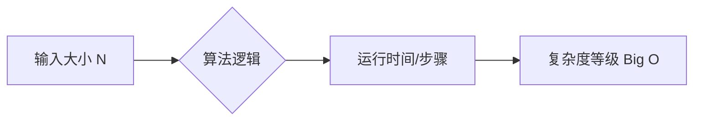
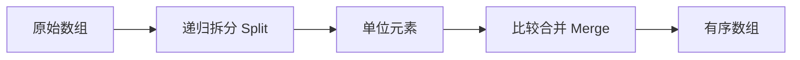
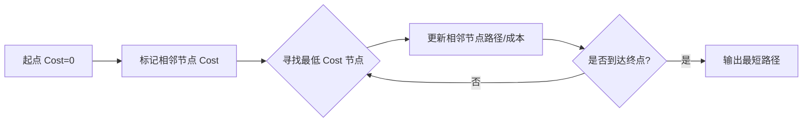
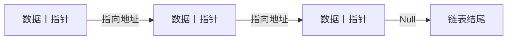
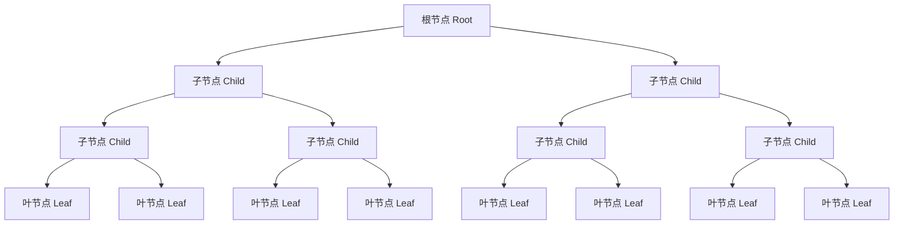

# 算法基础

## 算法入门

### 算法定义与历史起源

| **核心维度 (Dimension)** |              **描述 (Description)**               |
| :----------------------: | :-----------------------------------------------: |
|  **定义 (Definition)**   |             解决问题的具体计算步骤 。             |
|  **命名来源 (Origin)**   | 源于波斯博识者 Muhammad ibn Musa al-Khwarizmi 。  |
|  **评价指标 (Metrics)**  | 步骤执行数量 (Steps) 与内存占用 (Memory usage) 。 |

------

### 算法复杂度与大O表示法

大O表示法 (Big O Notation) 用于表征输入大小 ($N$) 与算法运行步骤之间的增长关系 。

| **复杂度类型 (Complexity)** |       **名称 (Term)**       |      **效率特征 (Efficiency)**       |
| :-------------------------: | :-------------------------: | :----------------------------------: |
|          $O(N^2)$           |     平方时间 (Squared)      |      随输入增加呈指数级恶化 。       |
|        $O(N \log N)$        | 线性对数时间 (Linearithmic) |    适用于大规模数据的高效量级 。     |
|           $O(N!)$           |    阶乘时间 (Factorial)     | 蛮力搜索 (Brute Force) 极低效表现 。 |

------

### 排序算法

排序 (Sorting) 是计算机科学中记载最多的算法问题 。

|   **算法名称 (Algorithm)**    |              **核心逻辑 (Logic)**               | **复杂度 (Complexity)** |
| :---------------------------: | :---------------------------------------------: | :---------------------: |
| **选择排序 (Selection Sort)** |       遍历数组查找最小值并执行交换 (Swap)       |        $O(N^2)$         |
|   **归并排序 (Merge Sort)**   | 递归拆分数组 (Split) 至单位大小后再合并 (Merge) |      $O(N \log N)$      |

#### 归并排序逻辑链条

- **拆分步骤 (Split)**: 重复切分具有对数关系 ($\log N$) 。
- **合并步骤 (Merge)**: 比较与合并次数与元素数量 ($N$) 成正比 。

------

### 图搜索算法

图 (Graph) 是通过线 (Lines/Edges) 连接的节点 (Nodes) 网络 ，线通常带有权重 (Weight) 或成本 (Cost) 。

#### Edsger Dijkstra 算法演进

Edsger Dijkstra 发明的路径搜索算法旨在寻找节点间的最低成本路线 。

| **版本 (Version)**  | **复杂度公式 (Formula)** |    **效率说明 (Performance)**     |
| :-----------------: | :----------------------: | :-------------------------------: |
| **原始版本 (1956)** |         $O(N^2)$         |      难以扩展至大规模地图 。      |
|    **改进版本**     |    $O(N \log N + L)$     | 显著减少循环次数，实际运行更快 。 |

#### Dijkstra 算法执行流程

- **节点初始化**: 起点标为 0，其余标为未知 (Question marks) 。
- **路径更新**: 若新路径成本低于记录值，则更新该节点成本 。
- **应用实例**: 如 Google Maps 的路线规划服务 。

## 数据结构

### 基础线性结构

数据结构 (Data Structures) 的核心目的是实现数据的结构化存储，以便于高效检索与读取 。最基础的结构是数组 (Array)，其在内存中占据连续的地址空间。

| **结构名称 (Structure)** |      **逻辑定义 (Logic)**      |               **内存特性 (Memory)**               |
| :----------------------: | :----------------------------: | :-----------------------------------------------: |
|       数组 (Array)       |        相同类型值的序列        | 连续存储，通过下标 (Index) 和偏移量 (Offset) 访问 |
|     字符串 (String)      | 字符数组 (Array of Characters) |      以二进制值 0 的 Null 字符结尾，标记终止      |
|      矩阵 (Matrix)       |  数组的数组 (Array of Arrays)  | 内存中顺序排列，支持多维 (Multi-dimensional) 扩展 |

------

### 链表

为了克服数组固定大小 (Fixed Size) 和插入困难的限制，计算机科学引入了复合结构与指针 (Pointer) 。

| **术语 (Term)** |       **定义与功能 (Definition & Function)**        |
| :-------------: | :-------------------------------------------------: |
| 结构体 (Struct) |    将多个不同类型的变量打包在一起的复合数据结构     |
|   节点 (Node)   | 包含数据变量和指向内存地址的指针 (Pointer) 的结构体 |
| 指针 (Pointer)  |               存储内存地址的特殊变量                |

- **链表 (Linked List)：** 由节点构成的灵活结构，支持动态增减长度 。
- **特性：** 通过修改指针值即可实现节点的插入、删除或重新排序 。

------

### 抽象数据结构

基于链表等基础结构，程序员构建了具有特定行为准则的抽象数据结构 。

| **抽象类型 (Type)** |        **行为逻辑 (Logic)**         |    **核心操作 (Operations)**    |
| :-----------------: | :---------------------------------: | :-----------------------------: |
|    队列 (Queue)     | 先进先出 (First-In First-Out, FIFO) | 入队 (Enqueue) / 出队 (Dequeue) |
|     栈 (Stack)      | 后进先出 (Last-In First-Out, LIFO)  |    入栈 (Push) / 出栈 (Pop)     |

------

### 非线性层次

当节点拥有多个指针时，可以构建更复杂的非线性关系 。

| **结构名称 (Structure)** |               **组织特征 (Organization)**               | **关键限制/属性 (Constraints/Properties)** |
| :----------------------: | :-----------------------------------------------------: | :----------------------------------------: |
|        树 (Tree)         | 层级结构：根 (Root)、父 (Parent)、子 (Child)、叶 (Leaf) |        单向路径：根到叶的连接不可逆        |
|   二叉树 (Binary Tree)   |               每个节点最多拥有两个子节点                |              树结构的特定变体              |
|        图 (Graph)        |                     节点间任意连接                      |    允许循环 (Loop)，无根、叶或父子概念     |

------

### 工业应用与库

现代编程语言通过标准库 (Libraries) 提供了预制的成熟数据结构，如 C++ 的标准模板库 (Standard Template Library) 和 Java 的 Java 类库 (Java Class Library) 。这使开发人员能够直接在更高的抽象层级 (Level of Abstraction) 上进行创作，而无需从零实现算法 。