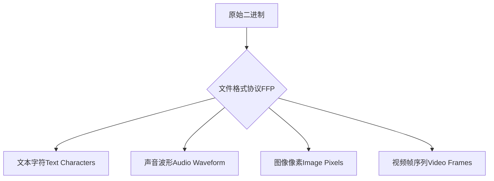
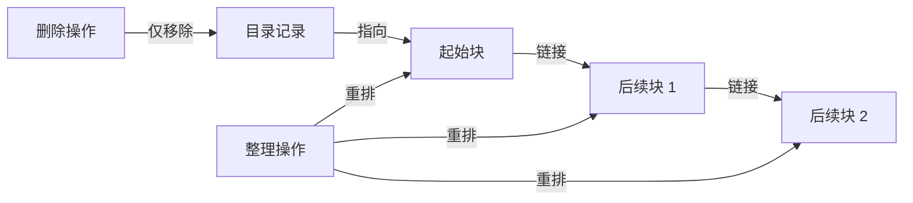
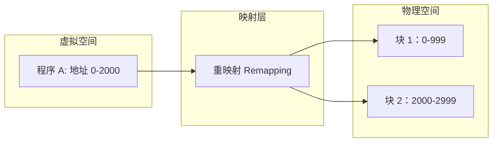
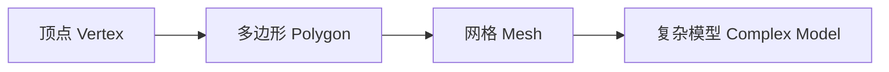
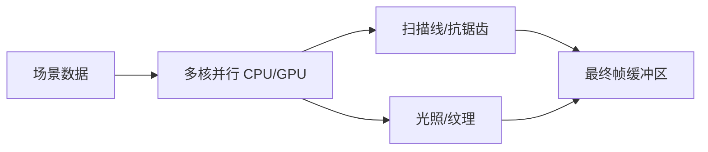
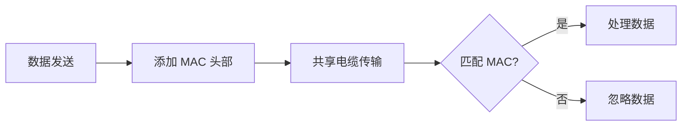
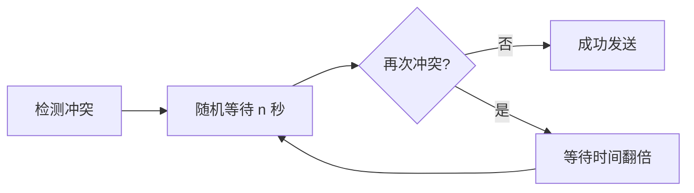

# 核心系统

## 文件系统

### 数据解释层

计算机文件 (File) 在底层均表现为二进制 (Binary) 数字序列 。文件格式 (File Format) 是解析这些原始数据的关键协议 。

| **格式类型 (Format)** |           **核心元数据 (Metadata)**            | **数据表示 (Data Representation)** |
| :-------------------: | :--------------------------------------------: | :--------------------------------: |
|    **文本 (TXT)**     |           字符编码 (Encoding): ASCII           |     映射至特定字符的二进制数值     |
|    **音频 (WAV)**     | 文件头 (Header): 码率 (Bit Rate)、声道 (Track) |    振幅 (Amplitude) 采样值序列     |
|    **位图 (BMP)**     |   宽高 (Dimensions)、颜色深度 (Color Depth)    |   RGB 像素点矩阵 (每像素 24 位)    |



------

### 存储管理层

文件系统通过硬件与软件抽象 (Abstraction)，将物理存储介质视为一系列连续的存储单元 。

|     **管理概念 (Concept)**     |            **定义与功能 (Definition & Function)**            |
| :----------------------------: | :----------------------------------------------------------: |
| **目录文件 (Directory File)**  |         记录文件名、扩展名、起始位置及长度的特殊文件         |
|       **数据块 (Block)**       | 文件系统划分的固定大小存储单元，简化管理并提供预留空间 (Slack Space) |
|   **碎片化 (Fragmentation)**   |           文件因增删改而分布在不连续存储块中的现象           |
| **碎片整理 (Defragmentation)** |          通过移动数据使文件存储块恢复连续及有序状态          |



------

### 组织结构层

随着存储容量爆炸，文件管理从扁平结构演进为层级抽象 。

- **平面文件系统 (Flat File System)**: 所有文件处于同一层级，仅适用于少量文件的早期系统 。
- **分层文件系统 (Hierarchical File System)**: 采用文件夹套文件夹的结构，支持无限深度的目录树 。
- **根目录 (Root Directory)**: 分层结构的顶层节点 。
- **文件路径 (File Path)**: 描述从根目录到目标文件的层级逻辑关系 。

| **操作类型 (Operation)** | **逻辑机制 (Logical Mechanism)** | **物理影响 (Physical Impact)** |
| :----------------------: | :------------------------------: | :----------------------------: |
|     **移动 (Move)**      |     修改相关目录文件中的记录     |       数据块位置保持不变       |
|    **删除 (Delete)**     |       移除目录文件中的条目       |     数据暂存，块标记为可用     |

此结构化框架展示了文件系统如何屏蔽底层物理位操作，为用户提供直观的数据管理抽象 。

## 压缩

### 压缩体系

数据压缩的核心目标在于通过使用比原始表示更少的 位 (Bits) 来编码数据，从而提高**存储 (Storage) 效率**与**传输 (Transmission) 速度**。

|   **压缩类型 (Compression Type)**   | **核心特性 (Core Characteristics)** | **解压状态 (Decompression State)** | **典型格式 (Typical Formats)** |
| :---------------------------------: | :---------------------------------: | :--------------------------------: | :----------------------------: |
| **无损压缩 (Lossless Compression)** |            消除冗余信息             |   与原始数据逐位一致 (Identical)   |       GIF, PNG, PDF, ZIP       |
|  **有损压缩 (Lossy Compression)**   |   丢弃不重要或人类无法感知的细节    |        降级还原 (Degraded)         |       MP3, JPEG, MPEG-4        |

------

### 无损压缩原理：游程编码与霍夫曼编码

无损压缩主要通过识别并简化数据中的重复模式来实现 。

**1. 游程编码 (Run-Length Encoding, RLE)** 利用文件中经常出现的连续相同值 。通过插入一个字节表示 游程长度 (Run-length)，并消除后续冗余数据 。

- **示例**：7个连续黄色像素编码为 `[7][Yellow]`，将 48 字节图像压缩至 24 字节 。

**2. 霍夫曼编码 (Huffman Coding)** 由 David Huffman 发明，基于 频率 (Frequency) 构建 霍夫曼树 (Huffman Tree) 以生成 紧凑代码 (Compact Codes) 。


| **编码属性 (Encoding Property)** |        **技术定义 (Technical Definition)**         |
| :------------------------------: | :------------------------------------------------: |
|      **字典 (Dictionary)**       |           存储代码与数据块之间的映射关系           |
|     **无前缀 (Prefix-free)**     | 任何代码都不是另一个完整代码的开头，确保解析无歧义 |
|  **变长编码 (Variable-length)**  |         高频数据使用短码，低频数据使用长码         |

------

### 有损压缩原理：感知编码与时间冗余

有损压缩依赖于 心理物理学 (Psychophysics) 领域的人类感知模型 。

**1. 感知编码 (Perceptual Coding)** 根据人类听觉或视觉系统的缺陷，降低非敏感区域的**精度 (Precision)** 。

- **音频**：丢弃人类听不到的 超声波 (Ultrasound)；对人声范围保留高精度，对低音降低精度 。
- **图像**：JPEG 将图像分为 8x8 像素块 (Blocks)，丢弃高频空间数据，保留视觉主体 。

**2. 视频压缩与时间冗余 (Temporal Redundancy)** 视频是有序的图像序列，利用 帧间相似性 (Inter-frame Similarity) 进一步压缩 。

|      **技术手段 (Technique)**      |          **逻辑描述 (Logic Description)**           |
| :--------------------------------: | :-------------------------------------------------: |
|    **补丁复制 (Patch Copying)**    |          不重传重复像素，仅向后复制数据块           |
| **差异编码 (Difference Encoding)** |             仅编码相邻帧之间的像素差异              |
|   **变换处理 (Transformation)**    | 对补丁应用 平移 (Shift)、旋转 (Rotation) 或亮度变化 |


当压缩率过高且缺乏足够空间更新补丁内的像素数据时，视频播放器会强制应用运动路径，导致画面出现怪异效果 。

## 操作系统

### 计算机执行模式

操作系统 (Operating Systems) 的诞生源于解决硬件处理速度与人工操作速度之间的指数级差距 。

|         **阶段**          | **执行特征 (Execution Traits)** | **核心限制 (Core Constraints)** |
| :-----------------------: | :-----------------------------: | :-----------------------------: |
|     手动处理 (Manual)     |        每次运行一个程序         |    停机时间长，依赖人工操作     |
| 批处理 (Batch Processing) |        自动连续加载程序         |     I/O 设备阻塞时 CPU 闲置     |
| 多任务处理 (Multitasking) |    单个 CPU 同时运行多个程序    |     内存分配与隔离复杂度高      |


------

### 硬件抽象

为了解决外部设备 (Peripherals) 型号差异带来的底层交互难题，操作系统引入了抽象层 。

- **中间人机制 (Intermediary):** 操作系统充当软件与硬件间的媒介 。
- **设备驱动程序 (Device Drivers):** 通过 应用程序接口 (API) 提供标准化机制 。
- **功能简化:** 程序员只需调用通用函数，如 `print()`，由 OS 处理具体硬件逻辑 。

------

### 内存管理

这是现代操作系统的核心复杂功能，旨在实现资源效率与系统稳定性 。

|       **技术 (Technology)**       | **功能描述 (Description)** |   **核心优势 (Key Benefit)**   |
| :-------------------------------: | :------------------------: | :----------------------------: |
|     虚拟内存 (Virtual Memory)     | 物理地址映射为连续虚拟空间 |   简化编程，隐藏碎片化物理块   |
| 动态内存分配 (Dynamic Allocation) |  根据需求灵活增减内存大小  |  提高多程序运行时的资源灵活性  |
|   内存保护 (Memory Protection)    |   隔离各程序专属内存区域   | 防止程序崩溃扩散或恶意软件攻击 |



------

### 系统架构与安全性演进

随着 70 年代 分时操作系统 (Time-sharing) 的出现，OS 开始处理多用户交互与安全权限 。

- **Multics (1969):** 首个初衷即考虑安全的系统，但因功能过度设计 (Over-engineered) 导致极其复杂 。
- **Unix:** 由 Dennis Ritchie 和 Ken Thompson 开发，追求精简架构 。
  - **内核 (Kernel):** 包含内存管理、多任务处理及 I/O 处理等核心功能 。
  - **工具层 (Tools):** 编译器、程序库等非核心组件 。
- **内核恐慌 (Kernel Panic):** 当内核遇到无法恢复的错误时主动崩溃，源于 Unix 简化错误恢复代码的设计 。

### 个人电脑操作系统

|  **属性**  | **MS-DOS (1981)**  | **早期 Windows (1985+)** | **现代 OS (Windows 10/macOS/Linux)** |
| :--------: | :----------------: | :----------------------: | :----------------------------------: |
| 多任务处理 |        缺失        |         有限支持         |       全面支持 (Multitasking)        |
|  内存保护  |        缺失        |        缺乏强保护        |      强隔离 (Protected Memory)       |
|   稳定性   | 程序常导致系统崩溃 |    易出现 蓝屏 (BSOD)    |               高稳定性               |
|  存储占用  |     约 160 KB      |           中等           |                 较大                 |

## 命令行界面

### 人机交互


### 早期批处理

早期计算系统缺乏交互性，设计核心为优化机器读取效率而非用户体验 。

| **技术节点 (Technical Node)** | **物理实现 (Physical Implementation)** | **系统特征 (System Characteristics)** |
| :---------------------------: | :------------------------------------: | :-----------------------------------: |
|     机械控制 (Mechanical)     |             齿轮/旋钮/开关             |       无交互 (Non-interactive)        |
|      存储介质 (Storage)       |             打孔纸卡/磁带              |      机器易读 (Machine-readable)      |
|       输出终端 (Output)       |             打印纸/指示灯              |              单线程运行               |

### 交互机制与输入标准化

多任务 (Multitasking) 和 分时系统 (Time-sharing Systems) 的出现促使系统支持并行用户程序，产生对实时交互输入的需求。


| **核心要素 (Core Elements)** | **关键人物/标准 (Key Figures/Standards)** | **演进结果 (Evolutionary Results)** |
| :--------------------------: | :---------------------------------------: | :---------------------------------: |
|     硬件架构 (Hardware)      |         Christopher Latham Sholes         |          现代打字机商业化           |
|  布局协议 (Layout Protocol)  |                  QWERTY                   |   形成高转换成本 (Switching Cost)   |
| 交互技术 (Interaction Tech)  | Elizabeth Longley / Frank Edward McGurrin |        十指盲打提升输入带宽         |

### 命令行界面与终端架构

工程师重用现有通信协议，将电传打字机接口适配为计算机输入输出标准，确立了文本交互的基础架构 。


| **架构层级 (Architecture Layer)** |    **组件描述 (Component Description)**     | **核心指令/应用 (Core Commands)** |
| :-------------------------------: | :-----------------------------------------: | :-------------------------------: |
|      物理层 (Physical Layer)      |        电传打字机 (Teletype Machine)        |          长距离信号传输           |
|    抽象层 (Abstraction Layer)     | 虚拟电传终端 (Virtual Teletype / Terminals) |          模拟无限长纸张           |
|      逻辑层 (Logical Layer)       |    命令行界面 (Command Line Interfaces)     |        用户与机器往复通信         |
|     指令集 (Instruction Set)      |              Unix系统命令抽象               |        `ls` , `cat` , `cd`        |

### 早期文本应用

命令行界面 (Command Line Interfaces) 为早期交互式应用程序奠定了逻辑基础 。

|   **应用分类 (App Category)**    | **典型代表 (Representative)** | **交互特征 (Interaction Feature)** |
| :------------------------------: | :---------------------------: | :--------------------------------: |
| 交互式小说 (Interactive Fiction) |    Colossal Cave Adventure    |          单/双词指令解析           |
|    文字冒险 (Text Adventure)     |             Zork              |            文本状态反馈            |
|    多人网络应用 (Multiplayer)    |             MUDs              |           多用户状态同步           |

## 屏幕&2D图形显示

### 物理显示基础

阴极射线管 (Cathode Ray Tube, CRT) 是早期电子计算机最核心的显示技术 。其工作原理依赖于物理电子束与化学涂层的相互作用。


|     **组件 (Component)**      | **功能描述 (Functional Description)** |
| :---------------------------: | :-----------------------------------: |
|       发射器 (Emitter)        |           发射带电电子粒子            |
|  磁场板/线圈 (Plates/Coils)   |     上下左右引导电子束至目标位置      |
| 磷光体涂层 (Phosphor Coating) |         被电子撞击时短暂发光          |

------

### 扫描与渲染范式

为了在屏幕上形成稳定图像，电子束必须根据不同的控制逻辑进行重复路径绘制 。

|    **范式 (Paradigm)**     | **控制逻辑 (Control Logic)** | **视觉特征 (Visual Features)** |
| :------------------------: | :--------------------------: | :----------------------------: |
| 矢量扫描 (Vector Scanning) |  引导电子束直接描绘形状线条  |     线条构成，无像素点概念     |
| 光栅扫描 (Raster Scanning) |     从左上至右下逐行扫描     |      由小线段或像素点组成      |

------

### 字符生成

早期计算机受限于 内存 (RAM) 容量（如 PDP-1），无法直接存储高分辨率 位图 (Bitmap) 。工程师通过字符生成器 (Character Generator) 实现了空间效率的飞跃 。


- **屏幕缓冲区 (Screen Buffer):** 内存中专门预留给图形显示的区域 。
- **字符集扩展 (Character Set Extensions):** 如 IBM 的 CP437，通过特定字符模拟图形界面 。
- **空间对比:** 200x200 像素需 40,000 位 ；而 80x25 文本界面仅需 16,000 位 。

------

### 矢量指令与交互式动画

由于 矢量模式 (Vector Mode) 仅存储线条端点指令而非完整像素矩阵，其在早期绘图应用中极具效率 。

| **指令示例 (Example Commands)** | **效果 (Effect)** | **内存占用 (Memory Usage)** |
| :-----------------------------: | :---------------: | :-------------------------: |
|         `MOVE_TO 50 50`         | 移动绘图点至坐标  |            极低             |
|         `INTENSITY 100`         |   设置线条亮度    |            极低             |
|        `LINE_TO 100 50`         |   绘制可见线段    |            极低             |

- **Spacewar (1962):** 第一款基于矢量图形的电子游戏，运行于 PDP-1 。
- **Sketchpad (1962):** Ivan Sutherland 开发的交互式 计算机辅助设计 (CAD) 软件 。
- **光笔 (Light Pen):** 利用光传感器检测屏幕刷新时间，从而计算坐标位置 。

------

### 现代位图显示与抽象

随着视频内存 (VRAM) 的普及，位图显示成为主流，每个 像素 (Pixel) 直接对应内存中的位 。


- **颜色深度 (Color Depth):** 8位灰度屏幕提供 0（黑）至 255（白）的强度值 。
- **图形库 (Graphics Libraries):** 预设函数（如画圆、矩形）为程序员提供了更高层级的 抽象 (Abstraction) 。
- **普及进程:** 1971年全美仅约 1,000 台电脑具备交互式图形屏幕 。

## 图形用户界面GUI

### 交互范式演进

从命令行界面到图形界面的演进，本质上是计算机直观性 (Intuitiveness) 的提升，使非专业人士也能操作计算机 。


| **交互范式 (Paradigm)** |     **操作逻辑 (Logic)**     | **用户要求 (User Requirement)** |
| :---------------------: | :--------------------------: | :-----------------------------: |
|    命令行界面 (CLI)     |         输入特定命令         |          记忆/猜测指令          |
|   图形用户界面 (GUI)    | 选择并点击 (Point and Click) |          视觉识别选项           |

------

### 技术与机构


| **实体 (Entity)** |     **核心贡献 (Core Contribution)**      |        **关键成果 (Key Output)**        |
| :---------------: | :---------------------------------------: | :-------------------------------------: |
| Douglas Engelbart | 增强人类智力 (Augmenting Human Intellect) | 鼠标 (Mouse)、多窗口 (Multiple Windows) |
|    Xerox PARC     |        桌面隐喻 (Desktop Metaphor)        |      Xerox Alto (1973)、WIMP 界面       |
|       Apple       |        GUI 主流化 (Mainstream GUI)        |            Macintosh (1984)             |
|     Microsoft     |        市场统治 (Market Dominance)        |  Windows 95、多任务处理 (Multitasking)  |

------

### WIMP 框架与组件化设计

WIMP 是现代桌面 GUI 的核心架构，通过模拟现实世界对象降低学习成本 。

| **组件 (Component)** |                 **描述 (Description)**                 |
| :------------------: | :----------------------------------------------------: |
|    窗口 (Window)     |               应用程序的视图框，支持重叠               |
|     图标 (Icon)      |             文件的逻辑抽象，如纸张或文件夹             |
|     菜单 (Menu)      |                 列出可选功能供用户选择                 |
|    指针 (Pointer)    |              由鼠标控制在屏幕上移动的光标              |
|    部件 (Widgets)    | 可复用的图形构建块，如按钮 (Buttons)、滑动条 (Sliders) |

------

### 事件驱动编程

与传统的线性执行不同，GUI 依赖事件驱动模式，代码响应用户或系统的异步触发 。


- **线性编程 (Linear Programming)**：代码从上到下执行 。
- **事件驱动 (Event-Driven)**：代码可以在任何时间按不同顺序触发 。
- **点击事件 (Click Event)**：例如点击“Roll”按钮触发随机数生成函数 。
- **所见即所得 (WYSIWYG)**：屏幕显示与打印输出完全一致 。

------

### 商业化进程与自然选择

GUI 的普及经历了高成本失败到低成本普及的过程 。

| **设备/系统 (System)** | **发布年份 (Year)** | **市场结果 (Market Outcome)** |        **失败/成功原因 (Reason)**         |
| :--------------------: | :-----------------: | :---------------------------: | :---------------------------------------: |
|       Xerox Star       |        1981         |          失败 (Flop)          |      售价过高（约合现今 20 万美元）       |
|       Apple Lisa       |        1983         |          失败 (Flop)          |      售价昂贵（约合现今 2.5 万美元）      |
|       Macintosh        |        1984         |           初期成功            |       价格较低，但早期缺乏软件支持        |
|       Windows 95       |        1995         |           统治地位            | 具备多任务和受保护内存 (Protected Memory) |
|     Microsoft Bob      |        1995         |        失败 (Failure)         |         隐喻过度（虚拟房间模式）          |

## 3D图形

### 空间建模与几何基础

3D 图形的核心在于通过数学坐标定义空间位置，并使用最小几何单元构建复杂物体 。

|           **概念**           |          **定义**           |                         **特性**                         |
| :--------------------------: | :-------------------------: | :------------------------------------------------------: |
| **3D 坐标 (3D Coordinates)** |   X, Y, Z (Zed) 三轴系统    |                  定义空间中点的绝对位置                  |
|    **多边形 (Polygons)**     | 以三角形 (Triangles) 为核心 |           三点唯一确定一个平面，具备数学稳定性           |
|       **网格 (Mesh)**        |        多边形的集合         | 密度决定模型精细度 (Fidelity) 与计算负载 (Polygon Count) |



------

### 3D 投影

由于计算机屏幕为 2D 介面，算法必须将 3D 坐标通过数学计算“拍平”为 2D 坐标，这一过程称为 3D 投影 (3D Projection) 。

|              **投影类型**              |        **特性描述**        |     **应用场景**     |
| :------------------------------------: | :------------------------: | :------------------: |
| **正交投影 (Orthographic Projection)** |   平行边在投影中保持平行   |  建筑设计、技术绘图  |
| **透视投影 (Perspective Projection)**  | 平行线随距离增加向远方收敛 | 真实感游戏、影视渲染 |

------

### 扫描线渲染与光栅化

将几何形状转化为屏幕像素的过程称为渲染。扫描线渲染 (Scanline Rendering) 是处理多边形填充的经典算法 。

- **算法逻辑**：
  1. 识别多边形的最高与最低 Y 轴数值 。
  2. 逐行 (Row by Row) 计算扫描线与多边形边的交点 。
  3. 填充两交点之间的像素区域 。
- **抗锯齿 (Antialiasing)**：针对填充产生的阶梯状边缘 (Jaggies)，通过计算像素被覆盖的比例调整颜色深浅，实现边缘羽化 (Feathering) 。


------

### 遮挡处理

在复杂场景中，算法必须决定哪些像素可见，哪些被遮挡 (Occlusion) 。

|            **技术方案**            |                  **处理逻辑**                   |                  **优缺点**                  |
| :--------------------------------: | :---------------------------------------------: | :------------------------------------------: |
| **画家算法 (Painter's Algorithm)** |         从远到近对多边形排序并依次渲染          |           逻辑简单但需大量排序计算           |
|     **深度缓冲 (Z-Buffering)**     | 在内存中维护 Z 轴矩阵，记录每个像素的最小距离值 |             速度快，无需全局排序             |
|  **背面剔除 (Back-Face Culling)**  |           忽略背向观察者的多边形背面            | 减少一半计算量，但进入模型内部会导致物体消失 |

- **Z 冲突 (Z-Fighting)**：当两个多边形距离极近时，由于浮点数舍入误差 (Rounding errors)，会导致渲染像素闪烁，不可预测哪个多边形在最前 。

------

### 表面着色与纹理映射

为了增加 3D 真实感，需要模拟光照效果 (Lighting/Shading) 和表面细节 (Texture) 。

- **表面法线 (Surface Normal)**：垂直于多边形表面的向量，决定光线反射方向 。
- **着色模型**：
  1. **平面着色 (Flat Shading)**：整个多边形使用统一颜色，边界明显且不光滑 。
  2. **高洛德/冯氏着色 (Gouraud/Phong Shading)**：在多边形表面平滑改变颜色，模拟自然光泽 。
- **纹理映射 (Texture Mapping)**：通过建立多边形坐标与内存中纹理图像的映射关系，查询对应像素颜色并填充。

------

### 硬件加速与并行计算

3D 渲染涉及海量重复计算（如数百万个多边形的扫描线填充与光照处理） 。

|     **硬件组件**     |                  **架构特点**                  |                      **职能**                       |
| :------------------: | :--------------------------------------------: | :-------------------------------------------------: |
| **中央处理器 (CPU)** |              通用计算，非并行设计              |               处理游戏逻辑与任务调度                |
| **图形处理器 (GPU)** | 具备数千个处理核心 (Cores)，支持大规模并行处理 |        每秒处理数亿个多边形的几何与渲染计算         |
| **显存 (Video RAM)** |                  专用高速内存                  | 存储网格 (Meshes) 与纹理 (Textures)，供核心高速访问 |



## 计算机网络  

### 局域网基础与以太网协议

计算机网络最初旨在组织内部共享资源（如打印机、存储器）并加速信息交换 。早期的 "球鞋网络 (Sneakernet)" 依赖人工搬运物理介质，效率极低 。

|        **概念 (Concept)**        |             **描述 (Description)**             |
| :------------------------------: | :--------------------------------------------: |
| 局域网 (Local Area Network, LAN) |   近距离计算机组成的网络，规模可从单室至校园   |
|        以太网 (Ethernet)         | 1970年代由 Xerox PARC 开发，最成功的局域网技术 |
|  媒体访问控制地址 (MAC Address)  |  硬件自带的全球唯一识别码，用于确定数据接收者  |



------

### 载波侦听多路访问与冲突处理

在共享介质（如铜线或空气）中，多个设备同时发送数据会导致 "冲突 (Collision)"，使电信号混乱 。

|     **术语 (Term)**     |         **定义 (Definition)**          |
| :---------------------: | :------------------------------------: |
|     载体 (Carrier)      | 运输数据的物理媒介（如电缆或无线电波） |
|    带宽 (Bandwidth)     |           载体传输数据的速率           |
| 载波侦听多路访问 (CSMA) | 多个设备在发送前侦听载体是否空闲的机制 |

#### 指数退避算法

当检测到冲突时，设备不会立即重传，而是采用指数级增长的随机等待时间，以疏导网络拥塞 。



------

### 网络扩展与冲突域分割

为提升效率，必须限制同一载体上的设备数量，即缩小 "冲突域 (Collision Domain)" 。

|      **设备 (Device)**      |     **逻辑功能 (Logic Function)**      |
| :-------------------------: | :------------------------------------: |
| 网络交换机 (Network Switch) | 根据 MAC 地址列表在不同子网间转发数据  |
|       路由器 (Router)       | 连接不同网络，实现跨网络通信与负载均衡 |

------

### 交换技术对比

随着网络规模扩大，路由技术从物理线路分配演进为灵活的数据包分发 。

|     **技术 (Technique)**     |       **特点 (Characteristics)**       |    **优缺点 (Pros/Cons)**    |
| :--------------------------: | :------------------------------------: | :--------------------------: |
| 电路交换 (Circuit Switching) |   分配专用物理线路（如早期电话系统）   |   独占带宽但成本高且不灵活   |
| 报文交换 (Message Switching) | 整份数据经多个站点中转（类似邮政系统） |    容错性强但易阻塞长链路    |
| 分组交换 (Packet Switching)  |  将数据拆分为小块 (Packets) 独立路由   | 极高效率与去中心化抗打击能力 |

------

### 互联网协议与起源

现代互联网基于分组交换逻辑，通过标准化的协议栈确保全球互联 。

|   **核心组件 (Core Component)**    |             **说明 (Explanation)**             |
| :--------------------------------: | :--------------------------------------------: |
| 互联网协议 (Internet Protocol, IP) |       定义数据包格式与点分十进制地址标准       |
|        跳数限制 (Hop Limit)        |    记录通过路由器次数，用于检测路由环路错误    |
|   阻塞控制 (Congestion Control)    |         路由器平衡负载以确保传输可靠性         |
|              ARPANET               | 1974年由美国高级研究计划局资助的现代互联网雏形 |

```mermaid
graph LR
    A[大数据报文] --> B[拆分为 Packets]
    B --> C[灵活路由选择]
    C --> D[乱序到达目标]
    D --> E[TCP/IP 协议重组]
```

## 互联网

### 网络拓扑与物理架构

互联网 (The Internet) 是一个由互联设备组成的巨型分布式网络 。数据通过多个中转点（跳数/Hops）进行传输。

```mermaid
graph LR
    A[计算机/LAN] --> B[广域网/WAN]
    B --> C[区域路由器]
    C --> D[互联网主干/Backbone]
    D --> E[目标服务器]
```

|     **节点类型 (Node Type)**     | **定义与功能 (Definition and Function)** | **归属/示例 (Owner/Example)** |
| :------------------------------: | :--------------------------------------: | :---------------------------: |
| 局域网 (Local Area Network, LAN) |        连接家庭或办公室内所有设备        |          无线路由器           |
| 广域网 (Wide Area Network, WAN)  |         连接较大区域的路由器网络         |    互联网服务提供商 (ISP)     |
|  互联网主干 (Internet Backbone)  |      超高带宽连接的超大型路由器集合      |         核心路由节点          |
|           跳数 (Hops)            |  数据包从中转设备移动到下一个设备的过程  |           路由路径            |

------

### 传输层协议：UDP 与 TCP

在互联网协议 (Internet Protocol, IP) 这一底层协议之上，开发了处理程序分配和可靠性的传输层协议 。

| **特性 (Feature)** | **用户数据报协议 (User Datagram Protocol, UDP)** | **传输控制协议 (Transmission Control Protocol, TCP)** |
| :----------------: | :----------------------------------------------: | :---------------------------------------------------: |
|      标识方式      |               端口号 (Port Number)               |                 端口号 (Port Number)                  |
|      数据验证      |                校验和 (Checksum)                 |                   校验和 (Checksum)                   |
|       可靠性       |             不提供重发机制，可能丢包             |           必须发送确认码 (ACK)，丢失则重传            |
|      数据顺序      |                    不保证顺序                    |        使用序列号 (Sequence Numbers) 重新排序         |
|      传输速度      |                    快，开销小                    |           慢，存在确认码产生的双倍消息开销            |
|      应用场景      |            视频通话 (Skype)、在线游戏            |                  电子邮件、网页请求                   |

#### TCP 交互逻辑与流量调节

```mermaid
graph LR
    P1[发送包 15] --> R[接收方]
    R -- 校验成功 --> ACK[发送确认码 ACK]
    ACK --> P2[发送包 16]
    R -- 确认码丢失/超时 --> T[超时重传]
    T --> P1
```

- **校验和 (Checksum) 算法**：将原始数据求和并存储为 16 位数值 。接收方重新计算并对比，不一致则丢弃。
- **拥塞控制 (Congestion Control)**：通过确认码的成功率和往返时间推测网络拥堵程度，动态调整发包频率。

------

### 域名系统DNS

由于 IP 地址 (如 `172.217.7.238`) 难以记忆，DNS 负责将域名映射为 IP 地址 。

```mermaid
graph LR
    Root[DNS 根] --> TLD[顶级域名 .com/.gov]
    TLD --> SLD[二级域名 google.com]
    SLD --> Sub[子域名 images.google.com]
```

|         **层级 (Level)**         | **说明 (Description)** |  **示例 (Example)**   |
| :------------------------------: | :--------------------: | :-------------------: |
| 顶级域名 (Top Level Domain, TLD) |  树状结构的最顶层分类  |      .com, .gov       |
|  二级域名 (Second Level Domain)  |   注册的特定组织名称   | google.com, dftba.com |
|        子域名 (Subdomain)        | 二级域名下的进一步划分 |   images.google.com   |

------

### OSI 参考模型

开放式系统互联通信参考模型 (OSI Model) 用于将网络通信过程划分为不同的抽象层 。

| **层号** |   **层名称 (Layer Name)**    |   **核心功能与协议 (Function and Protocols)**   |
| :------: | :--------------------------: | :---------------------------------------------: |
|    5     |    会话层 (Session Layer)    | 使用传输协议创建、管理及关闭连接（如 DNS 查询） |
|    4     |   传输层 (Transport Layer)   |   点对点数据传输、错误检测与恢复（UDP, TCP）    |
|    3     |    网络层 (Network Layer)    |             报文交换与路由选择技术              |
|    2     | 数据链路层 (Data Link Layer) |     媒体访问控制 (MAC)、碰撞检测、指数退避      |
|    1     |   物理层 (Physical Layer)    |        线路电信号或无线电信号的物理传输         |

## 万维网

### 抽象层级

万维网 (World Wide Web) 是运行在互联网 (Internet) 之上的分布式应用程序 (Distributed Application) 。互联网作为底层基础设施，负责传输各类程序的数据 。

```mermaid
graph LR
    A[互联网 Internet] --> B[底层管道 Plumbing]
    B --> C[万维网 WWW]
    B --> D[Skype]
    B --> E[Instagram]
    C --> F[浏览器 Browser]
```

|   **概念 (Concept)**    |          **描述 (Description)**          |
| :---------------------: | :--------------------------------------: |
|    互联网 (Internet)    |       传递数据的底层硬件与协议网络       |
| 万维网 (World Wide Web) | 在服务器上运行并通浏览器访问的分布式应用 |
|  浏览器 (Web Browser)   |       用于检索并渲染网页的专用程序       |

------

### 网页访问流程与协议栈

访问网页是一个涉及多个协议层级的线性逻辑链。

```mermaid
graph LR
    A[输入 URL] --> B[DNS 查找]
    B --> C[获取 IP 地址]
    C --> D[TCP 连接]
    D --> E[HTTP GET 请求]
    E --> F[服务器响应]
    F --> G[浏览器渲染]
```

|   **组件 (Component)**    | **技术细节 (Technical Details)** |
| :-----------------------: | :------------------------------: |
|   统一资源定位器 (URL)    |          网页的唯一地址          |
|   DNS 查找 (DNS Lookup)   |       将域名转换为 IP 地址       |
| TCP 连接 (TCP Connection) |       连接至服务器 80 端口       |
|   超文本传输协议 (HTTP)   |     使用 "GET" 指令请求资源      |
|   状态码 (Status Codes)   |   200 (OK) 或 404 (Not Found)    |

------

### 超文本标记语言HTML

网页通过超文本 (Hypertext) 实现关联索引，通过标记语言 (Markup Language) 定义结构。

> 由于HTML不具有图灵完备性，所以被称为**标记语言**而非**编程语言**。
>
> 一种语言如果能在数学上模拟“图灵机”，则被称为“图灵完备”。

| **标签 (Tag)**  |         **功能 (Function)**         |
| :-------------: | :---------------------------------: |
| `<h1>` / `<h2>` |      第一/二级标题 (Headings)       |
|      `<a>`      |   超链接与 href 属性 (Hyperlinks)   |
|     `<ol>`      |       有序列表 (Ordered List)       |
|     `<li>`      |        列表项目 (List Item)         |
|      `CSS`      | 层叠样式表 (Cascading Style Sheets) |
|  `JavaScript`   |          网页内嵌脚本语言           |

> HTML经常与CSS和Javascript搭配使用，共同构成网页。

------

### 搜索引擎演进

从人工目录转向自动化算法检索。

| **阶段 (Stage)** | **系统/算法 (System/Algorithm)** |              **核心机制 (Mechanism)**              |
| :--------------: | :------------------------------: | :------------------------------------------------: |
|     早期目录     |           Yahoo (1994)           |                 人工编辑的网页指南                 |
|    自动化索引    |        JumpStation (1993)        | 爬虫 (Crawler)、索引 (Index)、搜索算法 (Algorithm) |
|     链接分析     |        Google (PageRank)         |    基于反向链接 (Backlinks) 数量与信誉评估质量     |

------

### 网络中立性技术

网络中立性 (Net Neutrality) 核心在于所有数据包 (Packets) 是否应被平等对待 。

| **立场 (Position)** | **核心论点 (Core Arguments)** |          **技术/商业影响 (Impact)**          |
| :-----------------: | :---------------------------: | :------------------------------------------: |
| 支持者 (Advocates)  |   防止服务商成为内容守门人    | 保护创新，防止小公司因无法支付“溢价包”而劣势 |
| 反对者 (Opponents)  |    市场竞争会制约不良行为     |   允许根据数据类型（如实时通话）分配优先级   |
|  节流 (Throttling)  |    故意限制特定流量的带宽     |          可能导致非优先内容传输延迟          |
