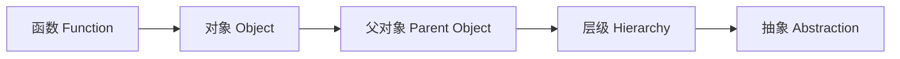
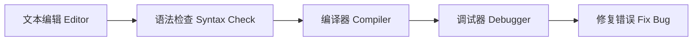

# 软件工程

## 软件工程

### 核心：面向对象编程

软件工程通过将大型程序（如拥有 4000 万行代码的 Microsoft Office）拆分为层级结构，实现复杂度的屏蔽 。**面向对象编程 (OOP)** 是这一过程的核心思想 。

|    **概念 (Concept)**    | **描述 (Description)** |  **作用 (Function)**   |
| :----------------------: | :--------------------: | :--------------------: |
|   **函数 (Function)**    |      最小功能单元      |      允许并行开发      |
| **封装 (Encapsulation)** |   包装相关函数与变量   |      隐藏底层细节      |
|   **API (Interface)**    |      程序编程接口      | 定义程序员间的交互方式 |

### 访问控制与安全性

通过设置权限，API 确保开发者仅能访问必要的功能，防止误操作导致系统崩溃 。

| **权限类型 (Access Type)** | **定义 (Definition)** | **调用限制 (Restriction)** |
| :------------------------: | :-------------------: | :------------------------: |
|     **私有 (Private)**     | 仅对象内部函数可调用  |     保护内部逻辑/数据      |
|     **公开 (Public)**      |  外部对象可直接调用   |      暴露必要功能接口      |

### 开发工具链与集成开发环境 (IDE)

现代开发依赖于集成开发环境 **IDE (Integrated Development Environments)**，它整合了代码编写、编译与测试所需的所有工具 。

| **工具/流程 (Tool/Process)** |    **说明 (Details)**     |  **关键数据 (Metrics)**   |
| :--------------------------: | :-----------------------: | :-----------------------: |
| **代码高亮 (Color-coding)**  |      提升代码可读性       |             /             |
|     **调试 (Debugging)**     |    追踪并修复程序漏洞     |  占据 70%-80% 的工作时间  |
|   **文档 (Documentation)**   | 注释 (Comments) 与 README | 促进代码复用 (Code Reuse) |

### 协作管理与版本控制

在大型项目中，**源代码管理 (Source Control)** 系统（如代码仓库 Code Repository）负责协调多名开发者的工作流。

|  **动作 (Action)**   | **逻辑定义 (Definition)** | **结果 (Outcome)**  |
| :------------------: | :-----------------------: | :-----------------: |
| **检出 (Check-out)** |   从服务器提取代码副本    | 锁定资源，防止冲突  |
|  **提交 (Commit)**   |  将修改后的代码传回仓库   | 更新主版本 (Master) |
| **回滚 (Rollback)**  |   恢复至之前的稳定版本    | 修复引入的严重错误  |

### 质量保证 (QA) 与发布周期

软件在发布前需经过严苛的测试阶段，以模拟各种不可见状况 。

| **测试阶段 (Phase)** |  **状态 (Status)**   | **测试范围 (Scope)** |
| :------------------: | :------------------: | :------------------: |
|    **Alpha 版本**    | 开发初期，极度不稳定 |      仅内部测试      |
|    **Beta 版本**     |     功能基本完整     |  公众测试 (免费 QA)  |
