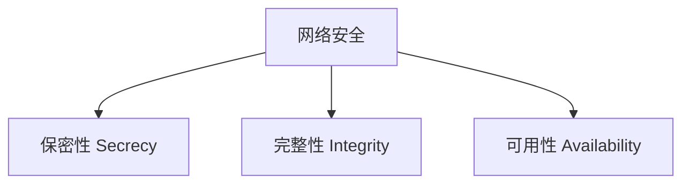
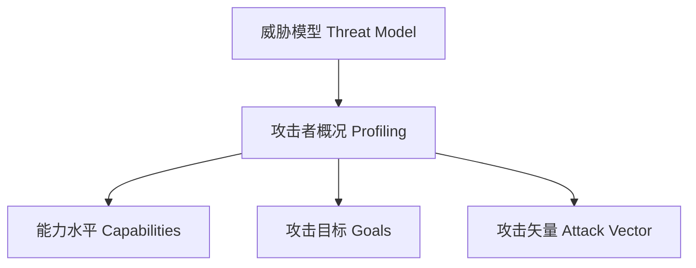
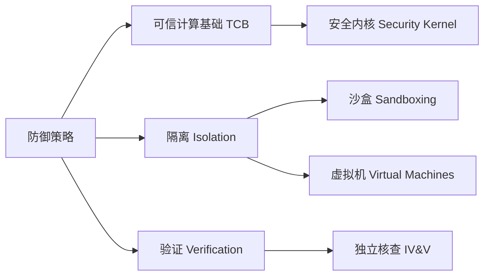
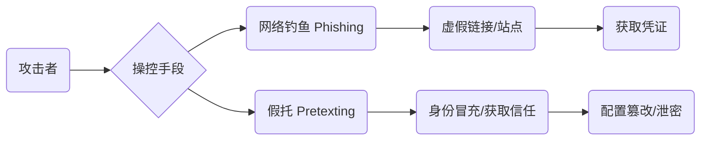
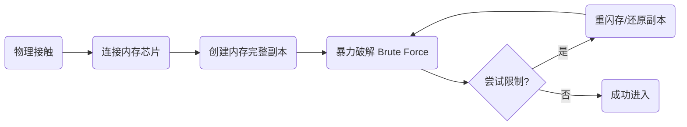
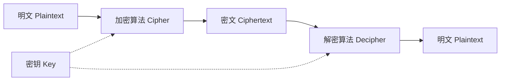
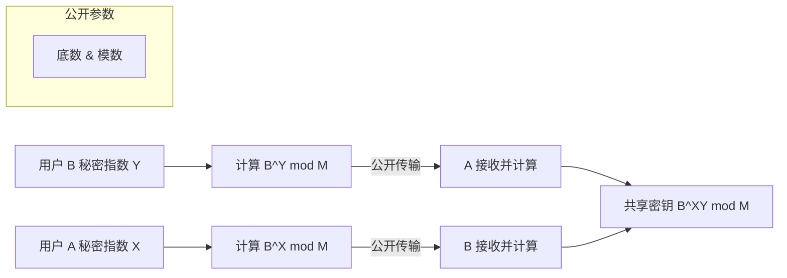

# 信息安全

## 计算机安全

### 核心目标

计算机安全 (Cybersecurity) 是一系列保护系统与数据免受威胁的技术，旨在维护三个核心属性 ：

|           **目标 (Goal)**            |      **定义 (Definition)**       |    **攻击示例 (Attack Example)**     |
| :----------------------------------: | :------------------------------: | :----------------------------------: |
| **保密性 (Secrecy/Confidentiality)** |    仅授权人员可读取系统与数据    |     信用卡信息泄露 (Data Breach)     |
|        **完整性 (Integrity)**        | 仅授权人员可修改或使用系统与数据 |   假冒他人发送邮件 (Masquerading)    |
|      **可用性 (Availability)**       |   授权人员可随时访问系统与数据   | 拒绝服务攻击 (Denial of Service/DoS) |

------

### 威胁建模与攻击矢量

安全专家通过抽象化的分析过程来预判潜在威胁 。

|     **组件 (Component)**     |         **描述 (Description)**         |
| :--------------------------: | :------------------------------------: |
| **威胁模型 (Threat Model)**  | 对潜在敌人的抽象定义及其技术能力的假设 |
| **攻击矢量 (Attack Vector)** |     攻击者可能使用的具体手段或路径     |

------

### 身份认证机制

身份认证 (Authentication) 是计算机确定交互对象身份的过程，分为三大类别 ：

|      **类别 (Category)**       |           **示例 (Example)**           |             **优势/局限 (Pros/Cons)**              |
| :----------------------------: | :------------------------------------: | :------------------------------------------------: |
| **你知道什么 (What you know)** |     用户名与密码 (Password)、PIN码     |   易于实现，但易受暴力攻击 (Brute Force Attack)    |
|  **你有什么 (What you have)**  | 物理钥匙 (Key)、令牌 (Token)、智能手机 |         难以远程攻击，但物理丢失后存在风险         |
|  **你是什么 (What you are)**   |   生物识别 (Biometrics)：指纹、虹膜    | 极高安全性，但不可重置且具有概率性 (Probabilistic) |

> **多因素认证 (Multi-factor Authentication/MFA)**：结合两种或多种认证方式（如密码+手机令牌），大幅增加攻击难度 。

------

### 访问控制与 Bell-LaPadula 模型

访问控制列表 (Access Control Lists/ACL) 定义了用户对文件、文件夹和程序的权限：读 (Read)、写 (Write)、执行 (Execute) 。

| **模型原则 (Model Principles)** |  **规则描述 (Rule Description)**   |   **目标 (Goal)**    |
| :-----------------------------: | :--------------------------------: | :------------------: |
|   **不能向上读 (No Read Up)**   | 低权限用户不能读取高安全级别的数据 | 保护保密性 (Secrecy) |
| **不能向下写 (No Write Down)**  | 高权限用户不能向低安全级别写入数据 |   防止信息意外泄露   |

------

### 系统防御、隔离与验证

由于实现漏洞 (Implementation Bugs) 无法完全消除，安全策略侧重于减少攻击面和控制损害 。

|   **技术项 (Technical Item)**   |     **定义与作用 (Definition and Function)**     |
| :-----------------------------: | :----------------------------------------------: |
|     **可信计算基础 (TCB)**      |           确保系统安全的最小化软件集合           |
|     **独立安全检查 (IV&V)**     |         通过第三方或开源审计发现代码漏洞         |
|      **沙盒 (Sandboxing)**      | 将程序限制在独立内存空间，防止其危害其他系统组件 |
| **虚拟机 (Virtual Machine/VM)** |    模拟独立计算机环境，实现最高等级的运行隔离    |

## 黑客&攻击

### 黑客分类与动机

|     **类别 (Category)**      |     **描述 (Description)**     |     **动机 (Motivation)**     |
| :--------------------------: | :----------------------------: | :---------------------------: |
|     白帽子 (White Hats)      |   受雇进行安全评估的专业人员   | 修复漏洞 (Bug) 并增强系统韧性 |
|      黑帽 (Black Hats)       |           恶意入侵者           |  窃取、利用或销售数据与漏洞   |
| 黑客行动主义者 (Hacktivists) | 使用技术手段达成特定目的的个人 |      推动社会或政治目标       |
|  网络罪犯 (Cybercriminals)   |  针对计算机系统发动攻击的罪犯  |         获取经济利益          |

------

### 社会工程学攻击

| **攻击类型 (Attack Type)** |         **机制 (Mechanism)**         |   **典型后果 (Typical Outcome)**   |
| :------------------------: | :----------------------------------: | :--------------------------------: |
|    网络钓鱼 (Phishing)     | 通过电子邮件诱导用户访问恶意克隆网站 |       窃取用户名、密码等凭证       |
|     假托 (Pretexting)      |  冒充 IT 部门等内部角色进行电话欺骗  | 诱导用户泄露机密信息或篡改系统配置 |
|    木马 (Trojan Horses)    | 伪装成无害附件 (如照片、发票) 的程序 |  植入恶意软件 (Malware) 窃取数据   |

------

### 硬件与物理攻击：NAND 镜像

对于具备物理接触权限的攻击者，可通过镜像技术绕过现代系统的尝试限制 。

| **步骤 (Step)** |  **描述 (Description)**  |        **原理 (Principle)**        |
| :-------------: | :----------------------: | :--------------------------------: |
|  备份 (Backup)  |  将设备内存内容完整复制  |       获取系统状态的静态快照       |
| 尝试 (Attempt)  |   暴力尝试所有密码组合   |        通过穷举获取访问权限        |
|  重置 (Reset)   | 在系统锁定前还原内存副本 | 消除失败尝试记录，避开递增等待时间 |

------

### 软件漏洞利用：缓冲区溢出

缓冲区 (Buffers) 是预留用于存储数据的内存块 。缓冲区溢出通过向固定长度的内存区域输入超长数据，破坏相邻内存 。

|     **概念 (Concept)**     | **说明 (Illustration)**  |  **攻击/防护手段 (Attack/Defense)**  |
| :------------------------: | :----------------------: | :----------------------------------: |
|   内存覆盖 (Overwriting)   |   超长输入覆盖相邻数据   |  修改“管理员 (is admin)”等关键变量   |
|    系统劫持 (Hijacking)    |     注入有目的的新值     |      绕过登录提示或控制整个系统      |
| 边界检查 (Bounds Checking) |    复制前测试输入长度    |    防止输入数据超过预定缓冲区大小    |
|     金丝雀 (Canaries)      | 在缓冲区后监视未使用空间 | 若该空间数值改变，则判定发生内存篡改 |

------

### 数据库攻击：代码注入

攻击者通过在输入字段中嵌入恶意指令，操纵服务器端执行的结构化查询语言 (Structured Query Language - SQL) 查询 。

| **SQL 注入示例 (SQLi Example)** |  **原始意图 (Original Intent)**   |  **攻击结果 (Attack Result)**  |
| :-----------------------------: | :-------------------------------: | :----------------------------: |
|      分号分隔 (Semicolon)       |      用于分隔合法的 SQL 命令      |   允许在原查询后附加独立命令   |
|      恶意指令 (Drop Table)      |        `drop table users`         |  彻底删除包含所有用户数据的表  |
|     输入清理 (Sanitization)     | 修改或删除特殊字符 (如分号、引号) | 防止外部数据被解释为可执行代码 |

------

### 网络层扩散与社会影响

|     **术语 (Term)**     |      **定义 (Definition)**       |         **典型应用 (Typical Use)**         |
| :---------------------: | :------------------------------: | :----------------------------------------: |
|   零日漏洞 (Zero Day)   |     软件开发者尚未察觉的漏洞     |         在补丁发布前进行最大化攻击         |
|      蠕虫 (Worms)       |   自动在计算机间传播的恶意程序   |       快速感染大量存在安全漏洞的系统       |
|    僵尸网络 (Botnet)    | 由黑客控制的大量受感染计算机集合 | 发送垃圾邮件、挖掘加密货币或发动 DDoS 攻击 |
|   拒绝服务攻击 (DDoS)   | 僵尸网络向服务器发送海量虚假信息 |    造成服务离线、进行勒索或破坏基础设施    |
| 网络战争 (Cyberwarfare) |  针对国家关键基础设施发动的攻击  |        瘫痪电网、水处理厂或空管系统        |

## 加密

### 密码学基础与术语

密码学 (Cryptography) 的核心目标是通过算法实现信息的秘密书写，确保系统在面临不可避免的漏洞时仍能通过多层防御 (Defence in Depth) 机制保障安全 。

| **术语 (Technical Term)** |      **定义 (Definition)**       |
| :-----------------------: | :------------------------------: |
|     明文 (Plaintext)      |       可直接阅读的原始信息       |
|     密文 (Ciphertext)     |   经过加密算法处理后的乱码信息   |
|     加密 (Encryption)     |      将明文转换为密文的过程      |
|     解密 (Decryption)     |      将密文还原为明文的过程      |
|        密钥 (Key)         | 解锁加密算法所需的特定参数或数值 |

------

### 对称加密演进

对称加密 (Symmetric Encryption) 要求发送者与接收者共享相同的密钥 。其发展经历了从手动代换到硬件机械，再到现代高强度数字算法的过程。

| **算法类型 (Algorithm Type)** |         **典型案例 (Case)**         | **机制与特征 (Mechanism)** | **安全弱点 (Weakness)** |
| :---------------------------: | :---------------------------------: | :------------------------: | :---------------------: |
|    替换加密 (Substitution)    |      凯撒密码 (Caesar Cipher)       |    字母按固定位移量替换    |    字符频率统计分析     |
|    移位加密 (Permutation)     | 列移位加密 (Columnar Transposition) |  依据网格排列改变字符顺序  |   算法及网格尺寸泄露    |
|     机械加密 (Mechanical)     |               Enigma                |   多转子替换与反射器电路   |   字母无法加密为自身    |
|      数据加密标准 (DES)       |               IBM/NSA               |       56位二进制密钥       |  算力提升导致暴力破解   |
|      高级加密标准 (AES)       |                 AES                 | 128/192/256位密钥 + 轮函数 |    性能与安全的权衡     |

------

### 密钥交换与单向函数

在互联网环境下，通过公开信道建立共享密钥需依赖单向函数 (One-way Function)，即正向计算简易而逆向推导困难的数学操作 。

- **Diffie-Hellman密钥交换 (Diffie-Hellman Key Exchange)**：利用模幂运算 (Modular Exponentiation) 实现 。
- **计算难度**：若已知结果和基数，在数值足够大（数百位）时，逆向推导指数在计算上是不可能的 。

------

### 非对称加密与现代应用

非对称加密 (Asymmetric Encryption) 使用一对密钥：公钥 (Public Key) 与私钥 (Private Key)，解决了大规模网络中的身份验证与密钥分发难题 。

| **功能 (Function)** | **加密密钥 (Encryption Key)** | **解密密钥 (Decryption Key)** | **应用场景 (Application)** |
| :-----------------: | :---------------------------: | :---------------------------: | :------------------------: |
|     机密性通信      |       公钥 (Public Key)       |      私钥 (Private Key)       |   保护数据不被第三方读取   |
| 数字签名 (Signing)  |      私钥 (Private Key)       |       公钥 (Public Key)       |    验证发送者身份真实性    |

**混合加密架构 (HTTPS)** ：

1. **非对称加密**：用于验证服务器身份并安全交换临时对称密钥 。
2. **对称加密 (AES)**：用于后续通信中大规模数据的实际加密，兼顾安全性与处理效率 。
