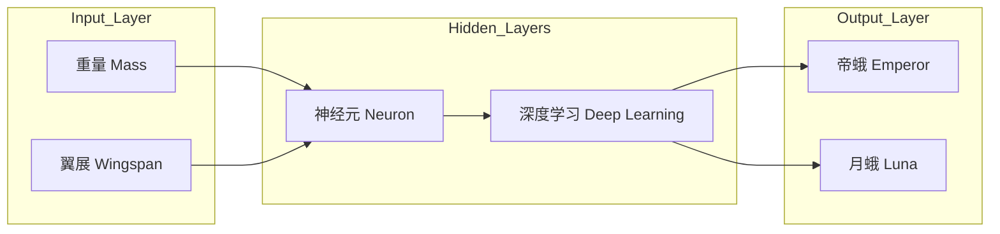
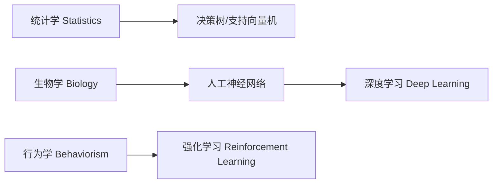
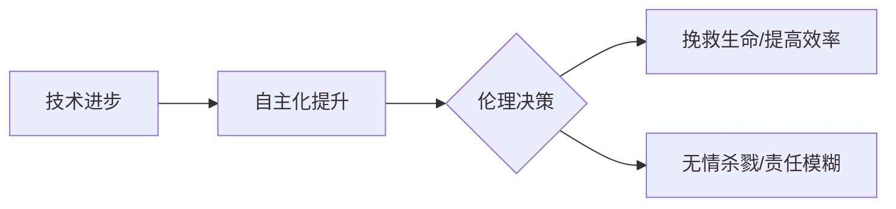
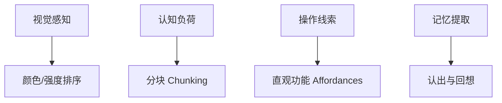
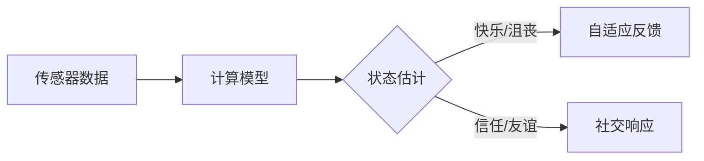
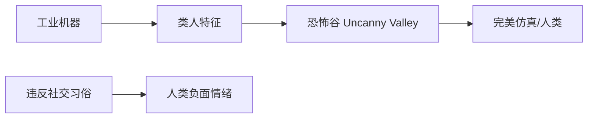
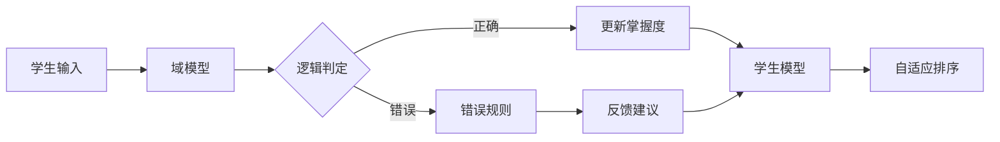

# 计算机未来

## 自然语言处理

### 语言特性与 NLP 定义

自然语言处理 (Natural Language Processing, NLP) 是结合了 **计算机科学 (Computer Science)** 与 **语言学 (Linguistics)** 的跨学科领域 。其核心挑战在于处理人类语言的复杂性与模糊性。

|       **特性维度**       | **编程语言 (Programming Languages)** | **自然语言 (Natural Languages)** |
| :----------------------: | :----------------------------------: | :------------------------------: |
|   词汇量 (Vocabulary)    |              极小且固定              |            大量且多样            |
|  结构化程度 (Structure)  |              高度结构化              |          灵活、存在歧义          |
| 容错性 (Error Tolerance) |     零容错 (100% Free of Errors)     |      高容错 (纠正口音/错误)      |
|     语义 (Semantics)     |               单一含义               |   一词多义 (Multiple Meanings)   |

------

### 文本解析与生成逻辑

为了让计算机理解无限种组合的句子 ，NLP 采用 **去结构化 (Deconstructing)** 方法，将句子分解为可处理的模块 。

- **词性 (Parts of Speech):** 识别名词、动词、形容词等九种基本类型 。
- **短语结构规则 (Phrase Structure Rules):** 规定句子的语法组成（如：句子 = 名词短语 + 动词短语） 。
- **分析树 (Parse Tree):** 标明单词词性并揭示句子结构，使计算机能提取意图 (Intent) 。
- **知识图谱 (Knowledge Graph):** 存储数以亿计的事实与实体关系，辅助计算机生成有意义的回复 。

------

### 聊天机器人 (Chatbots) 的技术演进

|   **阶段**    |        **技术路径**         |          **特点**          | **代表案例**  |
| :-----------: | :-------------------------: | :------------------------: | :-----------: |
| 早期 (Early)  |    基于规则 (Rule-based)    | 专家编写映射规则，难以维护 | ELIZA (1960s) |
| 现代 (Modern) | 机器学习 (Machine Learning) |  使用海量真人对话数据训练  |  Siri, Alexa  |

------

### 语音识别 (Speech Recognition) 深度逻辑

语音识别是将 **声学信号 (Acoustic Signal)** 转换为文本的过程 。

- **快速傅里叶变换 (Fast Fourier Transform, FFT):** 将振幅随时间变化的波形转换为不同频率的幅值 。
- **谱图 (Spectrogram):** 随时间变化的频率分布视图，亮度代表能量 。
- **共振峰 (Formants):** 声道产生的特定频率峰值，是识别元音的关键 。
- **音素 (Phonemes):** 构成单词的最小声音单位（英语约 44 个） 。
- **语言模型 (Language Model):** 利用单词序列的统计信息（如 "she was" 后接形容词的概率更高）来提高转录准确度 。

------

### 语音合成与交互闭环

语音合成是识别的逆过程：将文本分解为音素并连续播放 。随着数据量的增加，语音交互正在进入 **正反馈循环 (Positive Feedback Loop)**。

|  **步骤**   |                **逻辑流程**                |
| :---------: | :----------------------------------------: |
| 1. 文本处理 | 将文字分解为音素序列 (Phonetic Components) |
| 2. 声音拼接 | 早期为机械拼接（机器人声），现代为平滑融合 |
| 3. 数据驱动 |  更多用户使用 → 更多训练数据 → 准确率提升  |

许多人预测，语音技术将成为与屏幕、键盘同等地位的主流交互形式 。

## 机器学习&人工智能

### 基础定义与数据结构

机器学习 (Machine Learning) 的本质是赋予计算机从数据中学习并做出预测和决策的能力 。

|  **数据类型 (Data Type)**   | **描述 (Description)** |    **组成部分 (Components)**    |
| :-------------------------: | :--------------------: | :-----------------------------: |
|   标记数据 (Labeled Data)   |    由专家标注的数据    | 特征 (Features) + 标签 (Labels) |
| 未标记数据 (Unlabeled Data) |   待预测的新输入数据   |      仅包含特征 (Features)      |

------

### 分类逻辑与评估指标

分类 (Classification) 是通过算法在决策空间中寻找最佳分隔的过程 。

|   **核心术语 (Core Terms)**    |    **逻辑定义 (Definition)**    | **目标 (Goal)** |
| :----------------------------: | :-----------------------------: | :-------------: |
|        特征 (Features)         | 表征事物的特定值 (如翼展、重量) | 降低现实复杂性  |
| 决策边界 (Decision Boundaries) |     划分决策空间的数学界限      |  最大化准确率   |
|  混淆矩阵 (Confusion Matrix)   |   记录分类正确与错误的统计表    | 最小化分类错误  |

------

### 人工神经网络架构

人工神经网络 (Artificial Neural Networks) 受生物神经元启发 ，通过层级结构处理数字信号 。

#### 单个神经元计算流程

神经元通过对输入进行数学转换生成输出信号 。

| **步骤 (Step)** | **操作 (Operation)** |    **数学表达 (Expression)**     |
| :-------------: | :------------------: | :------------------------------: |
|        1        |   加权 (Weighting)   |   输入 × 权重 (Input × Weight)   |
|        2        |   求和 (Summation)   |           加权输入之和           |
|        3        |    偏置 (Biasing)    |     总和 + 偏差 (Sum + Bias)     |
|        4        |  激活 (Activation)   | 应用传递函数 (Transfer Function) |

------

### 智能层级与算法范式

当前技术主要集中于特定领域的 弱人工智能 (Weak AI) 。

|        **类别 (Category)**        | **定义与特征 (Definition)** | **典型案例 (Examples)** |
| :-------------------------------: | :-------------------------: | :---------------------: |
|       弱人工智能 (Weak AI)        |    专注于特定任务的智能     | AlphaGo, 医疗诊断, 翻译 |
|      强人工智能 (Strong AI)       |   达到人类水平的通用智能    | 尚无实现案例 (理论阶段) |
|     深度学习 (Deep Learning)      |  包含多个隐藏层的神经网络   |   人脸识别, 自动驾驶    |
| 强化学习 (Reinforcement Learning) | 通过试错与克隆对战自我进化  |         AlphaGo         |

## 计算机视觉

### 计算机视觉 (Computer Vision) 概论

计算机视觉 (Computer Vision) 的目标是使计算机能够从数字图像和视频中提取高层级的理解 。视觉被视为带宽最高的感官，能够提供关于世界状态及其交互方式的大量信息 。

| **维度 (Dimension)** |                  **说明 (Description)**                   |
| :------------------: | :-------------------------------------------------------: |
|  图像存储 (Storage)  |             以像素网格 (Pixel Grid) 形式存储              |
|   颜色定义 (Color)   |         通过红、绿、蓝 (RGB) 三原色的强度组合定义         |
| 核心挑战 (Challenge) | 拍摄照片不等于"看见/理解"图像 (Taking pictures vs Seeing) |

------

### 核心机制：卷积运算

对于超出单像素的特征识别，算法需要处理像素块 (Patches) 。卷积 (Convolution) 是将核 (Kernel) 或过滤器 (Filter) 应用于像素块的操作过程 。

|  **算子/工具 (Operator/Tool)**  |   **功能描述 (Function Description)**   |
| :-----------------------------: | :-------------------------------------: |
| Prewitt 算子 (Prewitt Operator) | 用于增强垂直或水平边缘 (Edge Enhancing) |
|   锐化核 (Sharpening Kernel)    |             提升图像清晰度              |
|    模糊核 (Blurring Kernel)     |              降低图像细节               |
|    形状匹配 (Shape Matching)    |         匹配特定形状的像素模式          |

------

### 目标检测与深度学习

从简单的颜色跟踪到复杂的人脸识别，算法演进经历了从预定义规则到自主学习的过程。

|   **算法 (Algorithm)**    |        **特性 (Characteristics)**         |
| :-----------------------: | :---------------------------------------: |
| 颜色跟踪 (Color Tracking) |   逐像素搜索 RGB 匹配，易受环境光线干扰   |
|   Viola-Jones 人脸检测    |  组合多个弱检测器以实现高准确度特征定位   |
|    卷积神经网络 (CNN)     | 能够自主学习有用的核 (Kernels) 来识别特征 |

#### 卷积神经网络 (CNN) 的抽象层级

卷积神经网络通常包含多个深层，通过逐层卷积提取复杂特征 。

------

### 高层级语义解释与应用

通过定位面部标志点 (Facial Landmarks)，计算机可以进一步理解复杂的社会和物理环境 。

|   **应用领域 (Application)**   |   **技术实现 (Implementation)**    |
| :----------------------------: | :--------------------------------: |
| 情感识别 (Emotion Recognition) | 基于标志点距离判断笑容、惊喜等情绪 |
|     生物识别 (Biometrics)      |    利用面部几何形状进行身份验证    |
|  姿态分析 (Gesture Tracking)   | 跟踪手臂和全身标志点以理解身体语言 |
|    自动驾驶 (Self-driving)     |       识别红绿灯及道路障碍物       |
|   医疗影像 (Medical Imaging)   |        在 CT 扫描中发现肿瘤        |

------

### 系统抽象架构

计算机视觉系统的构建依赖于从硬件到软件的层层抽象 。

|      **层级 (Level)**      | **负责主体 (Responsible Entity)** |       **功能 (Function)**        |
| :------------------------: | :-------------------------------: | :------------------------------: |
|     硬件层 (Hardware)      |        工程师 (Engineers)         |      制造更高保真度的摄像头      |
| 视觉算法层 (CV Algorithms) |           计算机科学家            |     处理像素以寻找人脸或手部     |
|  解释层 (Interpretation)   |             专用算法              |     解释表情、手势及社交环境     |
|    应用层 (Experience)     |              开发者               | 构建智能电视或辅导系统等交互体验 |

## 机器人

### 机器人 (Robot) 定义与演变历史

机器人是受 计算机控制 (Computer Control) ，能在现实物理世界中自动执行一系列动作的机器 。其核心特征在于物理存在感，区别于 虚拟代理 (Virtual Agents) 。

| **阶段**  |  **核心概念/装置**  |                   **关键特征**                    |
| :-------: | :-----------------: | :-----------------------------------------------: |
| 18-19世纪 | 自动机 (Automatons) |         非电子化、机械驱动、模拟生物动作          |
|  1920年   |    "Robot" 术语     | 源自斯拉夫语 "Robota" (强迫劳动) ，由捷克戏剧引入 |
| 1940年代  |  计算机数控 (CNC)   |       程序化控制、高精度加工、降低人力成本        |
|  1960年   |       Unimate       |     首个商业化工业机器人，用于通用汽车生产线      |

------

### 负反馈回路 (Negative Feedback Loop) 架构

在复杂物理环境中，机器人通过负反馈回路最小化 目标值 (Desired Value) 与 传感器 (Sensor) 测量值之间的 误差 (Error) 。

|      **组件**       |      **功能描述**      |     **物理示例**     |
| :-----------------: | :--------------------: | :------------------: |
|   传感器 (Sensor)   | 测量现实世界的物理状态 | 水压、马达位置、气温 |
| 控制器 (Controller) | 解释误差并决定调整策略 |  处理芯片、控制算法  |
|  执行器 (Actuator)  | 对现实世界产生物理影响 |  泵、电机、加热元件  |

------

### 比例-积分-微分 (PID) 控制器原理

PID 控制器是一种通过软件实现的复杂反馈机制，用于平滑控制并防止 越放 (Overshoot) 。

|      **维度**       |         **计算逻辑**         |           **核心功能**           |
| :-----------------: | :--------------------------: | :------------------------------: |
| 比例 (Proportional) | 当前时刻目标值与实际值的差异 |        差距越大，推力越大        |
|   积分 (Integral)   |     一段时间内误差的总和     |   弥补稳态误差，如克服持续阻力   |
|  微分 (Derivative)  |  目标值与实际值之间的变化率  | 预期控制，防止运动过快导致冲过头 |

------

### 现代机器人技术与挑战

尽管机器人能在深海或火星执行任务 ，但人类直觉性的动作对机器人仍是巨大挑战 。

|  **领域**  |            **技术栈**             |             **当前现状**             |
| :--------: | :-------------------------------: | :----------------------------------: |
| 运动与感知 |   计算机视觉 (Computer Vision)    | 无人驾驶汽车依赖传感器融合与视觉算法 |
|  物理交互  | 强化学习 (Reinforcement Learning) |     通过数千小时试错学习抓取动作     |
|  类人形态  |       仿生学与人工智能 (AI)       |      行为与外貌仍处于非自然阶段      |

------

### 机器人伦理与社会风险

机器人技术的进步带来了军事与道德的双重挑战 。

|                 **概念**                 |        **定义/背景**         |            **核心争议**            |
| :--------------------------------------: | :--------------------------: | :--------------------------------: |
| 致命自主武器 (Lethal Autonomous Weapons) | 具备独立杀伤能力的武装机器人 |       缺乏人类判断力与同情心       |
|  机器人三定律 (Three Laws of Robotics)   | Isaac Asimov 提出的道德准则  |      实践中存在模糊性与局限性      |
|          机器人双重性 (Duality)          |     技术的良性与恶性用途     | 潜力和危害并存，需谨慎反映计算影响 |

## 计算机心理学

### 界面设计

系统设计通过运用社会心理学 (Social Psychology)、认知心理学 (Cognitive Psychology) 等原理提升易用度 (Usability)。设计核心在于平衡计算机效率与人类生理/心理限制之间的矛盾。

|  **心理学维度 (Dimension)**  |   **设计原则 (Design Principle)**    |     **实践应用 (Application)**     |
| :--------------------------: | :----------------------------------: | :--------------------------------: |
|   视觉系统 (Visual System)   |     颜色强度优于色相排序连续数据     |  连续值使用亮度；分类数据使用色相  |
| 短期记忆 (Short-term Memory) |           5至9项限制 (7±2)           |    电话号码/菜单分块 (Chunking)    |
|     操作直觉 (Intuition)     |      强化直观功能 (Affordances)      | 按钮纹理、滚花 (Knurling) 视觉效果 |
|    记忆效率 (Efficiency)     | 认出 (Recognition) 优于回想 (Recall) |      图标界面替代命令行 (CLI)      |
|     专业知识 (Expertise)     |              多路径支持              |  下拉菜单 (新手) 与 快捷键 (专家)  |

------

### 交互与通信

情感计算 (Affective Computing) 由 *Rosalind Picard* 于1995年提出，旨在构建能识别并模拟人类情感 (Affect) 的系统。

| **交互模式 (Interaction Mode)** | **定义与特征 (Definition & Features)** | **心理学效应 (Psychological Effect)**  |
| :-----------------------------: | :------------------------------------: | :------------------------------------: |
|     情感感知 (Affect-aware)     |        多模态传感器监测生物指标        |          建立信任、缓解沮丧感          |
|   内容调控 (Content Curation)   |         算法控制社交媒体时间线         | 情绪传染 (Positive/Negative Contagion) |
|          CMC 同步通信           |           视频通话等实时互动           |               增强参与感               |
|          CMC 异步通信           |          邮件、短信等延时互动          |    高水平自我揭露 (Self-disclosure)    |

------

### 人机交互与拟人化

人类具有拟人化 (Anthropomorphizing) 倾向，这在人机交互 (Human-Robot Interaction - HRI) 中尤为显著 。

- **眼神注视 (Eye Gaze)：**
  - **相互凝视 (Mutual Gaze)：** 提升教学、劝说及社交效率 。
  - **增强凝视 (Augmented Gaze)：** 通过计算机图形软件纠正摄像头视角，重建视线接触 。
- **恐怖谷 (Uncanny Valley)：**
  - 当机器人外表极度接近人类但不够完美时，会引发怪异、不安的心理反应 。

|      **概念 (Concept)**       |   **描述 (Description)**   |    **结论 (Conclusion)**     |
| :---------------------------: | :------------------------: | :--------------------------: |
| 社交习俗 (Social Conventions) |  人类按人类标准对待机器人  | 违反习俗 (如插队) 会引发愤怒 |
|         增强凝视技术          |  数字化修正头部与眼睛位置  |  解决视频会议中的权力不平衡  |
|       道德考量 (Ethics)       | 社交媒体调控、计算机欺骗性 |      仍是开放性研究问题      |

## 教育科技

### 学习效率优化

在信息爆炸时代，获取信息不等于完成学习 。主动学习 (Active Learning) 技巧可将效率提升 10 倍以上 。

| **技巧类别 (Category)**  | **操作建议 (Action)** | **核心目的 (Objective)**  |
| :----------------------: | :-------------------: | :-----------------------: |
| 速度控制 (Speed Control) |     匹配认知节奏      | 留出思考时间 (Reflection) |
| 间歇策略 (Interruption)  |    难点暂停并提问     |      预测与验证逻辑       |
|  实践应用 (Application)  |    编写伪代码/练习    |      强化操作性知识       |

------

### 规模化教育挑战

大型开放式在线课程 (MOOCs) 在扩张过程中面临师生比失衡的核心瓶颈 。

| **挑战维度 (Dimension)** | **描述 (Description)** |     **解决方案 (Solution)**      |
| :----------------------: | :--------------------: | :------------------------------: |
|   反馈延迟 (Feedback)    |  百万学生对应极少教师  |          自动化反馈系统          |
|    评估压力 (Grading)    |  无法人工批改海量作业  | 自动评分算法 (Automated Grading) |
|  交互质量 (Interaction)  |     缺乏个性化指导     |        智能辅导系统 (ITS)        |

------

### 智能辅导系统架构

智能辅导系统通过模仿人类导师，提供个性化学习路径 (Personalized Learning) 。

| **组件名称 (Component)** | **核心功能 (Core Function)** | **实现技术 (Implementation)** |
| :----------------------: | :--------------------------: | :---------------------------: |
|  域模型 (Domain Model)   |      形式化表示学科知识      |  判断规则 (Production Rules)  |
| 学生模型 (Student Model) |      追踪学习者掌握进度      |     贝叶斯知识追踪 (BKT)      |
|  错误规则 (Buggy Rules)  |      识别并归类常见错误      |       IF-THEN 逻辑语句        |

------

### 贝叶斯知识追踪

BKT 算法将学习者状态视为隐藏变量 (Latent Variables)，通过观察答题表现动态更新概率估值 。

| **概率参数 (Probability Parameter)** |   **定义 (Definition)**    | **逻辑含义 (Logical Meaning)** |
| :----------------------------------: | :------------------------: | :----------------------------: |
|        已学会概率 (P-Learned)        |   学生已掌握该技能的几率   |          基础知识状态          |
|          瞎猜概率 (P-Guess)          |   未学会但意外答对的几率   |        噪声修正 (正向)         |
|          失误概率 (P-Slip)           |  已学会但因疏忽答错的几率  |        噪声修正 (负向)         |
|         习得概率 (P-Transit)         | 在解决问题过程中学会的几率 |          学习增量评估          |

**计算逻辑概要：** 系统根据观察到的正确或错误结果，选择相应的方程更新 "之前已学会概率"，并累加 "做题过程中学会的概率"，最终结果存入学生模型以实现达标学习 (Mastery Learning) 。

------

### 未来教育技术趋势

教育技术正从传统屏幕转向沉浸式与生物级交互 。

| **技术阶段 (Stage)** | **关键特性 (Key Features)** |      **代表性概念/人物**       |
| :------------------: | :-------------------------: | :----------------------------: |
|     虚拟教学助手     |   具备言语与肢体社交行为    |        Justine Cassell         |
|      沉浸式体验      |     跨越时空的模拟互动      |            VR / AR             |
|       脑机接口       |     技能上传与知识下载      | 《钻石时代》 (Neal Stephenson) |

## 奇点，天网，计算机的未来

### 计算机科学演进逻辑

计算机科学的发展遵循从底层硬件到高层抽象的演进路径，通过对基础逻辑的层层封装，最终实现复杂的人工智能系统 。

### 关键先驱与技术贡献

计算机科学由多位先驱在不同维度奠定了理论与工程基础 。

|           **姓名 (Name)**           | **核心领域 (Core Field)** |
| :---------------------------------: | :-----------------------: |
|   Charles Babbage & Ada Lovelace    |     早期机械计算理论      |
|          Herman Hollerith           |       数据处理工程        |
|             Alan Turing             |    计算机科学理论基础     |
|  J. Presper Eckert & Grace Hopper   |  早期电子计算机与编译器   |
| Ivan Sutherland & Douglas Engelbart |      人机交互 (HCI)       |
|     Vannevar Bush & Berners-Lee     |  信息网络与万维网 (WWW)   |
|     Bill Gates & Steve Wozniak      |      个人计算商业化       |

### 普适计算的范式转移

Mark Weiser 提出的普适计算 (Ubiquitous Computing) 预示了计算机从显性工具向隐性环境的转变 。

| **特性 (Feature)** | **戏剧化机器 (Dramatic Machine)** | **无形机器 (Invisible Machine)** |
| :----------------: | :-------------------------------: | :------------------------------: |
|      交互状态      |     占据注意力，需长时间注视      |     嵌入式，自然使用无需思考     |
|      存在形式      |          桌面、移动设备           |     嵌入墙壁、衣服、甚至人体     |
|      最终目标      |           吸引用户关注            |         融入日常生活背景         |

### 计算能力与奇点理论

**奇点 (Singularity)** 是指由人工智能自我进化引发的失控性技术增长。目前计算能力正处于指数增长向人类水平逼近的阶段 。

**智能演进深度分析：**

- **计算能力对比：** 现代计算机的计算能力约等于老鼠，而人类大脑的计算能力约比当前计算机高 100,000 倍 。
- **增长模型：**
  - **指数模型 (Exponential)：** 计算机智能将在本世纪末超过全人类大脑总和 。
  - **S曲线模型 (S Curve)：** Paul Allen 提出的“复杂度刹车 (Complexity Brake)”认为随复杂度提升，进步难度会非线性增加 。
- **奇点定义：** John von Neumann 最早描述了这种人类事务无法持续的临界点 。

### 劳动力市场自动化分析

根据任务性质（体力 vs 认知）和重复程度（常规 vs 非常规），自动化对就业的影响呈现显著差异 。

| **象限 (Quadrant)** | **任务属性 (Task Nature)** | **自动化风险 (Risk)** | **典型职业 (Examples)** |
| :-----------------: | :------------------------: | :-------------------: | :---------------------: |
|    **常规体力**     |       重复性手工操作       |         极高          |        玩具组装         |
|    **常规认知**     |       重复性逻辑处理       |          高           |    出纳、客服、助理     |
|   **非常规体力**    |      灵活环境手工操作      |          中           |   厨师、保安、服务员    |
|   **非常规认知**    |    创造性与复杂解决问题    |          低           |  医生、艺术家、科学家   |

- **风险评估：** 约 60% 的工作岗位面临自动化威胁，而仅 40% 的非重复性认知工作相对安全 。

### 人机融合与未来形态

计算机科学的终极愿景涉及生物界限的模糊及文明的扩张 。

|      **概念 (Concept)**      | **定义与愿景 (Definition and Vision)** |
| :--------------------------: | :------------------------------------: |
|       改造人 (Cyborgs)       |     人类与科技融合，增强生理与智力     |
| 数字永生 (Digital Ascension) |     意识上传至计算机，脱离肉体存在     |
|         超级智能管家         |      AI 负责农业、医疗与基础建设       |
|           星际殖民           |      机器人携带人类遗产探索银河系      |

### 待开发的计算前沿

除现有的虚拟现实 (VR)、无人驾驶外，多个前沿领域将持续驱动未来创新 。

- **硬件革新：** 神经网络处理器、量子计算 (Quantum Computing)、3D 图形加速 。
- **前沿领域：** 加密货币 (Cryptocurrencies)、生物信息学 (Bioinformatics)、3D 打印 。
- **交互进化：** 从桌面隐喻 (Desktop Metaphor) 转向全时在线的虚拟助手 。
