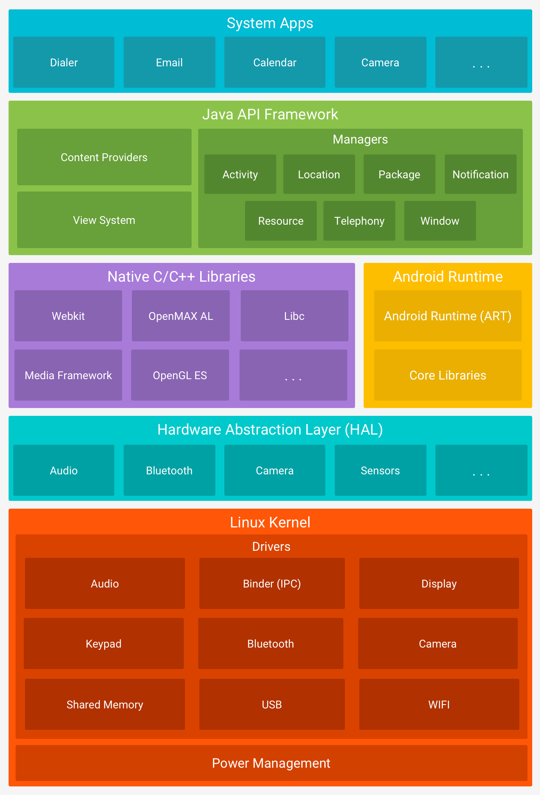

# Linux 简介

!!! quote "参考资料"

    [初识 Linux - Linux 101](https://101.lug.ustc.edu.cn/Ch01/)

## 操作系统

**操作系统**是**用户与底层硬件交流的桥梁**。

用户通过 **操作系统的 UI** 向计算机发出命令，操作系统则对输入的命令进行 **解释** 并 **驱动相关的设备** 来实现用户的要求。

??? note "现代个人计算机操作系统的功能"

    - **驱动程序**：**驱动程序是直接与硬件交互的软件**，操作系统要有能力**与驱动程序对接**以发挥硬件的功能。
    - **内存管理**：计算机的**内存**是**有限的**、**多层次的**，因此操作系统需要合理**分配和回收内存**。
    - **文件系统**：为了**管理**计算机上的**文件和数据**，操作系统需要建立合适的数据结构（**文件系统**）来**存储**它们。
    - **进程管理**：运行的**各类程序**都以**进程**的形式存在，而通常计算机的 **CPU** 只有几个。为了能让许多进程**并发执行**，需要操作系统进行**调度**。
    - **网络通信**：为了与其它计算机联络，一个公认的通信协议（如 `TCP/IP`）是必要的。操作系统需要有能力**实现各种必需的网络通信方式**。
    - **安全机制**：操作系统必须配备**安全机制**，**保护数据**不被未授权的人士获取，并保护计算机**免于计算机病毒的攻击**。
    - **用户界面**：现代的个人计算机操作系统通常都会包含一个**图形化的用户界面**。

## Linux 历史

- UNIX 操作系统
    - 1969 年，美国 AT&T 公司的贝尔实验室开发了 **UNIX 操作系统**，在此后的 10 年里在学术机构和大型企业中得到了广泛的应用。
    - 在这段时间，许多计算机从业者开发了很多基于 UNIX 的变种，统称为 **类 UNIX 操作系统**。
    - 最初， AT&T 公司将 UNIX 的源码以低价甚至免费的许可授权给学术机构做研究和教学之用，但在意识到  **UNIX 操作系统** 的商业价值之后，**取消了授权并对代码进行闭源**。同时，AT&T 公司对之前在 UNIX 之上研究出来的各类衍生组件和变种系统全部声明了著作权，开始了一场旷日持久的诉讼。
    - AT&T 公司的这种行为对诸多使用 UNIX 和其变种的学术机构和商业厂家造成了**巨大的负面影响**。
- GNU 计划
    - 1983 年 9 月 27 日，Richard Stallman 在 MIT 发起了 **GNU 计划**。
    - GNU 计划的目标是：创建一套 **类似 UNIX 但完全自由的操作系统**。因此，这套系统不会包括任何 UNIX 的代码。
    - GNU 计划诞生了著名的 **GPL**（`General Public License`，GNU 通用公共许可证）。GPL 把 **使用了 GPL 的软件的所有权利** 授予 **任何使用它的人**。GPL 的授权方式十分慷概地让出了几乎所有权利，让基于它的软件成为了自由且开源的软件，因此这种权利又被称为**著作传**。
- Linux 内核
    - 1991 年，正在大学内进修的 `Linus Torvalds` 对他使用的一个类 UNIX 操作系统 MINIX 十分不满（当时 MINIX 仅可用于教育但不允许任何商业用途）。
    - 于是他在他的大学时期编写并发布了自己的操作系统，也就是后来所谓的 **Linux 内核**。
    - Linux 内核成为了如今各类 **Linux 发行版的基础**。
- Linux 发行版
    - **Linux 内核并不是一个完整的操作系统**。为了能让这个内核拥有更多功能，许多开发人员和商业公司把**各种组件添加到这个内核之上**，构建成了一个**完整的 Linux 操作系统**。
    - 由于 **Linux 内核** 是一个**开源软件**，所以组合出来的 Linux 操作系统会有**许许多多的形式**（与Windows、macOS 这些商业操作系统不同）。
    - 因此，我们可以说，**Linux 操作系统**从来都**不是**指**哪一种操作系统**。
    - 取而代之地，为了指代某一个**基于 Linux 内核构造出来的操作系统**，我们通常都将其称之为 **Linux 发行版**。

???+ info "`GNU/Linux`"

    从前面的 `GNU 计划` 部分可知，GNU 计划最初是为了**对抗 UNIX** 而建立的。这可以从 GNU 的全称 `GNU's Not UNIX` 中十分直观地看出来。`GNU 计划`其实是希望开发出一个**自由的操作系统** GNU。
    
    虽然 GNU 计划 产出了许多**自由开源的组件和软件**，但核心的 **GNU 操作系统** 却至今**没有开发完成**。
    
    在实际操作中，**GNU 计划的组件** 通常都会 **依赖 Linux 内核** 作为核心来承载，合称为 **`GNU/Linux`**。**Linux 内核**是**功能核心**；**GNU 组件**是核心的**外设**，也是**操作和使用 Linux 内核**的工具。主流的 Linux 发行版都属于 `GNU/Linux`。
    
    ??? success "`Android/Linux`"
    
        `Android`  也是一个基于 Linux 内核开发的操作系统。不过，`Android` 没有采用 `GNU 组件` 作为工具，而是 Google 自行研发的另一套体系，而基于这套体系构成的组合则被称为 `Android/Linux`。同时，`Android` 还大幅度修改了 Linux 内核以精简运行时开销、适应移动设备。
    
        `AOSP (Android Open Source Project)` 只使用了 GPL 许可证的 Linux Kernel，而在 Kernel 之上的 `ART (Android Runtime)`、`Bionic C 库`、`驱动透明化的 HAL (Hardware Abstraction Layer)` 则作为**用户态**存在，避免 Android 系统框架、Google 移动应用服务框架（GMS）和各厂商的驱动程序被 GPL 感染而开源。
    
    ??? info "Android 软件堆栈"
    
        

??? tip "GNU 自由软件"

    进入 GNU/Linux 世界，便意味着与 GNU 自由软件打交道。
    
    | `GCC`      | **GNU 的 C 和 C++ 编译器**    |
    | ---------- | ----------------------------- |
    | **`GDB`**  | **GNU 程序调试器**            |
    | **`Gzip`** | **`gz` 格式压缩与解压缩工具** |
    | **`GIMP`** | **GNU 图像编辑工具**          |
    
    它们的首字母 g 都是 GNU 的缩写（当然不是所有以 g 开头的都是 GNU 软件）。
    
    > 许多 Linux 上的系统管理命令虽然未必以 `g` 开头，但都属于自由软件；还有更多优秀的软件，被自由软件爱好者维护、分享……选择 Linux，很大程度上是一种对极客精神与开源文化的认同。

## Linux 发行版

一个典型的 Linux 发行版除了 **Linux 内核**以外，通常还会包括一系列 **GNU 工具和库**、一些附带的**软件**、**说明文档**、一个**桌面系统**、一个**窗口管理器**和一个**桌面环境**。

**不同的发行版**之间除了 Linux 内核以外的其它部分都有可能不一样，但实质上它们却拥有着**相同的核心**，即 Linux 内核。

若干桌面和服务器环境中**主流的发行版分支**如下：

=== "`Debian` 分支"

    !!! note inline end ""
    
        

    
    - `Debian` 是一个完全由自由软件构成的类 UNIX 操作系统，迄今仍在维护，是最早的发行版之一。
    
    - `Debian` 以坚持自由软件精神和生态环境优良而出名，拥有庞大的用户群体。
    
    - 同时，`Debian` 自身也成为了一个主流的子框架，称为 `Debian GNU/Linux`。
    
    !!! success "`Ubuntu`"
    
        !!! note inline end ""
        
            

        
        Debian GNU/Linux 也派生了很多发行版，其中最为著名的便是 `Ubuntu`。
        
        Ubuntu 由英国的 Canonical 公司主导创立，是一个主打桌面应用的操作系统。
        
        `Ubuntu` 为一般用户提供了一个**时新且稳定**的**由自由软件构成的操作系统**，且**拥有庞大的社群力量和资源**，十分适合普通用户使用。

=== "`Red Hat 分支`"

    !!! info "`Red Hat Linux (RHL)` 与 `Red Hat Enterprise Linux (RHEL)`"
    
        !!! note inline end ""
        
            

        
        - `Red Hat Linux` 是美国的 Red Hat 公司发行的一个发行版，也是一个历史悠久的发行版。
        - 2003 年， Red Hat 公司停止了对 `Red Hat Linux` 的维护，转而将精力都投身于其企业版 `Red Hat Enterprise Linux` （简称 `RHEL`）上。
        - `Red Hat Linux` 自此完结，而商业市场导向的 `RHEL` 维护至今。
    
    !!! info "`Fedora` 发行版"
    
        !!! note inline end ""
        
            

        
        - 社群启动的 `Fedora` 项目接管了 `Red Hat Linux` 的源代码并构筑了自己的更新，演变成了如今的 `Fedora` 发行版。
        - `Fedora` 是一套功能完备且更新迅速的系统，且本身计划也受到了 Red Hat 公司的赞助，成为了公司测试新技术的平台。
    
    !!! info "`CentOS` 发行版"
    
        !!! note inline end ""
        
            

        
        - 虽然 `RHEL` 是一个收费的、商业化的系统，但是 `RHEL` 遵循 GPL，因此会**开放源代码**。
        - 编译 `RHEL` 的源代码可以得到一个可以使用的**操作系统**，即一个新的发行版：`CentOS` （`Community Enterprise Operating System`，**社区版企业操作系统**）。
        - 由于 `CentOS` 几乎完全编译自 `RHEL` 的代码，所以其也像 `RHEL` 一样**具有企业级别的稳定性**，适合在要求高度稳定的服务器上运行。
        
        !!! tip "`CentOS` 的转变"
        
            - 2020 年 12 月，CentOS 社区在其博客中宣布未来的重点转向 `CentOS Stream`，一个全新的滚动发行版。
            - 在此之前，而 `CentOS` 的上游为 `RHEL`，而 `RHEL` 的上游为 `Fedora`。
            - 在推出 `CentOS Stream` 之后，`RHEL` 的上游变成了 `CentOS Stream`。
            - 与此同时，`CentOS 8` 的支持期限被缩短至 2021 年底，且不再推出新的非 Stream 的 `CentOS` 版本。
            
            > 不满于该决定的人们也组织了新的社区，推出了诸如 `Alma Linux`、`Rocky Linux` 等发行版。

=== "`Arch Linux` 分支"

    !!! info "`Arch Linux`"
    
        !!! note inline end ""
        
            

    
        - `Arch Linux` 是一个基于 `x86-64` 架构的 Linux 发行版。
        - 但是，由于 `Arch Linux` 的内核默认包含了部分非自由的模块，所以其未受到 GNU 计划的官方支持。
        - 即便如此，`Arch Linux` 也因其“简单、现代、实在、人本、万能”的宗旨赢得了 Linux 中坚用户的广泛青睐。
        
        > 通常的操作系统为了方便用户快速上手，都是尽可能隐藏底层细节，从而避免用户了解操作系统的运行知识即可直接使用。
        >
        > 但是 Arch Linux 则是重在构建`优雅`、`极简`的代码结构，不可避免地要求使用者了解操作系统的运作方式。
        
        因此，**不建议**初学者**直接上手** `Arch Linux`，但**十分推荐**对 Linux 有**进一步了解之后去探索它**。
    
    !!! info "`Manjaro` 发行版"
    
        !!! note inline end ""
        
            

    
        `Arch Linux` 拥有强大的功能，但因其**特殊的理念**使得用户**不易使用**。
        
        因此，为了能让一般用户也能用上 `Arch Linux` 的强大功能，它的变种 `Manjaro` 发行版于 2011 年问世。
        
        `Manjaro` 发行版基于 `Arch Linux`，但更注重**易用**，因而更适合一般用户。

---

由上文可知，**Linux 发行版** 非常丰富，不同的发行版有其各自的特性，可以面向不同的用户满足独特的需求。

不同于 `Windows`、`MacOS` 这种 受到一家商业公司完全控制和规划的系统 **单一、线性** 的发展轨迹；Linux 由于其独特的**自由**、**开源**的特性，注定了它的发展进程是一个**去中心化的**、**非线性**的形式。

我们**推荐初次接触 Linux 的读者优先采用 `Ubuntu` 发行版或者它的子发行版（`Lubuntu`, `Xubuntu` 等）** 作为自己接触和探索 Linux 的平台，在以后可以自行上手其它发行版。

???+ "什么是 `Linux`？"

    因此，什么是Linux？这个问题在不同的语境下有不同的答案：
    
    > 它可以指代 `Linux 内核`，也可能指代一个或者多个 `Linux 发行版`。
    >
    > 在日常领域或是作为新手接触到的情境来看，这个词通常都是指代 `Linux 发行版`，而且往往指的是 `GNU/Linux` 的发行版。

## 思考题

???+ question "`免费软件` 与 `自由软件`"

    同样叫做 `free software`，**免费软件** 与 **自由软件** 的区别是什么？
    
    ??? example "解答"
    
        - **免费软件并不一定自由。**
            - 因为免费的软件可能只是软件的所有者**提供了免费许可**，并不一定也会同时允许用户**自由地研究、修改和分发**。
            - 诸如QQ、Adobe Reader、WPS Office，或者 许多收费的专业软件的个人版、教育版、社区版，都是**免费但不自由的软件**。
        - **自由软件并不一定免费。**
            - 自由软件的定义并不妨碍其收费，因此理论上想收费就可以收费。
            - 自由软件的发行商可以为顾客提供专业的技术服务，相当于买自由软件的钱可以购买到专业技术支持。
            - 一个十分典型的例子就是 `RHEL`，它是收费的，但遵循 GPL 开源。使用 RHEL 源代码编译成的免费版本（再去掉 RHEL 本身包含的闭源软件和 Red Hat 商标信息）就是之前提到的 `CentOS` 了。

???+ question "著作传"

    !!! note inline end ""
        
        

    
    **著作传** （英文：copyleft）源于自由软件运动，是一种利用现有著作权的法律体制巧妙地保证用户自由使用软件的权利的许可方式。
    
    著作传一般包含哪些规则？它和常见的著作权有什么区别？它和完全放弃权利的“公有领域”又有什么不同？
    
    （右图为著作传的标志。我们注意到，**著作传的标志** 与 **常见的著作权标志** 左右颠倒）
    
    （tips: 了解“著作传”的定义和它与其它两种许可方式的区别即可）
    
    ??? example "解答"
    
        - 通常来说，著作传保证了任何用户都可以自由地**使用**、**复制**、**修改**和**传播**所许可的软件。
            - 不过，基于这个软件的复制传播和修改后的再分发通常还必须以著作传的方式发布，即后续的用户也能享受到同等的自由。
        - 由上面的解释可见，著作传许可 比 通常的著作权提供的使用许可 要**宽容**、**自由**得多。
        - 事实上，**著作传**和**著作权**、**公有领域**的关系和区别有以下几个显著的要点：
            - 在**著作传**中，用户依然需要遵守著作传的许可，并非像 **公有领域的产品** 一样完全随心所欲。
                - 著作传许可 要求 其传播和衍生还是要继续采用著作传许可，不可以申请自己的著作权，也不能重新赋予新的许可。
                - 这种方法保证了该软件的权利 完全由人类共同体充分享受。
                - 但是，这种方式也得到了一些反对声音，因为这种许可的传播方式看起来太像是病毒传染。
            - 著作传是利用了现有的著作权体系设立的。这说明著作传许可**虽然自由**，但实际上也可以认为是对软件的一种保护，**是另一种“著作权”**。
                - 这也说明了，著作传理论是一种受到法律保护的许可（如果当地法律兼容的话），而不是某种大家自发遵守的倡议。
                - 不过，和普通的著作权不同，著作传许可面向用户下放了许多权利，这是通常的著作权许可不会做的。

???+ question "`GPL` 感染"

    什么是 `GPL` 感染？`GPL`许可证 与 开源许可证的区别是什么？
    
    ??? example "解答"
    
        - 简单而不太严谨地来说，如果你的程序使用了 GPL 许可证的代码，那么你的程序就必须以 GPL 许可证开源，这被称为「GPL 感染」。
            - 由于许多公司不希望自己的代码被感染开源，因而 Android 经过设计，规避了相关的法律问题。因此，只需要厂商将对 Linux 内核的修改开源即可。
            - 一个被 GPL 感染的例子是用于嵌入式路由器设备的 `OpenWrt`。由于 `Linksys` 在编写自己的无线路由器固件时使用了 GPL 的代码，因此不得不将相关的代码开源。`OpenWrt` 即由此发展而来。
        - GPL 许可证是在第一章正文中提到的「著作传」（Copyleft）许可的代表。而另一类开源许可证则更加宽松，允许用户在署名等前提下将代码使用在闭源软件中。
            - 开源许可证的代表，如 MIT 许可证、Apache 许可证等。
            - 目前，GitHub 网页版在创建 `LICENSE` 文件时，会给出一些开源许可证的选项以供选择。网络上也有相关的资料以供需要选择开源许可证的开发者们参考。

???+ question "`x86-64` 与 `ARM64` 架构"

    `x86-64` 架构和 `ARM64` 两种架构都是什么？它们有什么区别？
    
    ??? example "解答"
    
        - ARM64（也被称为 AArch64）是 ARM 公司推出的 64 位处理器架构。它被广泛用于**移动设备**、**嵌入式系统**和**服务器领域**。与之前的 32 位架构相比，它具有更高的性能和更好的功耗管理。
        - x86-64 也被称为 x64 或者 AMD64。它广泛应用于 **PC** 和**服务器领域**，并且兼容大部分之前的 32 位 x86 应用程序。
        
        在使用上，这两种架构是不兼容的，即针对一种架构编译的程序无法直接在另一种架构上运行。
