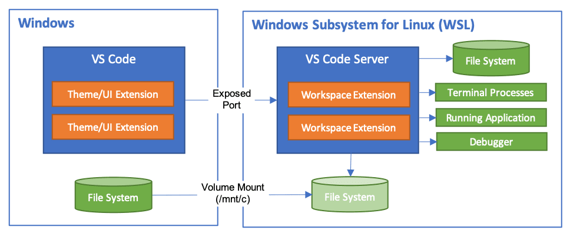
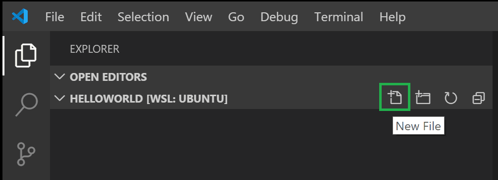
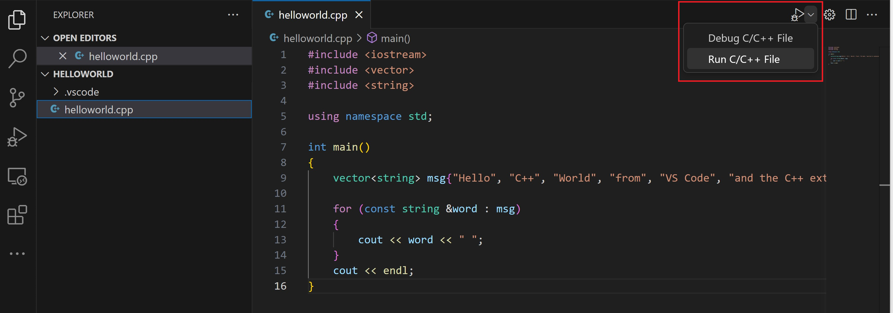
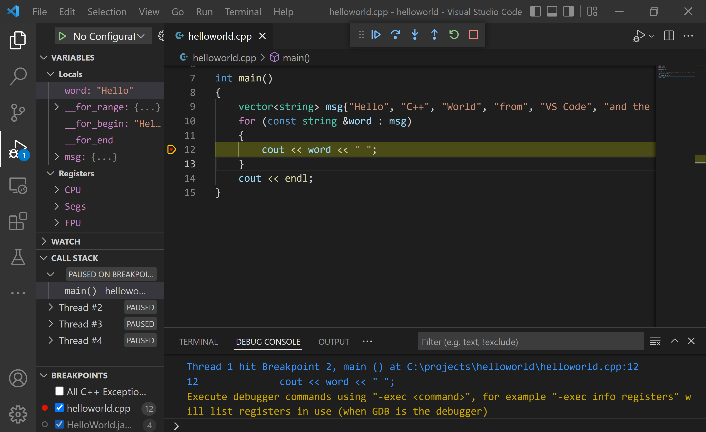
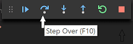
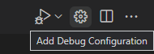
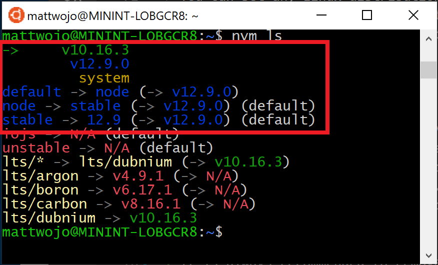

# WSL

!!! quote "参考资料"

    [Windows Subsystem for Linux 文档 | Microsoft Learn](https://learn.microsoft.com/zh-cn/windows/wsl/)

## WSL简介

**WSL**（Windows Subsystem for Linux），**适用于 Linux 的 Windows 子系统**，是 Windows 的一项功能，可用于**在 Windows 计算机上运行 Linux 环境**，无需单独的虚拟机。WSL旨在为想要**同时使用 Windows 和 Linux** 的开发人员提供无缝高效的体验。

??? abstract "WSL的功能"

    - 安装和运行各种 **Linux 分发版**，例如 **Ubuntu**、**Debian**、Kali 等
        - 将**文件存储**在**独立的 Linux 文件系统**中，特定于已安装的分发版
    - 运行**命令行工具**，例如 BASH
        - 运行常见的 BASH **命令行工具**，例如`grep` `sed` `awk`或其他 ELF-64 二进制文件
        - 运行 **Bash 脚本**和 GNU/Linux **命令行应用程序**，包括：
            - 工具：**vim**、emacs、tmux
            - 语言：**NodeJS**、**JavaScript**、 **Python**、Ruby、**C/C++**、C# & F#、Rust、Go 等
            - 服务：SSHD、 **MySQL**、Apache、lighttpd、 MongoDB、 PostgreSQL
    - 使用自己的 GNU/Linux 分发包管理器安装其他软件
    - 同时使用 Windows 和 Linux
        - 使用类似 Unix 的命令行 **shell** 调用 **Windows 应用程序**
        - 在 **Windows** 上调用 **GNU/Linux 应用程序**
        - 运行直接集成到 Windows 桌面的**GNU/Linux 图形应用程序**
    - 使用**设备 GPU 加速** Linux 上运行的**机器学习工作负载**

> **WSL 2** 是安装 Linux 分发版时的当前**默认版本**，以托管**VM（轻型实用工具虚拟机）**的独立容器的形式运行 Linux 分发版。
>
> WSL 2 体系结构在多种方面优于 WSL 1，但在**不同操作系统的文件系统的性能**方面除外，这可以通过将项目文件**存储在与运行项目工具相同的操作系统**上来解决。

## WSL基本命令

> 注意，如果你从**Bash/Linux 发行版**运行这些命令，必须将 `wsl` 替换为 `wsl.exe`。

### 基本命令

|   功能   |        命令         |           注释           |
| :------: | :-----------------: | :----------------------: |
| **安装** | **`wsl --install`** | 安装默认 `Ubuntu` 分发版 |
| **更新** | **`wsl --update`**  |      更新为最新版本      |
| **状态** | **`wsl --status`**  |    参阅配置的常规信息    |
| **版本** | **`wsl --version`** |       检查版本信息       |
| **帮助** |  **`wsl --help`**   | 参阅可用的选项和命令列表 |

### 拓展命令

??? note "WSL 版本"

    === "设置默认 WSL 版本"
    
        ```bash
        wsl --set-default-version <Version>
        ```
    
    === "将 WSL 版本设置为 1 或 2"
    
        ```bash
        wsl --set-version <distribution name> <versionNumber>
        ```

??? note "Linux 分发版"

    === "列出可用的 Linux 分发版"
    
        ```bash
        wsl --list --online
        ```
    
    === "列出已安装的 Linux 分发版"
    
        ```bash
        wsl --list --verbose
        ```
    
    === "设置默认 Linux 分发版"
    
        ```bash
        wsl --set-default <Distribution Name>
        ```
    
    === "从 PowerShell 或 CMD 运行特定的 Linux 分发版"
    
        ```bash
        wsl --distribution <Distribution Name> --user <User Name>
        ```

??? note "分发版操作"

    === "导出分发版"
    
        ```bash
        wsl --export <Distribution Name> <FileName>
        ```
        
        将指定分发的快照导出为新的分发文件，默认为 tar 格式。
        
        `--vhd`：指定导出分发应为 .vhdx 文件而不是 tar 文件（仅使用 WSL 2 支持）
    
    === "导入分发版"
    
        ```bash
        wsl --import <Distribution Name> <InstallLocation> <FileName>
        ```
        
        将指定的 tar 文件导入为新的分发版。
        
        - `--vhd`：指定导入分发应为 .vhdx 文件而不是 tar 文件（仅使用 WSL 2 支持）
        - `--version <1/2>`：指定是否将分发导入为 WSL 1 还是 WSL 2
    
    === "就地导入分发包"
    
        ```bash
        wsl --import-in-place <Distribution Name> <FileName>
        ```
        
        将指定的 .vhdx 文件导入为新的分发版。
        
        注：虚拟硬盘必须在 ext4 文件系统类型中格式化。
    
    === "卸载分发版"
    
        ```bash
        wsl --unregister <DistributionName>
        ```
        
        注销后，与该分发关联的所有数据、设置和软件都将永久丢失。 从应用商店重新安装将安装分发版的干净副本。

??? note "用户"

    === "以特定用户身份运行"
    
        ```bash
        wsl --user <Username>
        ```
    
    === "更改分发版的默认用户"
    
        ```bash
        <DistributionName> config --default-user <Username>
        ```

??? note "结束"

    === "关机"
    
        ```bash
        wsl --shutdown
        ```
        
        立即终止所有正在运行的分发版和 WSL 2 轻型实用工具虚拟机。
    
    === "终止"
    
        ```bash
        wsl --terminate <Distribution Name>
        ```
        
        终止指定的分发或阻止其运行。

??? note "IP 地址"

    === "标识 IP 地址"
    
        ```bash
        wsl hostname -I
        ```
        
    === "返回通过 WSL 2 安装的 Linux 分发版的 IP 地址（WSL 2 VM 地址）"
        
        ```bash
        ip route show | grep -i default | awk '{ print $3}'
        ```
        
        返回从 WSL 2（WSL 2 VM）中看到的 Windows 计算机的 IP 地址。

??? note "磁盘与设备"

    === "装载磁盘或设备"
    
        ```bash
        wsl --mount <DiskPath>
        ```
        
        将 `<DiskPath>` 替换为磁盘所在的目录\文件路径，附加和装载物理磁盘。
        
          - `--vhd`：指定 `<Disk>` 引用虚拟硬盘
          - `--name`：使用装入点的自定义名称装载磁盘
          - `--bare`：将磁盘附加到 WSL2，但不装载它
          - `--type <Filesystem>`：在装载磁盘时使用的文件系统类型，如果未指定，则默认为 ext4
          - `--partition <Partition Number>`：要装载的分区的索引号（如果未指定，默认为整个磁盘）
          - `--options <MountOptions>`：装载磁盘时，可以包含一些特定于文件系统的选项
    
    === "卸载磁盘"
    
        ```bash
        wsl --unmount <DiskPath>
        ```
      
        卸载磁盘路径中给定的磁盘。如果未提供磁盘路径，卸载并分离所有装载的磁盘。

## 开始

### 安装

打开 **Powershell**（或 **Windows 命令提示符**）

```bash
wsl --install
```

??? info "`install`命令功能"

    - 启用可选的 WSL 和虚拟机平台组件
    
    - 下载并安装最新 Linux 内核
    
    - 将 WSL 2 设置为默认值
    
    - 下载并安装 Ubuntu Linux 发行版（可能需要重新启动）

### 设置

使用“**开始**”菜单，打开 **Ubuntu**。系统将要求你为 Linux 发行版创建**用户名**和**密码**。

??? info "**用户名**和**密码**"

    - 此用户名和密码**特定**于安装的每个**单独的 Linux 分发版**，**与 Windows 用户名无关**。
    - 输入**密码**时，屏幕上不会显示任何内容（**盲人键入**）。
    - 创建用户名和密码后，该帐户将是分发版的**默认用户**，并将在启动时**自动登录**。
    - 此帐户将被视为 **Linux 管理员**，能够运行 `sudo` (Super User Do) 管理命令。

??? tip "设置密码"

    === "**更改**密码"
    
        打开 Linux 发行版，输入命令：`passwd`。
        
        系统会要求你**输入当前密码**，然后要求**输入新密码**，之后再**确认新密码**。
    
    === "**重置**密码"
    
        1. 请打开 PowerShell，并使用以下命令进入默认 WSL 分发版的根目录：`wsl -u root`。
           如果需要在**非默认的分发版**中更新忘记的密码，请使用命令：`wsl -d <DistroName> -u root`，并将 `<DistroName>` 替换为目标分发版的名称。
        
        2. 在 PowerShell 内的**根目录**打开 WSL 发行版后，可使用此命令更新密码：`passwd <username>`。
        
        3. 系统将提示输入新的 UNIX 密码，然后确认该密码。
        
        4. 在被告知密码已正确更新后，在 PowerShell 内使用以下命令关闭 WSL：`exit`。

### 更新

建议使用发行版的**首选包管理器**定期更新和升级包。

对于 Ubuntu 或 Debian，使用以下命令：

```bash
sudo apt update && sudo apt upgrade
```

> Windows 不会自动更新或升级 Linux 分发版。 大多数 Linux 用户往往倾向于自行控制此任务。

### 终端

[**Windows Terminal**](https://learn.microsoft.com/zh-cn/windows/terminal/install) 可以运行任何**具有命令行界面**的应用程序。每当安装新的 WSL Linux 发行版时，都会在 Windows Terminal 中为其创建一个新实例。

我们建议将 WSL 与 Windows Terminal 配合使用，特别是在计划**同时使用多个命令行界面**时。

??? tip "个性化"

    我们推荐对终端进行个性化。
    
    打开**终端**，点开**下拉菜单**（即 $\downarrow$ 按钮），点开**设置**（或者通过快捷键 `Ctrl` + `,` 打开）。
    
    1. 在 `Stratup` （启动）选项卡中：
         - 建议选择 **Windows 终端** 作为 **默认终端应用程序** 设置。
         - 可以选择配置 **默认配置文件**，如 Windows Powershell。
    
    2. 在想要修改的 **配置文件** 选项卡中：
    
         - 可以修改 `名称`、`图标` 等选项。
         - 点开 `外观`，可以修改 `配色方案`、`字体`、`光标形状`、`光标颜色`、`背景图像` 等，**将终端的外观修改为你最喜欢的形式！**

## VS Code扩展

Visual Studio Code 以及 WSL 扩展使你可以直接从 VS Code 使用 WSL 作为全职开发环境。

??? abstract "功能"

    - 在**基于 Linux 的环境**中进行开发
    
        - 使用特定于 **Linux 的工具链**和实用工具
        - 在 Windows 上**运行和调试基于 Linux 的应用程序**，同时保持对 **Outlook 和 Office 等生产力工具**的访问权限。
        - 使用 VS Code **内置终端**运行所选 **Linux** 分发版
    
    - 利用 VS Code 功能
        - 例如 Intellisense 代码完成、linting、调试支持、代码片段 和 单元测试。
        - 使用 VS Code 的**内置 Git** 支持轻松管理版本控制
        - 直接**在 WSL 项目上运行命令和 VS Code 扩展**
    
    - 在 Linux 或装载的 Windows 文件系统（例如 `/mnt/c`）中编辑文件，而**无需担心路径问题、二进制兼容性或其他跨 OS 挑战**

> 先决条件：安装 **VS Code** 和 **VS Code 上的 WSL 扩展**。

### 更新

某些 WSL Linux 分发版缺少 VS Code 服务器启动所需的库。 可以使用其**包管理器**将**其他库**添加到 **Linux 分发版**中。

- 若要更新 Debian 或 Ubuntu：

  ```bash
  sudo apt-get update
  ```
<div class="annotate" markdown>

- 若要添加 wget(1) 和 ca-certificates(2)，请输入：

  ```bash
  sudo apt-get install wget ca-certificates
  ```

</div>

1.  要从 Web 服务器检索内容
2.  若要允许基于 SSL 的应用程序检查 SSL 连接的真实性

### 运行

#### 从 WSL 终端

1. **打开**一个 WSL **终端窗口**（当然，也可以从 Powershell 或 命令提示符 中输入 `wsl`）
2. **导航**到希望在其中打开 VS Code 的**文件夹**（包括但不限于 Windows 文件系统挂载，如 `/mnt/c`）
3. 在终端中输入 `code .` 
4. 完成后，你将在左下角看到 **WSL 指示器**，并可以像平常一样使用 VS Code。

> 在 VS Code 的**命令面板**中，如果键入 `WSL`，你将看到**可用的选项列表**，如允许你在 WSL 会话中重新打开文件夹，指定要在其中打开哪个分发版，等等。 

#### 从 VS Code

1. **启动** VS Code。
2. 按 `F1`（打开命令面板），选择 `WSL: Connect to WSL` 或 `WSL: Connect to WSL using Distro`。
3. 使用文件菜单打开文件夹。

> 如果你**已经打开文件夹**，也可以在**命令面板**中选择：`WSL: Reopen Folder in WSL`。系统会提示你选择要使用的发行版。
>
> 如果你在 **WSL 窗口**中，并希望在**本地窗口**中打开当前输入，请使用 `WSL: Reopen in Windows`。

### 扩展

WSL 扩展将 VS Code 拆分为“**客户端-服务器**”体系结构。

- **客户端 UI** 在 **Windows 计算机**上运行
- **服务器**（代码、Git、插件等）在 **WSL 分发版**中“远程”运行。



运行 WSL 扩展时，**“扩展”选项卡** 将显示 **本地计算机** 与 **WSL 分发版** 之间**拆分的**扩展列表。

- **本地扩展**（如 主题）只需安装一次。
- **某些扩展**（如 Python 扩展）或 **处理代码检查或调试任务**的任何扩展 必须**单独**安装在**每个 WSL 发行版**上。 

如果本地安装了 未安装在 WSL 分发版上的扩展，VS Code 将显示警告图标 ⚠以及绿色的“在 WSL 中安装”按钮。

**需要在远程环境中运行**的**本地扩展**，在 `Local - Installed`类别中会显示为灰色并禁用。选择 `Install` 以在您的远程主机上安装扩展。

### 打开 WSL 终端（从VS Code）

从 VS Code 在 WSL 中打开终端非常简单。一旦**文件夹在 WSL中打开**， `Terminal - New Terminal` 中打开的**任何终端窗口**都将自动**在 WSL 中运行**，而不是本地。

同时，可以使用终端窗口的 `code` 命令执行多种操作，例如在 WSL 中**打开新的文件或文件夹**。

> 键入 `code --help` 以查看**命令行**提供的**可用选项**。

!!! success "**Debugging** in WSL"

    在 WSL 中打开文件夹后，你可以像在本地运行应用程序时一样使用 VS Code 的调试器。例如，如果你在 `launch.json` 中选择一个启动配置并开始调试（F5），应用程序将在远程主机上启动，并将调试器附加到它上。

??? info "WSL 特定设置"

    当你在 WSL 中打开文件夹时，VS Code 的**本地用户设置**也会被**重用**。
    
    如果你希望在 **本地** 和 **WSL** 之间对**某些设置**进行**区分**，可以通过 **命令面板** 运行 `Preferences: Open Remote Settings`，或 在 `设置` **编辑器** 中选择 `remote` 选项卡来设置 WSL 特定设置。

??? tip "启动脚本"

    当**在 WSL 中**启动 **VS Code 远程**时，**不会运行**任何 shell **启动脚本**。
    
    如果你想 **运行附加命令** 或 **修改环境**，可以在**设置脚本** `~/.vscode-server/server-env-setup` 中完成。此后，如果存在该脚本，会在**服务器启动之前**进行**处理**。
    
    !!! warning "注意"
    
        该脚本必须是**有效的 Bourne shell 脚本**。无效的脚本将**阻止服务器启动**。如果运行一个**阻止服务器启动的脚本**，你必须使用**常规的 WSL shell** 并**删除或重命名**设置脚本。

### 使用 C++

从 WSL 中，通过输入以下命令来安装 GNU 编译器工具和 GDB 调试器：

```bash
sudo apt-get install build-essential gdb
```

通过定位 g++和 gdb 来验证安装是否成功。如果 `whereis` 命令没有返回文件名，请尝试再次运行更新命令 `sudo apt-get update`。

```bash
whereis g++
whereis gdb
```

#### 运行

- 创建一个名为 `projects` 的目录，然后在其中创建一个名为 `helloworld` 的子目录，并从 WSL 终端使用 `code .` 启动 VS Code：

  ```bash
  mkdir projects
  cd projects
  mkdir helloworld
  cd helloworld
  code .
  ```

- 在文件资源管理器标题栏中，选择 `New File` 按钮并命名为 `helloworld.cpp`。



- 安装 C/C++ 扩展
    - 一旦你创建了文件，并且 VS Code 检测到它是一个 C++语言文件，如果你还没有安装，可能会提示你安装 Microsoft C/C++扩展。
    - 如果你已经在 VS Code 本地安装了 C/C++语言扩展，点击 `扩展` 选项卡，将这些扩展安装到 WSL 中。（本地安装的扩展可以通过选择 `Install in WSL` 按钮，然后点击 `Reload Required` 来安装到 WSL）

- 添加源代码

    ??? tip "`helloworld.cpp`"
    
        ```c++
        #include <iostream>
        #include <vector>
        #include <string>
        
        using namespace std;
        
        int main()
        {
           vector<string> msg {"Hello", "C++", "World", "from", "VS Code", "and the C++ extension!"};
        
           for (const string& word : msg)
           {
              cout << word << " ";
           }
           cout << endl;
        }
        ```

- 探索 IntelliSense

    - 在你的新 `helloworld.cpp` 文件中，将鼠标悬停在 `vector` 或 `string` 上即可查看类型信息。在 `msg` 变量的声明后，开始输入 `msg.` ，就像调用成员函数时那样。你会立即看到一个完成列表，显示所有成员函数，以及一个显示 `msg` 对象类型信息的窗口。

    - 你可以按 Tab 键插入选定的成员；然后，当你添加左括号时，你会看到该函数所需的任何参数信息。

- 运行 `helloworld.cpp`

    - 打开 `helloworld.cpp` 使其成为活动文件。
    - 点击编辑器右上角的 `run` 按钮。
    - 从系统检测到的编译器列表中选择 g++ 构建和调试活动文件。
    - 构建成功后，你的程序的输出将出现在集成终端中。



只有第一次运行 `helloworld.cpp` 时，才需要选择一个编译器。这个编译器将被设置为 `tasks.json` 文件中的"默认"编译器。

当第一次运行你的程序时，C++扩展会创建 `tasks.json` ，你会在 **项目的 `.vscode` 文件夹** 中找到它。 

> `tasks.json` 存储**构建配置**。

 `tasks.json` 文件与这串 JSON 类似：

??? success "`tasks.json`"

    ```json
    {
      "version": "2.0.0",
      "tasks": [
        {
          "type": "shell",
          "label": "C/C++: g++ build active file",
          "command": "/usr/bin/g++",
          "args": ["-g", "${file}", "-o", "${fileDirname}/${fileBasenameNoExtension}"],
          "options": {
            "cwd": "/usr/bin"
          },
          "problemMatcher": ["$gcc"],
          "group": {
            "kind": "build",
            "isDefault": true
          },
          "detail": "Task generated by Debugger."
        }
      ]
    }
    
    ```

??? info "`tasks.json` 变量信息"

    - `command` 设置指定要运行的程序
    - `args` 数组指定将传递给 g++ 的命令行参数。这些参数必须按照编译器期望的顺序指定。
        - `tasks.json` 指示 g++ 编译当前活动文件（ ${file} ），并在当前目录（ ${fileDirname} ）中创建一个可执行文件（ ${fileBasenameNoExtension} ），该文件与活动文件同名但没有扩展名。在该示例中，就是 `helloworld`。
    - `label` 的值是你在任务列表中看到的内容；你可以随意命名。
    - `detail` 值将作为任务列表中任务的描述。强烈建议重命名此值以区别于相似任务。
    
    `run` 按钮将读取 `tasks.json` 来确定如何构建和运行程序。你可以在 `tasks.json` 中定义多个构建任务，而默认任务将由 `run` 按钮使用。
    
    如果您需要更改默认编译器，可以运行 `Tasks: Configure default build task`。
    
    或者您可以修改 `tasks.json` 文件，通过替换此段来移除默认设置：
    
    ??? success "tasks.json"
    
        将以下片段：
        
        ```json
        "group": {
            "kind": "build",
            "isDefault": true
        },
        ```
        
        替换为：
        
        ```json
        "group": "build",
        ```

??? tip "修改 `tasks.json`"

    你可以通过替换 `${file}` 为 `${workspaceFolder}/*.cpp` 参数来修改 `tasks.json` ，以构建多个 C++文件。这将构建你当前文件夹中的所有 `.cpp` 文件。
    
    你也可以将 `${fileDirname}/${fileBasenameNoExtension}` 替换为硬编码的文件名（例如'helloworld.out'）来修改输出文件名。

#### 调试

1. 返回到 `helloworld.cpp` ，使其成为活动文件。
2. 通过点击编辑器边缘或使用当前行的 F9 来设置断点。
3. 在 `run` 按钮的下拉菜单中，选择 `Debug C/C++ File`。
4. 从系统检测到的编译器列表中构建和调试活动文件

??? info "调试器的用户界面"

    - **集成终端**出现在编辑器的**底部**。
    - 编辑器**高亮**显示**当前断点**。
    - 左侧的 `Run and Debug` 视图显示调试信息。
    - 在编辑器的**顶部**，会出现一个**调试控制面板**。（你可以通过抓住左侧的圆点来在屏幕上移动这个面板）
    
    
    
    如果工作区中已经有一个 `launch.json` 文件，`run` 按钮会从该文件中读取内容，以确定如何运行和调试 C++ 文件。
    
    如果你没有 `launch.json` 文件，播放按钮将即时创建一个临时的“快速调试”配置，完全不需要 `launch.json`！

你可以点击 `调试控制面板` 中的 `step over` 图标，或者按下 `F10`，来逐步调试代码。



#### 设置监视器

要跟踪变量在程序执行过程中的值，请设置该变量的**监视**。

- 将光标置于语句内部。在 `WATCH` 窗口中，点击加号，并在文本框中输入 `<variable>` （替换为你想要监视的变量名）。
- 同时，如果执行**在断点处暂停**，要**快速查看**任何变量的值，可以用鼠标指针**悬停**在该变量上。

#### 使用 `launch.json` 自定义调试

当你使用 `run` 按钮或 F5 进行调试时，C++扩展会即时创建一个动态调试配置。

但是，在某些情况下，你可能需要自定义调试配置，例如指定在运行时传递给程序的参数。你可以在 `launch.json` 文件中自定义调试配置。

要创建 `launch.json` ，请从 `run` 按钮的下拉菜单中选择 `Add Debug Configuration`。



然后你将看到一个**用于各种预定义调试配置**的**下拉菜单**。选择 `g++ build and debug active file`。

此时，VS Code 会创建一个 `launch.json` 文件，类似于：

??? success "`launch.json`"

    ```json
    {
      "version": "0.2.0",
      "configurations": [
        {
          "name": "C/C++: g++ build and debug active file",
          "type": "cppdbg",
          "request": "launch",
          "program": "${fileDirname}/${fileBasenameNoExtension}",
          "args": [],
          "stopAtEntry": false,
          "cwd": "${workspaceFolder}",
          "environment": [],
          "externalConsole": false,
          "MIMode": "gdb",
          "miDebuggerPath": "/usr/bin/gdb",
          "setupCommands": [
            {
              "description": "Enable pretty-printing for gdb",
              "text": "-enable-pretty-printing",
              "ignoreFailures": true
            }
          ],
          "preLaunchTask": "C/C++: g++ build active file"
        }
      ]
    }
    ```

??? tip "设置 `launch.json`"

    - `program` 指定想要调试的程序。这里设置为当前活动文件文件夹 `${fileDirname}` 和没有扩展名的当前活动文件名 `${fileBasenameNoExtension}`；如果 `helloworld.cpp` 是当前活动文件，则将是 `helloworld`。
    - `args` 是一个传递给程序在运行时的参数数组。
    - 默认情况下，C++扩展不会向源代码添加任何断点，并且 `stopAtEntry` 值设置为 `false`。
        - 如果将 `stopAtEntry` 值更改为 `true` ，那么在开始调试时，调试器在 `main` 处停止。
    
    从此，在启动程序进行调试时，`run` 按钮和 F5 将读取 `launch.json` 文件。

### 使用 Python

如果还没有安装 Python，请运行以下命令，将 Python3 和 pip（Python 的包管理器）安装到 Linux 系统中。

```bash
sudo apt update
sudo apt install python3 python3-pip
```

然后运行以下命令进行验证：

```bash
python3 --version
```

在 `helloworld`文件夹中添加一个 Python 文件。当运行时会打印一条消息：

```bash
cd ~/projects
mkdir helloWorld_py && cd helloWorld_py
echo 'print("hello from python on ubuntu on windows!")' >> hello.py
python3 hello.py
```

!!! warning "注意"

    在一个远程 Linux 环境，你的开发工具和体验相当有限。你可以在终端中运行 Vim 来编辑文件，或者通过 \\wsl$ 挂载在 Windows 侧编辑源代码。
    
    此时，缺点在于 Windows 上没有安装 Python 运行时、pip，或者任何 conda 包。
    
    如果 Python 安装在 Linux 发行版中，而你在 Windows 侧编辑 Python 文件，除非你在 Windows 上安装相同的 Python 开发堆栈，否则你无法运行或调试它们。（这违背了设置一个隔离的 Linux 实例，并安装所有你的 Python 工具和运行时的目的）

在 WSL 终端中，确保你位于 `helloWorld_py` 文件夹内，并输入 `code .` 来启动 Visual Studio Code。

现在，当将鼠标悬停在 `hello.py` 上时，你将看到正确的 Linux 路径。

同时，建议在 Linux 上安装 `Microsoft Python` 扩展，这将为您提供丰富的编辑和调试体验。（步骤与 `C++` 部分类似，不再赘述）

此后，运行、调试的步骤都与前面的 `C++` 教程类似，不再赘述。

## Git 扩展

对于 Ubuntu/Debian 中最新的稳定 Git 版本，请输入以下命令：

```bash
sudo apt-get install git
```

若要设置 Git 配置文件，请为正在使用的分发打开命令行，并使用此命令设置名称（将 `<your_name>` 替换为首选用户名）：

```bash
git config --global user.name "<your_name>"
```

使用此命令设置电子邮件（将 `<youremail@domain.com>` 替换为你的电子邮件）：

```bash
git config --global user.email "<youremail@domain.com>"
```

## 数据库扩展

> 在本部分，我们主要使用 MySQL。

**MySQL** 是一个开源 SQL 关系数据库，将数据组织成一个或多个表，其中数据类型可能相互关联。 它可垂直缩放，这意味着一台最终计算机将为你完成工作。 它目前是数据库系统中最广泛使用的。

### MySQL 安装

若要在 WSL 上运行的 Linux 分发版上安装 MySQL，只需按照 [MySQL 文档中的 Linux 上安装 MySQL](https://dev.mysql.com/doc/refman/en/linux-installation.html) 说明进行操作。

使用 Ubuntu 分发版的示例：

- 打开 Ubuntu 命令行并更新可用的包：

  ```bash
  sudo apt update
  ```

- 更新包后，使用以下命令安装 MySQL：

  ```bash
  sudo apt install mysql-server
  ```

- 确认安装并获取版本号：

  ```bash
  mysql --version
  ```

- 启动 MySQL 服务器/检查状态：

  ```bash
  systemctl status mysql
  ```

### MySQL 使用

- 打开 MySQL 提示符：

  ```bash
  sudo mysql
  ```

- 若要查看可用的数据库，请在 **MySQL 提示符**下输入：

  ```bash
  SHOW DATABASES;
  ```

- 创建新数据库：

  ```bash
  CREATE DATABASE database_name;
  ```

- 删除数据库：

  ```bash
  DROP DATABASE database_name;
  ```

> 有关使用 MySQL 数据库的详细信息，请参阅 [MySQL 文档](https://dev.mysql.com/doc/mysql-getting-started/en/)。
>
> 若要在 VS Code 中使用 MySQL 数据库，请尝试 [MySQL 扩展](https://marketplace.visualstudio.com/items?itemName=cweijan.vscode-mysql-client2)。

??? info "运行包含的安全脚本"

    运行包含的安全脚本，会更改**远程根登录**和**示例用户**等一些不太安全的默认选项。此脚本还包括**更改 MySQL 根用户密码**的步骤。
    
    - 启动 MySQL 服务器：
    
      ```bash
      sudo service mysql start
      ```
    
    - 启动安全脚本提示：
    
      ```bash
      sudo mysql_secure_installation
      ```
    
    - 第一个提示将询问是否要设置 VALIDATE PASSWORD COMPONENT，该组件可用于测试 MySQL 密码强度。 如果要设置一些简单密码，则不应设置此组件。
    
    - 然后，将为 MySQL 根用户设置/更改密码，决定是否删除匿名用户，决定是否允许根用户在本地和远程登录，决定是否删除测试数据库，最后决定是否立即重新加载特权表。

## Linux GUI 应用

WSL 支持在完全集成的桌面体验中在 Windows 上运行 Linux GUI 应用程序（X11 和 Wayland）。

### 现有 WSL 安装

-  以管理员身份运行 Windows Powershell。

- 输入 WSL 更新命令

  ```bash
  wsl --update
  ```

- 需要重启 WSL 才能使更新生效。 可以通过在 PowerShell 中运行关闭命令来重启 WSL。

  ```bash
  wsl --shutdown
  ```

### 运行 Linux GUI 应用

可以从 Linux 终端运行以下命令，下载并安装这些常用的 Linux 应用程序。

#### 安装常用 GUI 应用

安装 Linux 应用程序后，可以在分发名称下的 **“开始”** 菜单中找到它。例如：`Ubuntu -> Microsoft Edge`。

- 更新发行版中的软件包

  ```bash
  sudo apt update && sudo apt upgrade
  ```
  
- 安装 Gnome 文本编辑器。Gnome 文本编辑器是 GNOME 桌面环境的默认文本编辑器。（若要在编辑器中启动 bashrc 文件，请输入： `gnome-text-editor ~/.bashrc`）

  ```bash
  sudo apt install gnome-text-editor -y
  ```

- 安装 GIMP。GIMP 是一种免费的开源光栅图形编辑器，用于图像作和图像编辑、自由格式绘图、不同图像文件格式之间的转码以及更专门的任务（若要启动，请输入  `gimp`）：

  ```bash
  sudo apt install gimp -y
  ```

- 安装 Nautilus。Nautilus 也称为 GNOME 文件，是 GNOME 桌面的文件管理器。（若要启动，请输入： `nautilus`）：

  ```bash
  sudo apt install nautilus -y
  ```

- 安装 VLC。VLC 是一种免费的开源跨平台多媒体播放器和框架，可播放大多数多媒体文件。（若要启动，请输入： `vlc`）

  ```bash
  sudo apt install vlc -y
  ```

- 安装 X11 应用。X11 是 Linux 开窗系统，这是随其附带的应用和工具的杂项集合，例如 xclock、xcalc 计算器、用于剪切和粘贴的 xclipboard、用于事件测试的 xev 等。（若要启动，请输入要使用的工具的名称。 例如：`xcalc`、`xclock`、`xeyes`）

  ```bash
  sudo apt install x11-apps -y
  ```

#### 安装 Google Chrome for Linux

- 将目录更改为临时文件夹：

  ```bash
  cd /tmp
  ```

- 使用 wget 下载：

  ```bash
  wget https://dl.google.com/linux/direct/google-chrome-stable_current_amd64.deb
  ```

- 安装包：

  ```bash
  sudo apt install -f ./google-chrome-stable_current_amd64.deb
  ```

若要启动，请输入： `google-chrome`

## Node.js 扩展

建议使用**版本管理器**，因为版本更改非常快。您可能需要根据您正在处理的不同项目的需求，在多个版本的 Node.js 之间切换。 

节点版本管理器（更常见的称为 `nvm`）是安装多个版本的 Node.js的最常用方法。 我们将逐步完成安装 nvm 的步骤，然后使用它安装 Node.js 和 Node 包管理器（npm）。

!!! warning "重要"

    通常建议在安装版本管理器之前，先从操作系统中删除任何现有的 Node.js 或 npm 安装，因为不同类型的安装可能会导致奇怪且令人困惑的冲突。
    
    例如，可以使用 Ubuntu 命令 `apt-get` 判断安装的 Node 版本当前是否已过时。有关删除以前安装的帮助，请参阅 [如何从 ubuntu 中删除 nodejs](https://askubuntu.com/questions/786015/how-to-remove-nodejs-from-ubuntu-16-04)。

- 打开 Ubuntu 命令行（或你选择的发行版）。

- 安装 cURL（一个在命令行用于从互联网下载内容的工具）使用：`sudo apt-get install curl`

- 安装 nvm，使用 `curl -o- https://raw.githubusercontent.com/nvm-sh/nvm/master/install.sh | bash`。

- 若要验证安装，请输入：`command -v nvm`。如果收到“找不到命令”或根本没有响应，请关闭当前终端，重新打开它，然后重试。

- 列出当前安装的 Node 版本（此时应不安装）： `nvm ls`

- 安装 Node.js 稳定的 LTS 版本：（建议用于生产应用程序）： `nvm install --lts`

- 列出已安装的 Node 版本：`nvm ls` ...现在，应会看到刚刚安装的两个版本。



- 验证是否已安装 Node.js，并检查其是否为当前默认版本：`node --version`。 然后验证你是否安装了 npm，并确认：`npm --version` （你还可以使用 `which node` 或 `which npm` 查看默认版本的路径）。
- 若要更改要用于项目的 Node.js 版本，请创建新的项目目录，然后输入该目录`mkdir NodeTest``cd NodeTest`，然后输入`nvm use node`以切换到当前版本或`nvm use --lts`切换到 LTS 版本。 
- 还可以对已安装的任何其他版本使用特定编号，例如 `nvm use v8.2.1`。 （若要列出所有可用的 Node.js 版本，请使用以下命令： `nvm ls-remote`

> 如果使用 NVM 安装 Node.js 和 NPM，则无需使用 SUDO 命令来安装新包。

??? info "有用的 VS Code 扩展"

    虽然 VS Code 自带了许多适用于 Node.js 开发的功能，但你可以考虑在 [Node.js 扩展包](https://marketplace.visualstudio.com/items?itemName=waderyan.nodejs-extension-pack)中安装一些有用的扩展工具。
    
    1. 在 VS Code 中打开 **扩展** 窗口（Ctrl+Shift+X）。
    2. 在“扩展”窗口顶部的搜索框中，输入： **Node Extension Pack** 。
    3. 根据您当前项目打开的位置，将在 VS Code 的**本地实例**或 **WSL 实例**之一安装该扩展。
    
    可能需要考虑的一些附加扩展包括：
    
    - [JavaScript 调试器](https://marketplace.visualstudio.com/items?itemName=ms-vscode.js-debug)：使用 Node.js在服务器端完成开发后，需要开发和测试客户端。 此扩展是基于 DAP 的 JavaScript 调试器。 它调试 Node.js、Chrome、Edge、WebView2、VS Code 扩展等。
    - [来自其他编辑器的键映射](https://marketplace.visualstudio.com/search?target=VSCode&category=Keymaps&sortBy=Downloads)：如果你从另一个文本编辑器（如 Atom、Sublime、Vim、Emacs、Notepad++等）转换，这些扩展可以帮助你的环境更适应你的使用习惯。

