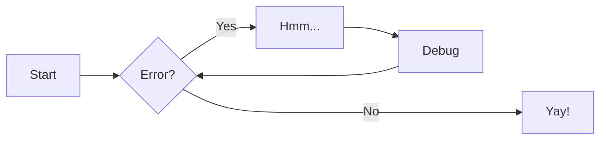
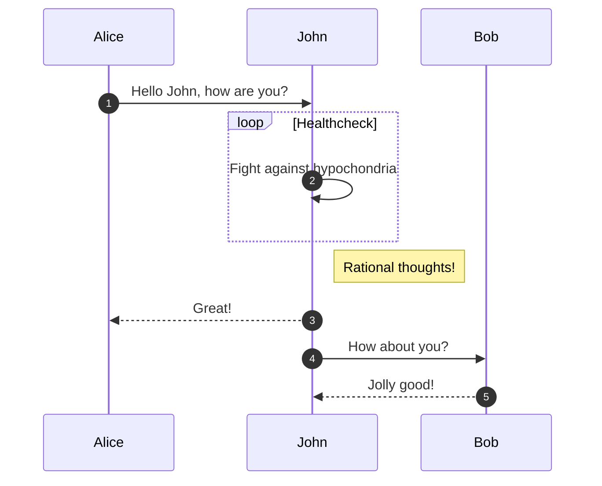
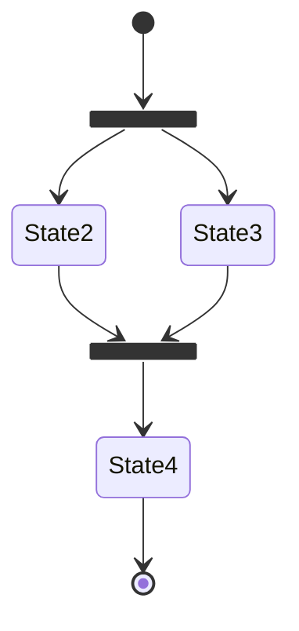
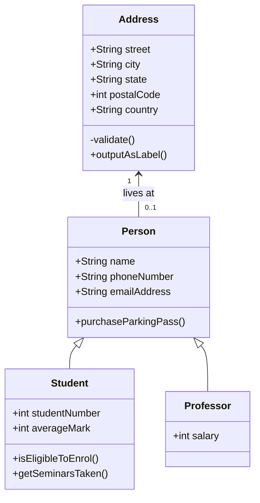
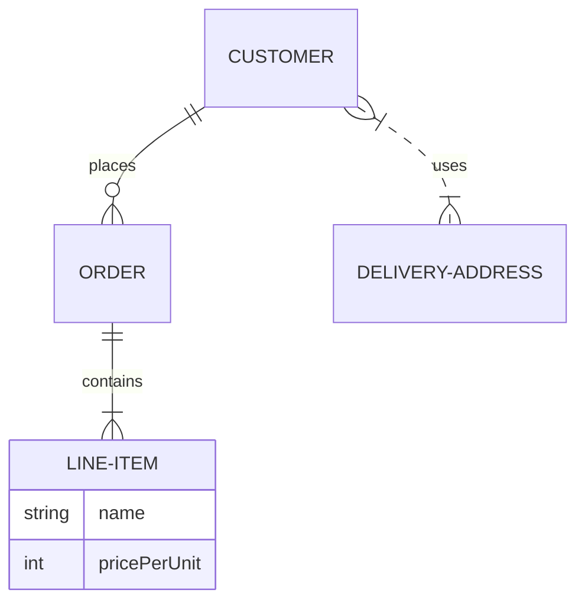

# Python Markdown参考

> 全文主要参考资料：
>
> [**Material for MkDocs官方文档**](https://squidfunk.github.io/mkdocs-material/)

## 工具提示

### 配置

```yaml
markdown_extensions:
  - abbr
  - attr_list
  - pymdownx.snippets
```

#### 改进的工具提示

启用改进的工具提示后，Material for MkDocs 会将浏览器的 `title` 属性渲染逻辑替换为精美的小工具提示。

```yaml
theme:
  features:
    - content.tooltips
```

现在，将为以下元素呈现工具提示：

- **内容** – 带有 `title` 、永久链接和代码复制按钮的元素
- **标题** – 主页按钮、标题标题、调色板开关和存储库链接
- **导航** – 用省略号缩短的链接，即 `...`

### 用法

#### 添加工具提示

[Markdown 语法](https://daringfireball.net/projects/markdown/syntax#link)允许为每个链接指定 `title` ，当启用[改进的工具](https://squidfunk.github.io/mkdocs-material/reference/tooltips/#improved-tooltips)提示时，标题将呈现为美观的工具提示。使用以下几行代码为链接添加工具提示：

```markdown
[Hover me](https://example.com "I'm a tooltip!")
```

还可以将工具提示添加到链接引用：

```markdown
[Hover me][example]

  [example]: https://example.com "I'm a tooltip!"
```

对于所有其他元素，可以使用**属性列表**扩展添加 `title` ：

```markdown
:material-information-outline:{ title="Important information" }
```

#### 添加缩写

[**Abbreviations**](https://python-markdown.github.io/extensions/abbreviations/) 扩展添加了向元素添加小工具提示的功能，方法是用 `abbr` 标签包裹元素。仅支持纯文本（无标记）。

```yaml
markdown_extensions:
  - abbr
```

##### 添加缩写

可以使用类似于**URL**和**脚注**的特殊语法来定义缩写，以 `*` 开头，紧接着在方括号中附加要关联的术语或首字母缩略词：

```txt
The HTML specification is maintained by the W3C.

*[HTML]: Hyper Text Markup Language
*[W3C]: World Wide Web Consortium
```

##### 添加词汇表

[**Snippets**](https://facelessuser.github.io/pymdown-extensions/extensions/snippets/)扩展新增了一项功能，只需使用简单的语法，即可将任意文件的内容嵌入到文档中，包括其他文档或源文件。

```yaml
markdown_extensions:
  - pymdownx.snippets
```

**Snippets**扩展可用于实现简单的词汇表，通过将所有缩写移动到专用文件中，并使用以下配置将该文件自动附加到所有页面：

> 强烈建议将包含缩写的 Markdown 文件放在 `docs` 文件夹之外（此处使用名为 `includes` 的文件夹），否则`MkDocs`可能会报错文件未引用

```markdown
[//]: (includes/abbreviations.md)
*[HTML]: Hyper Text Markup Language
*[W3C]: World Wide Web Consortium
```

```yaml
# mkdocs.yml
markdown_extensions:
  - pymdownx.snippets:
      auto_append:
        - includes/abbreviations.md
```

> 当使用 `docs` 文件夹外的专用文件时，将父目录添加到 `watch` 文件夹列表中，以便当词汇表文件更新时，运行 `mkdocs serve` 时会自动重新加载项目。

```yaml
watch:
  - includes
```

## 警告

[**Admonition**](https://python-markdown.github.io/extensions/admonition/) 扩展添加了对警告（通常称为**标注 **） 的支持，可以使用简单的语法在 Markdown 中定义。

```yaml
markdown_extensions:
  - admonition
```

警告，也称为**标注** ，是包含侧边内容的绝佳选择，不会显著中断文档流程。`Material for MkDocs`提供了几种不同类型的警告，并允许包含和嵌套任意内容。

### 配置

此配置启用警告，允许其可折叠，并允许在警告中嵌套任意内容。

```yaml
markdown_extensions:
  - admonition
  - pymdownx.details
  - pymdownx.superfences
```

- [**Details**](https://facelessuser.github.io/pymdown-extensions/extensions/details/) 扩展增强了`Admonition`扩展的功能，使生成的*标注*可折叠，方便用户打开和关闭

- [**SuperFences**](https://facelessuser.github.io/pymdown-extensions/extensions/superfences/) 扩展允许代码块和内容块任意嵌套，包括警告、标签、列表和所有其他元素。

  > 此处`SuperFences`暂不赘述

### 警告图标

每种支持的警告类型都有一个独特的图标，可以更改为主题自带的任何图标，甚至可以更改为自定义图标。

```yaml
theme:
  icon:
    admonition:
      <type>: <icon>
```

> **备用图标集**
>
> ```yaml
> theme:
>   icon:
>     admonition:
>       note: octicons/tag-16
>       abstract: octicons/checklist-16
>       info: octicons/info-16
>       tip: octicons/squirrel-16
>       success: octicons/check-16
>       question: octicons/question-16
>       warning: octicons/alert-16
>       failure: octicons/x-circle-16
>       danger: octicons/zap-16
>       bug: octicons/bug-16
>       example: octicons/beaker-16
>       quote: octicons/quote-16
> ```

### 用法

警告遵循简单的语法：一个块以 `!!!` 开头，后跟一个用作类型限定符的关键字。块的内容在下一行，缩进四个空格：

```markdown
Admonition 警告
---
!!! note

    Lorem ipsum dolor sit amet, consectetur adipiscing elit.
```

#### 更改标题

默认情况下，标题将等于类型限定符的首字母大写形式。但是，可以通过在类型限定符后添加包含有效 Markdown 代码（包括链接、格式等）的引号字符串来更改它。

```markdown
带有自定义标题的警告
---
!!! note "Phasellus posuere in sem ut cursus"

    Lorem ipsum dolor sit amet, consectetur adipiscing elit.
```

#### 嵌套警告

您还可以在文档中包含嵌套的警告。为此，您可以使用现有的警告，并缩进所需的警告：

```markdown
嵌套警告
---
!!! note "Outer Note"

    Lorem ipsum dolor sit amet, consectetur adipiscing elit.

    !!! note "Inner Note"

        Lorem ipsum dolor sit amet, consectetur adipiscing elit.
```

#### 删除标题

与**更改标题**类似，可以通过在类型限定符后直接添加空字符串来完全省略图标和标题。请注意，这不适用于**可折叠块**：

```markdown
无标题的警告
---
!!! note ""

    Lorem ipsum dolor sit amet, consectetur adipiscing elit.
```

#### 可折叠块

当警告块以 `???` 而不是 `!!!` 开头时，警告将呈现为可扩展块，右侧带有一个小切换按钮

```markdown
可折叠块
---
??? note

    Lorem ipsum dolor sit amet, consectetur adipiscing elit. 
```

在 `???` 标记后添加 `+` 可使块展开：

```markdown
可折叠且最初展开
---
???+ note

    Lorem ipsum dolor sit amet, consectetur adipiscing elit.
```

#### 内联块

警告也可以呈现为内联块（例如，用于侧边栏），使用 `inline` + `end` 修饰符将它们放置在右侧，或仅使用 `inline` 修饰符将它们放置在左侧：

```markdown
!!! info inline end "Lorem ipsum"

    Lorem ipsum dolor sit amet, consectetur
    adipiscing elit.
```

> 使用 `inline end` 向右对齐。

```markdown
!!! info inline "Lorem ipsum"

    Lorem ipsum dolor sit amet, consectetur
    adipiscing elit. 
```

> 使用 `inline` 左对齐。

> **重要提示** ：使用 `inline` 修饰符的警告**必须**在要放置它们的内容块之前声明。如果内容块旁边没有足够的空间来渲染警告，则警告将拉伸至视口的整个宽度，例如在移动设备视口上。

## 注释

### 配置

此配置允许向所有内联和块级元素以及代码块添加注释，并且可以将注释嵌套在一起。

```yaml
markdown_extensions:
  - attr_list
  - md_in_html
  - pymdownx.superfences
```

> 此处`md_in_html`、`pymdownx.superfences`暂不赘述。

### 注释图标

注释图标可以更改为主题附带的任何图标，甚至可以是自定义图标。

```yaml
theme:
  icon:
    annotation: material/arrow-right-circle
```

### 用法

#### 使用注解

注释由两部分组成：标记，可以放置在标有 `annotate` 类的块中的任何位置，以及位于包含标记的块下方的列表中的内容：

```markdown
带注释的文本
---
Lorem ipsum dolor sit amet, (1) consectetur adipiscing elit.
{ .annotate }

1.  :man_raising_hand: I'm an annotation! I can contain `code`, __formatted
    text__, images, ... basically anything that can be expressed in Markdown.
```

> 请注意， `annotate` 类只能添加到最外层的块中。所有嵌套元素都可以使用相同的列表来定义注释，除非注释本身是嵌套的。

#### 在注释中

可以通过将注释类添加到 `annotate` 注释内容的列表项，将注释嵌套在注释中，重复该过程。

```markdown
带有嵌套注释的文本
---
Lorem ipsum dolor sit amet, (1) consectetur adipiscing elit.
{ .annotate }

1.  :man_raising_hand: I'm an annotation! (1)
    { .annotate }

    1.  :woman_raising_hand: I'm an annotation as well!
```

#### 在警告中

**警告**的标题和正文也可以通过在类型限定符后添加 `annotate` 修饰符来承载注释，这与**内联块**的工作方式类似。

```markdown
带注释的警告
---
!!! note annotate "Phasellus posuere in sem ut cursus (1)"

    Lorem ipsum dolor sit amet, (2) consectetur adipiscing elit.

1.  :man_raising_hand: I'm an annotation!
2.  :woman_raising_hand: I'm an annotation as well!
```

#### 在内容标签中

内容选项卡可以通过将 `annotate` 类添加到专用内容选项卡的块（而不是添加到容器，因为不支持）来托管注释。

```markdown
带有注释的内容选项卡
---
=== "Tab 1"

    Lorem ipsum dolor sit amet, (1) consectetur adipiscing elit.
    { .annotate }

    1.  :man_raising_hand: I'm an annotation!

=== "Tab 2"

    Phasellus posuere in sem ut cursus (1)
    { .annotate }

    1.  :woman_raising_hand: I'm an annotation as well!
```

#### 在其它一切中

**Attribute Lists**扩展是向大多数元素添加注释的关键要素，但它有一些**局限性**。不过，始终可以利用**Markdown in HTML**扩展，使用带有 `annotate` 类的 `div` 包裹任意元素

```html
<div class="annotate" markdown>

> Lorem ipsum dolor sit amet, (1) consectetur adipiscing elit.

</div>

1.  :man_raising_hand: I'm an annotation!
```

使用此技巧，注释也可以添加到块**引用**、**列表**以及许多**其他属性列表扩展**不支持的元素中。此外，请注意，**代码块遵循不同的语义**。

> 请注意，注释目前在**数据表**中不起作用，因为数据表是可滚动元素，并且定位非常棘手。

## 按钮

### 配置

此配置允许使用简单的语法向所有内联和块级元素添加属性，从而将任何链接转换为按钮。

```yaml
markdown_extensions:
  - attr_list
```

### 用法

#### 添加按钮

要将链接渲染为按钮，请在其后添加花括号，并添加 `.md-button` 类选择器。按钮将采用所选的**主色**和**强调色**如果处于活动状态）。

```markdown
[Subscribe to our newsletter](#){ .md-button }
```

#### 添加主要按钮

如果您想要显示一个填充的主按钮，请同时添加 `.md-button` 和 `.md-button--primary` CSS 类选择器。

```markdown
[Subscribe to our newsletter](#){ .md-button .md-button--primary }
```

#### 添加图标按钮

当然，可以使用**图标语法**和任何有效的图标短代码将图标添加到所有类型的按钮中，只需通过**图标搜索**按几次键即可轻松找到它们。

```markdown
[Send :fontawesome-solid-paper-plane:](#){ .md-button }
```

## 代码块

### 配置

此配置启用代码块和内联代码块的语法高亮，并允许直接从其他文件包含源代码。

```yaml
markdown_extensions:
  - pymdownx.highlight:
      anchor_linenums: true
      line_spans: __span
      pygments_lang_class: true
  - pymdownx.inlinehilite
  - pymdownx.snippets
  - pymdownx.superfences
```

以下部分讨论如何使用推荐的突出显示器 [**Pygments**](https://pygments.org/) 来使用不同的语法突出显示功能，因此在使用`JavaScript`语法突出显示器时它们不适用。

#### 代码复制按钮

代码块可以自动在右侧渲染一个按钮，允许用户将代码块的内容复制到剪贴板。

```yaml
theme:
  features:
    - content.code.copy
```

#### 代码注释

代码注释提供了一种便捷友好的方式，通过在代码块中添加数字标记以及使用代码块语言编写的内联注释，可以将任意内容附加到代码块的特定部分。

```yaml
theme:
  features:
    - content.code.annotate
```

### 用法

代码块必须用包含三个反引号的两行代码隔开。要为这些代码块添加语法高亮，请在代码块开头后直接添加语言简码（和`Markdown`语法相同）。查看[可用词法分析器列表 ](https://pygments.org/docs/lexers/)，查找特定语言的简码：

````markdown
``` py
import tensorflow as tf
```
````

#### 添加标题

为了提供额外的上下文，可以通过在短代码后直接使用 `title="<custom title>"` 选项将自定义标题添加到代码块中。

````markdown
``` py title="bubble_sort.py"
def bubble_sort(items):
    for i in range(len(items)):
        for j in range(len(items) - 1 - i):
            if items[j] > items[j + 1]:
                items[j], items[j + 1] = items[j + 1], items[j]
```
````

#### 添加注释

代码注释可以放置在代码块中的任何位置，其中可以放置块语言的注释，例如对于 JavaScript 放在 `// ...` 和 `/* ... */` 中，对于 YAML 放在 `# ...` 中，等等。

````markdown
``` yaml
theme:
  features:
    - content.code.annotate # (1)
```

1.  :man_raising_hand: I'm a code annotation! I can contain `code`, __formatted
    text__, images, ... basically anything that can be written in Markdown.
````

#### 删除注释

如果您希望删除代码注释周围的注释字符，只需在代码注释的右括号后添加 `!`。

````markdown
``` yaml
# (1)!
```

1.  Look ma, less line noise!
````

> 请注意，每个注释仅允许渲染单个代码注释。如果您想添加多个代码注释，由于技术原因，注释无法被移除。

#### 添加行号

可以在短代码后直接使用 `linenums="<start>"` 选项为代码块添加行号，其中 `<start>` 表示起始行号。代码块可以从 `1` 以外的行号开始，这样可以拆分较大的代码块以提高可读性：

````markdown
``` py linenums="1"
def bubble_sort(items):
    for i in range(len(items)):
        for j in range(len(items) - 1 - i):
            if items[j] > items[j + 1]:
                items[j], items[j + 1] = items[j + 1], items[j]
```
````

#### 突出显示特定行

通过将行号传递给紧跟在语言短代码后的 `hl_lines` 参数，可以高亮显示特定行。请注意，行数从 `1` 开始，无论`linenums`中指定的起始行号是多少：

````markdown
``` py hl_lines="2 3"
def bubble_sort(items):
    for i in range(len(items)):
        for j in range(len(items) - 1 - i):
            if items[j] > items[j + 1]:
                items[j], items[j + 1] = items[j + 1], items[j]
```
````

> 单指时使用空格分开

````markdown
``` py hl_lines="3-5"
def bubble_sort(items):
    for i in range(len(items)):
        for j in range(len(items) - 1 - i):
            if items[j] > items[j + 1]:
                items[j], items[j + 1] = items[j + 1], items[j]
```
````

> 指示范围时用`-`表示范围

#### 高亮内联代码块

启用`InlineHilite`后，可以将语法高亮应用于内联代码块，方法是在内联代码块前添加即 `#!` ，后跟相应的[语言短代码](https://pygments.org/docs/lexers/)。

```markdown
The `#!python range()` function is used to generate a sequence of numbers.
```

#### 嵌入外部文件

启用`Snippets`后，可以使用 [`--8<--` 符号](https://facelessuser.github.io/pymdown-extensions/extensions/snippets/#snippets-notation)直接从代码块中嵌入其他文件（包括源文件）的内容。

````markdown
``` title=".browserslistrc"
--8<-- ".browserslistrc"
```
````

## 内容标签

### 配置

此配置启用内容选项卡，并允许在内容选项卡内嵌套任意内容，包括代码块和更多内容选项卡！

```markdown
markdown_extensions:
  - pymdownx.superfences
  - pymdownx.tabbed:
      alternate_style: true
```

#### 锚链接

为了链接到内容选项卡并更轻松地共享它们，每个内容选项卡都会自动添加一个锚链接，您可以通过右键单击复制该链接或在新选项卡中打开该链接。

您可以复制标签页的链接，并在同一页面或任何其他页面上创建链接。

> [Python Markdown Extensions](https://facelessuser.github.io/pymdown-extensions/) 9.6 新增了对内容标签页`slugify`的支持，这将使锚链接看起来更美观、更易读。使用以下代码启用`slugify`函数：
>
> ```yaml
> markdown_extensions:
>   - pymdownx.tabbed:
>       slugify: !!python/object/apply:pymdownx.slugs.slugify
>         kwds:
>           case: lower
> ```

#### 链接内容标签

启用后，整个文档站点的所有内容选项卡都将被链接，并在用户点击选项卡时切换到相同的标签。

```yaml
theme:
  features:
    - content.tabs.link
```

内容选项卡基于其标签而非偏移量进行链接。这意味着，当用户点击内容选项卡时，所有具有相同标签的选项卡都将被激活，无论其在容器内的顺序如何。此外，此功能与**即时加载功能**完全集成，并在页面加载过程中持续生效。

### 用法

#### 分组代码快

代码块是需要分组的主要目标之一，可以视为内容选项卡的特殊情况，因为具有单个代码块的选项卡始终呈现为没有水平间距。

```markdown
=== "C"

    ``` c
    #include <stdio.h>

    int main(void) {
      printf("Hello world!\n");
      return 0;
    }
```

=== "C++"

    ``` c++
    #include <iostream>
    
    int main(void) {
      std::cout << "Hello world!" << std::endl;
      return 0;
    }
    ```
```

#### 分组其它内容

当内容选项卡包含多个代码块时，它将以水平间距呈现。垂直间距永远不会添加，但可以通过将选项卡嵌套在其他块中来实现。

```markdown
=== "Unordered list"

    * Sed sagittis eleifend rutrum
    * Donec vitae suscipit est
    * Nulla tempor lobortis orci

=== "Ordered list"

    1. Sed sagittis eleifend rutrum
    2. Donec vitae suscipit est
    3. Nulla tempor lobortis orci
```

#### 嵌入内容

启用`SuperFences`后，内容选项卡可以包含任意嵌套内容，包括进一步的内容选项卡，并且可以嵌套在其他块中，如**警告**或**块引用**。

```markdown
!!! example

    === "Unordered List"

        ``` markdown
        * Sed sagittis eleifend rutrum
        * Donec vitae suscipit est
        * Nulla tempor lobortis orci
```

    === "Ordered List"
    
        ``` markdown
        1. Sed sagittis eleifend rutrum
        2. Donec vitae suscipit est
        3. Nulla tempor lobortis orci
        ```
```

## 数据表

### 配置

此配置启用 Markdown 表格支持，通常应默认启用，但为了确保万无一失，请将以下几行添加到 `mkdocs.yml` 中：

```yaml
markdown_extensions:
  - tables
```

### 用法

数据表可以在项目文档中的任何位置使用，并且可以包含任意 Markdown，包括内联代码块以及**图标和表情符号**：

```markdown
| Method      | Description                          |
| ----------- | ------------------------------------ |
| `GET`       | :material-check:     Fetch resource  |
| `PUT`       | :material-check-all: Update resource |
| `DELETE`    | :material-close:     Delete resource |
```

#### 列对齐

- 左对齐

  ```markdown
  | :---------- | :----------------------------------- |
  ```

- 中心对齐

  ```markdown
  | :---------: | :----------------------------------: |
  ```

- 右对齐

  ```markdown
  | ----------: | -----------------------------------: |
  ```

### 定制

#### 可排序表

如果您想让数据表可排序，您可以添加 [`tablesort`](http://tristen.ca/tablesort/demo/) ，它与`Material for MkDocs`原生集成，并且还可以通过**额外的 JavaScript**进行**即时加载**。

```javascript
/* docs/javascipts/tablesort.js */
document$.subscribe(function() {
  var tables = document.querySelectorAll("article table:not([class])")
  tables.forEach(function(table) {
    new Tablesort(table)
  })
})
```

```yaml
# mkdocs.yml
extra_javascript:
  - https://unpkg.com/tablesort@5.3.0/dist/tablesort.min.js
  - javascripts/tablesort.js
```

应用自定义后，可以通过单击列对数据表进行排序。

请注意， [`tablesort`](http://tristen.ca/tablesort/demo/) 提供了其他比较实现，例如数字、文件大小、日期和月份名称。有关更多信息，请参阅 [`tablesort 文档` ](http://tristen.ca/tablesort/demo/)。

## 图表

图表有助于沟通不同技术组件之间复杂的关系和互连，是项目文档的重要补充`Material for MkDocs`与 [Mermaid.js](https://mermaid.js.org/) 集成，后者是一种非常流行且灵活的图表绘制解决方案。

### 配置

此配置启用了对 [Mermaid.js](https://mermaid.js.org/) 图表的原生支持。当页面包含 `mermaid` 代码块时，`Material for MkDocs`将自动初始化 JavaScript 运行时：

```yaml
markdown_extensions:
  - pymdownx.superfences:
      custom_fences:
        - name: mermaid
          class: mermaid
          format: !!python/name:pymdownx.superfences.fence_code_format
```

- 无需任何额外努力即可立即加载
- 图表自动使用 `mkdocs.yml` 中定义的字体和颜色
- 字体和颜色可以通过**附加CSS**进行自定义
- 支持明暗配色方案

### 用法

#### 流程图

[流程图](https://mermaid.js.org/syntax/flowchart.html)是表示工作流或流程的图表。这些步骤呈现为各种类型的节点，并通过边连接，描述步骤的必要顺序：

````markdown

````

#### 序列图

[序列图](https://mermaid.js.org/syntax/sequenceDiagram.html)将特定场景描述为多个对象或参与者之间的顺序交互，包括这些参与者之间交换的消息：

````markdown

````

#### 状态图

[状态图](https://mermaid.js.org/syntax/stateDiagram.html)是描述系统行为的绝佳工具，它可以将系统分解为有限数量的状态以及这些状态之间的转换：

````markdown

````

#### 类图

[类图](https://mermaid.js.org/syntax/classDiagram.html)是面向对象编程的核心，通过将实体建模为类及其之间的关系来描述系统的结构：

````markdown

````

#### 实体关系图

[实体关系图](https://mermaid.js.org/syntax/entityRelationshipDiagram.html)由实体类型组成，并指定实体之间存在的关系。它描述特定知识领域中相互关联的事物：

````markdown

````

#### 其它图表类型

除了上面列出的图表类型外， [Mermaid.js](https://mermaid.js.org/) 还支持[饼图 ](https://mermaid.js.org/syntax/pie.html)、[ 甘特图 ](https://mermaid.js.org/syntax/gantt.html)、[ 用户旅程图 ](https://mermaid.js.org/syntax/userJourney.html)、 [git 图表](https://mermaid.js.org/syntax/gitgraph.html)和[需求图 ](https://mermaid.js.org/syntax/requirementDiagram.html)，所有这些图表均未得到 Material for MkDocs 的官方支持。这些图表应该仍能像 [Mermaid.js](https://mermaid.js.org/) 宣传的那样工作，但我们认为它们不是一个好的选择，主要是因为它们在移动设备上运行不佳。

### 定制

如果您想要自定义 Mermaid.js，例如引入对 [ELK 布局](https://www.npmjs.com/package/@mermaid-js/layout-elk)的支持，您可以通过向 `mkdocs.yml` 添加自定义 JavaScript 文件来实现：

```javascript
/* docs/javascripts/mermaid.mjs */
import mermaid from 'https://cdn.jsdelivr.net/npm/mermaid@11/dist/mermaid.esm.min.mjs';
import elkLayouts from 'https://cdn.jsdelivr.net/npm/@mermaid-js/layout-elk@0/dist/mermaid-layout-elk.esm.min.mjs';

mermaid.registerLayoutLoaders(elkLayouts);
mermaid.initialize({
  startOnLoad: false,
  securityLevel: "loose",
  layout: "elk",
});

// Important: necessary to make it visible to Material for MkDocs
window.mermaid = mermaid;
```

```yaml
# mkdocs.yml

extra_javascript:
  - javascripts/mermaid.mjs
```

## 脚注

### 配置

此配置添加了定义内联脚注的功能，这些脚注随后会呈现在文档所有 Markdown 内容的下方。

```yaml
markdown_extensions:
  - footnotes
```

### 用法

#### 添加脚注引用

脚注引用必须用方括号括起来，并且必须以插入符号 `^` 开头，后面紧跟任意标识符，这与标准 Markdown 链接语法类似。

```markdown
Lorem ipsum[^1] dolor sit amet, consectetur adipiscing elit.[^2]
```

#### 添加脚注内容

##### 一行显示

```markdown
[^1]: Lorem ipsum dolor sit amet, consectetur adipiscing elit.
```

##### 多行显示

段落可以写在**下一行**，并且必须缩进**四个空格**。

```
[^2]:
    Lorem ipsum dolor sit amet, consectetur adipiscing elit. Nulla et euismod
    nulla. Curabitur feugiat, tortor non consequat finibus, justo purus auctor
    massa, nec semper lorem quam in massa.
```

## 格式化

### 配置

此配置启用了键盘按键支持、文档更改跟踪、上下标定义以及文本高亮显示。

```yaml
markdown_extensions:
  - pymdownx.critic
  - pymdownx.caret
  - pymdownx.keys
  - pymdownx.mark
  - pymdownx.tilde
```

### 用法

#### 突出显示更改

```markdown
Text can be {--deleted--} and replacement text {++added++}. This can also be
combined into {~~one~>a single~~} operation. {==Highlighting==} is also
possible {>>and comments can be added inline<<}.

{==

Formatting can also be applied to blocks by putting the opening and closing
tags on separate lines and adding new lines between the tags and the content.

==}
```

#### 高亮文本

当启用`Caret`、`Mark` 和 `Tilde`时，可以使用简单的语法突出显示文本，这比直接使用相应的 [`mark`](https://developer.mozilla.org/en-US/docs/Web/HTML/Element/mark) 、 [`ins`](https://developer.mozilla.org/en-US/docs/Web/HTML/Element/ins) 和 [`del`](https://developer.mozilla.org/en-US/docs/Web/HTML/Element/del) HTML 标签更方便：

```markdown
- ==This was marked (highlight)==
- ^^This was inserted (underline)^^
- ~~This was deleted (strikethrough)~~
```

#### 下标和上标

当启用`Caret`和`T`时，可以使用简单的语法为文本添加下标和上标，这比直接使用相应的 [`sub`](https://developer.mozilla.org/en-US/docs/Web/HTML/Element/sub) 和 [`sup`](https://developer.mozilla.org/en-US/docs/Web/HTML/Element/sup) HTML 标签更方便：

```markdown
- H~2~O
- A^T^A
```

#### 添加键盘按键

启用`Keys`后，键盘按键可以用简单的语法呈现。请参阅 [Python Markdown 扩展](https://facelessuser.github.io/pymdown-extensions/extensions/keys/#extendingmodifying-key-map-index)文档，了解所有可用的短代码：

```markdown
++ctrl+alt+del++
```

## 网格

### 配置

此配置启用网格，允许将相同或不同类型的块排列成矩形。

```yaml
markdown_extentions: 
  - attr_list
  - md_in_html
```

### 用法

网格有两种形式：`卡片网格`，将每个元素包裹在悬停时悬浮的卡片中；`通用网格`，允许将任意块元素排列成矩形形状。

#### 使用列表网格

##### 列表语法

列表语法本质上是**卡片网格**的快捷方式，由一个无序（或有序）列表组成，该列表由一个包含 `grid` 和 `cards` 类的 `div` 包裹：

```html
<div class="grid cards" markdown>

- :fontawesome-brands-html5: __HTML__ for content and structure
- :fontawesome-brands-js: __JavaScript__ for interactivity
- :fontawesome-brands-css3: __CSS__ for text running out of boxes
- :fontawesome-brands-internet-explorer: __Internet Explorer__ ... huh?

</div>
```

列表元素可以包含任意 Markdown 代码，只要其周围的 `div` 定义了 `markdown` 属性即可。以下是一个更复杂的示例，其中包含图标和链接：

```html
<div class="grid cards" markdown>

-   :material-clock-fast:{ .lg .middle } __Set up in 5 minutes__

    ---

    Install [`mkdocs-material`](#) with [`pip`](#) and get up
    and running in minutes

    [:octicons-arrow-right-24: Getting started](#)

-   :fontawesome-brands-markdown:{ .lg .middle } __It's just Markdown__

    ---

    Focus on your content and generate a responsive and searchable static site

    [:octicons-arrow-right-24: Reference](#)

-   :material-format-font:{ .lg .middle } __Made to measure__

    ---

    Change the colors, fonts, language, icons, logo and more with a few lines

    [:octicons-arrow-right-24: Customization](#)

-   :material-scale-balance:{ .lg .middle } __Open Source, MIT__

    ---

    Material for MkDocs is licensed under MIT and available on [GitHub]

    [:octicons-arrow-right-24: License](#)

</div>
```

如果空间不足以并排渲染网格项，这些项将拉伸至视口的整个宽度，例如在移动端视口上。如果有更多可用空间，网格将以 3 个或更多项的形式渲染。

##### 块语法

块语法允许将卡片**与其他元素一起**排列在网格中，只需将 `card` 类添加到 `grid` 内的任何块元素即可。

```html
<div class="grid" markdown>

:fontawesome-brands-html5: __HTML__ for content and structure
{ .card }

:fontawesome-brands-js: __JavaScript__ for interactivity
{ .card }

:fontawesome-brands-css3: __CSS__ for text running out of boxes
{ .card }

> :fontawesome-brands-internet-explorer: __Internet Explorer__ ... huh?

</div>
```

#### 使用通用网格

通用网格允许在网格中排列任意块元素，包括警告、代码块、内容选项卡等。只需使用带有 `grid` 类的 `div` 包裹一组块即可。

````html
<div class="grid" markdown>

=== "Unordered list"

    * Sed sagittis eleifend rutrum
    * Donec vitae suscipit est
    * Nulla tempor lobortis orci

=== "Ordered list"

    1. Sed sagittis eleifend rutrum
    2. Donec vitae suscipit est
    3. Nulla tempor lobortis orci

``` title="Content tabs"
=== "Unordered list"

    * Sed sagittis eleifend rutrum
    * Donec vitae suscipit est
    * Nulla tempor lobortis orci

=== "Ordered list"

    1. Sed sagittis eleifend rutrum
    2. Donec vitae suscipit est
    3. Nulla tempor lobortis orci
```

</div>
````

## 图标与表情符号

`Material for MkDocs`的一大亮点是，它几乎无需任何额外工作，即可在项目文档中使用超过 10,000 个图标和数千个表情符号。此外，您还可以在 `mkdocs.yml` 文件、文档和模板中**添加和使用自定义图标**。

您可以通过输入一些关键字来[**查找**](https://squidfunk.github.io/mkdocs-material/reference/icons-emojis/#search)图标和表情符号，然后单击短代码将其复制到剪切板。

### 配置

此配置允许使用简单的短代码来使用图标和表情符号，这些短代码可以通过[**图标搜索**](https://squidfunk.github.io/mkdocs-material/reference/icons-emojis/#search)找到。

```yaml
markdown_extensions:
  - attr_list
  - pymdownx.emoji:
      emoji_index: !!python/name:material.extensions.emoji.twemoji
      emoji_generator: !!python/name:material.extensions.emoji.to_svg
```

以下图标集与`Material for MkDocs`捆绑在一起：

- [**`Material Design`**](https://pictogrammers.com/library/mdi/)

- [**`FontAwesome`**](https://fontawesome.com/search?m=free)
- [**`Octicons`**](https://octicons.github.com/)
- [**`Simple Icons`**](https://simpleicons.org/)

### 用法

#### 使用表情

通过将表情符号的短代码放在两个冒号之间，可以将表情符号集成到 Markdown 中。如果您使用[**`Twemoji`**](https://github.com/jdecked/twemoji)（推荐），您可以在[**`Emojipedia`**](https://emojipedia.org/twitter/)上查找短代码。

```markdown
:smile:
```

#### 使用图标

启用[表情符号](https://squidfunk.github.io/mkdocs-material/setup/extensions/python-markdown-extensions/#emoji)后，可以像表情符号一样使用图标，通过引用主题捆绑的任何图标的有效路径（位于 [`.icons`](https://github.com/squidfunk/mkdocs-material/tree/master/material/templates/.icons) 目录中），并将 `/` 替换为 `-` 

```markdown
:fontawesome-regular-face-laugh-wink:
```

##### 带颜色

启用“**属性列表**”后，可以通过在图标后添加特殊语法来添加自定义 CSS 类。虽然 HTML 允许使用[**内联样式**](https://developer.mozilla.org/en-US/docs/Web/HTML/Global_attributes/style)，但始终建议添加**额外的样式表**，并将声明移至专用的 CSS 类中。

```css
/* docs/stylesheets/extra.css */
.youtube {
    color: #EE0F0F;
}
```

```yaml
# mkdocs.yml
extra_css: 
  - stylesheets/extra.css
```

应用自定义后，将 CSS 类添加到图标短代码。

```markdown
:fontawesome-brands-youtube:{ .youtube }
```

##### 带动画

与添加**颜色**，通过使用**附加样式表**、定义 `@keyframes` 规则并向图标添加专用 CSS 类，可以轻松地向图标添加[动画](https://developer.mozilla.org/en-US/docs/Web/CSS/animation)。

```css
/* docs/stylesheets/extra.css */
@keyframes heart {
  0%, 40%, 80%, 100% {
    transform: scale(1);
  }
  20%, 60% {
    transform: scale(1.15);
  }
}
.heart {
  animation: heart 1000ms infinite;
}
```

```yaml
# mkdocs.yml
extra_css:
  - stylesheets/extra.css
```

## 图像

### 配置

此配置添加了对齐图像、为图像添加标题（将其渲染为图形）以及将大图像标记为延迟加载的功能。

```yaml
markdown_extensions:
  - attr_list
  - md_in_html
  - pymdownx.blocks.caption
```

#### 灯箱

如果您想在文档中添加图像缩放功能， [**`glightbox`**](https://github.com/blueswen/mkdocs-glightbox)插件是一个绝佳的选择，因为它与`Material for MkDocs`完美集成。

```cmd
$ pip install mkdocs-glightbox
```

然后，将以下行添加到 `mkdocs.yml` ：

```yaml
plugins: 
  - glightbox
```

### 用法

#### 图像对齐

启用[**属性列表**](https://squidfunk.github.io/mkdocs-material/setup/extensions/python-markdown/#attribute-lists)后，可以通过 `align` 属性添加相应的对齐方向来对齐图像，即 `align=left` 或 `align=right` 。

- **左对齐**

  ```markdown
  { align=left }
  ```

- **右对齐**

  ```markdown
  { align=right }
  ```

> 如果没有足够的空间来呈现图像旁边的文本，则图像将拉伸到视口的整个宽度，例如在移动视口上。

#### 图片标题

遗憾的是，`Markdown`语法不提供对图像标题的原生支持，但始终可以使用带有文字 `figure` 和 `figcaption` 标签的**HTML 扩展中的 Markdown**。

```html
<figure markdown="span">
  { width="300" }
  <figcaption>Image caption</figcaption>
</figure>
```

但是， **Caption**提供了一种替代语法来向任何 Markdown 块元素（包括图像）添加标题：

```markdown
{ width="300" }
/// caption
Image caption
///
```

#### 图像延迟加载

现代浏览器通过 `loading=lazy` 指令[**为延迟加载图像提供本机支持**](https://caniuse.com/#feat=loading-lazy-attr)，在不支持的浏览器中，该指令将降级为立即加载：

```markdown
{ loading=lazy }
```

#### 明暗模式

如果您添加了**调色板切换**，并希望为明暗配色方案显示不同的图像，则可以将 `#only-light` 或 `#only-dark` 哈希片段附加到图像 URL。

```markdown


```

## 列表

### 配置

此配置允许使用定义列表和任务列表，它们都不属于标准 Markdown 语法。

```yaml
markdown_extensions:
  - def_list
  - pymdownx.tasklist:
      custom_checkbox: true
```

### 用法

#### 使用无序列表

无序列表可以通过在行首添加 `-` 、 `*` 或 `+` 列表标记来编写，这些标记可以互换使用。此外，所有类型的列表都可以相互嵌套。

#### 使用有序列表

有序列表必须以数字开头，后跟一个点。数字不必连续，可以全部设置为 `1.` ，因为它们在渲染时会重新编号。

#### 使用定义列表

##### 配置

[**定义列表**](https://python-markdown.github.io/extensions/definition_lists/)扩展添加了通过 Markdown 将定义列表（通常称为[**描述列表** ](https://developer.mozilla.org/en-US/docs/Web/HTML/Element/dl)- HTML 中的 `dl` ）添加到文档的功能。

```yaml
markdown_extensions:
  - def_list
```

##### 用法

启用**定义列表**后，可以使用简单的语法枚举任意键值对的列表，例如函数或模块的参数。

```markdown
`Lorem ipsum dolor sit amet`

:   Sed sagittis eleifend rutrum. Donec vitae suscipit est. Nullam tempus
    tellus non sem sollicitudin, quis rutrum leo facilisis.
```

#### 使用任务列表

启用**任务列表**后，无序列表项可以添加前缀 `[ ]` 来呈现未选中的复选框，或添加前缀 `[x]` 来呈现选中的复选框，从而可以定义任务列表。

```markdown
- [x] Lorem ipsum dolor sit amet, consectetur adipiscing elit
- [ ] Vestibulum convallis sit amet nisi a tincidunt
    * [x] In hac habitasse platea dictumst
    * [ ] Praesent sed risus massa
```

## 数学

[**MathJax**](https://www.mathjax.org/)和[**KaTeX**](https://katex.org/)是两个在浏览器中显示数学内容的流行库。虽然这两个库提供类似的功能，但它们使用不同的语法并具有不同的配置选项。

### 配置

以下配置支持使用[**MathJax**](https://www.mathjax.org/)和[**KaTeX**](https://katex.org/)渲染块和内联块方程。

#### `MathJax`

[**MathJax**](https://www.mathjax.org/) 是一个功能强大且灵活的库，支持多种输入格式，例如 [**LaTeX**](https://en.wikibooks.org/wiki/LaTeX/Mathematics) 、 [**MathML**](https://en.wikipedia.org/wiki/MathML) 、 [**AsciiMath**](http://asciimath.org/) ，以及各种输出格式，例如 HTML、SVG 和 MathML。·

```javascript
/* docs/javascripts/mathjax.js */
window.MathJax = {
  tex: {
    inlineMath: [["\\(", "\\)"]],
    displayMath: [["\\[", "\\]"]],
    processEscapes: true,
    processEnvironments: true
  },
  options: {
    ignoreHtmlClass: ".*|",
    processHtmlClass: "arithmatex"
  }
};

document$.subscribe(() => { 
  MathJax.startup.output.clearCache()
  MathJax.typesetClear()
  MathJax.texReset()
  MathJax.typesetPromise()
})
```

```yaml
# mkdocs.yml
markdown_extensions:
  - pymdownx.arithmatex:
      generic: true

extra_javascript:
  - javascripts/mathjax.js
  - https://unpkg.com/mathjax@3/es5/tex-mml-chtml.js
```

#### KaTeX

[**KaTeX**](https://katex.org/) 是一个轻量级库，专注于速度和简洁性。它支持部分 LaTeX 语法，并可以将数学运算渲染为 HTML 和 SVG。要在项目中使用 [**KaTeX**](https://katex.org/) ，请将以下几行添加到 `mkdocs.yml` 文件中

```javascript
/* docs/javascripts/katex.js */
document$.subscribe(({ body }) => { 
  renderMathInElement(body, {
    delimiters: [
      { left: "$$",  right: "$$",  display: true },
      { left: "$",   right: "$",   display: false },
      { left: "\\(", right: "\\)", display: false },
      { left: "\\[", right: "\\]", display: true }
    ],
  })
})
```

```yaml
# mkdocs.yml
markdown_extensions:
  - pymdownx.arithmatex:
      generic: true

extra_javascript:
  - javascripts/katex.js
  - https://unpkg.com/katex@0/dist/katex.min.js
  - https://unpkg.com/katex@0/dist/contrib/auto-render.min.js

extra_css:
  - https://unpkg.com/katex@0/dist/katex.min.css
```

### 用法

#### 块语法

块必须用 `$$ ... $$` 或 `\[ ... \]` 括起来，放在单独的行中：

```markdown
$$
\cos x=\sum_{k=0}^{\infty}\frac{(-1)^k}{(2k)!}x^{2k}
$$
```

#### 内联块语法

内联块必须括在 `$ ... $` 或 `\( ... \)` 中：

```markdown
The homomorphism $f$ is injective if and only if its kernel is only the
singleton set $e_G$, because otherwise $\exists a,b\in G$ with $a\neq b$ such
that $f(a)=f(b)$.
```

### 比较

> 若追求速度，一般选择`KaTeX`；
>
> 若追求间接性、精确性和普适性，`MathJax`会是更好的选择。

## 其它

### `BetterEm`

[**BetterEm**](https://facelessuser.github.io/pymdown-extensions/extensions/betterem/)扩展改进了 Markup 的检测功能，可以使用特殊字符（例如 `**bold**` 和 `_italic_` ）来强调 Markdown 中的文本。

```yaml
markdown_extensions:
  - pymdownx.betterem
```

### 智能符号

[**SmartSymbols**](https://facelessuser.github.io/pymdown-extensions/extensions/smartsymbols/) 扩展可以将一些字符序列转换为相应的符号，例如版权符号或分数。

```yaml
markdown_extensions:
  - pymdownx.smartsymbols
```

