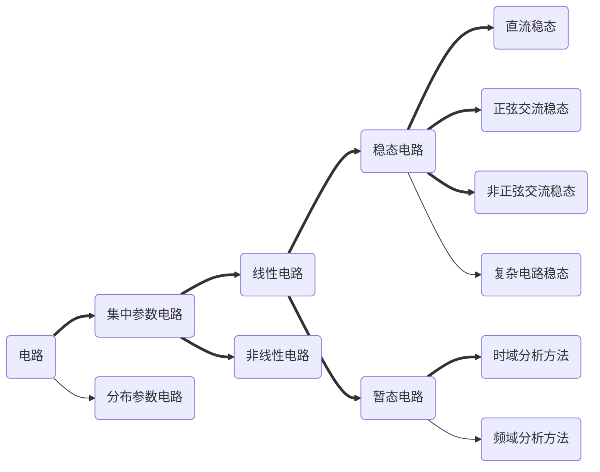

# 电路概述



## 电路模型

!!! note "电路"

    - **电路**是由若干**电气设备**或**元器件**按一定方式组合起来的整体。
    
    - 电路的作用是**传输、存储电能**或**变换、处理电信号**。
    
    - 电路原理的**研究对象**是由实际电路抽象而成的**理想化的电路模型**。
    
    - 这种抽象化的基本物理模型就称为**理想电路元件**。
    
    - 实际电路元件是理想电路元件的组合。
    
    - 在不同的运行条件下，一个实际电路可简化为不同的电路模型。

??? note "电路元件"

    ```mermaid
    graph LR
    Z(电路元件)==>A(负载)
    Z==>B(电源)
    A==>C(电阻元件)
    A==>D(电感元件)
    A==>E(电容元件)
    B==>F(独立电源元件)
    B==>G(受控源元件)
    ```

## 电路元件

### 电阻

电阻元件是体现电能转化为其它形式能量的二端元件，简称**电阻**`Resistor`。电阻的端电压与电流有确定的函数关系，用字母`R`表示，符号为$\Omega$。

凡是端电压与端电流成正比的电阻元件称为**线性电阻**，否则称为**非线性电阻**。

#### 电导

$$
G = \frac{1}{R}
$$

称为**电导**，用字母`G`表示，单位为西门子`S`。

电阻元件**消耗功率**和**消耗热量**的关系为

$$
P=UI\\
W=\int_0^t p \mathrm{d}t
$$

若电阻元件为线性电阻，则可以表示为

$$
P = I^2 R = \frac{U^2}{R}\\
W = Pt = I^2 Rt
$$

??? note "作用"

    - 用途：阻碍电流通过
    
    - 作用：分流、限流、分压、降压、滤波（与电容器组合使用）和阻抗匹配等。

### 电容

**电容元件**`Capacitor`是体现电场能量的二端元件，用字母`C`表示，单位为**法拉**`F`，常用的有$\mu F$、$pF$。

#### 线性电容

线性电容上储存的电荷$q$与端电压$u_C$之间的关系

$$
q=Cu_C
$$

当电流与线性电容电容电压方向相同时，电流与电容的关系为

$$
i_C=\frac{\mathrm{d}q}{\mathrm{d}t}=C\frac{\mathrm{d}u_C}{\mathrm{d}t}
$$

线性电容电容电压具有“记忆”功能

$$
u_C(t)=u_C(t_0)+\frac{1}{C}\int_{t_0}^t i_C(\xi)\mathrm{d}\xi
$$

!!! note "电容"

    - 电容对直流具有隔离作用（相当于开路）
    
    - 电容器是一种储能原件，具有“隔直通交阻低频”的特性

??? note "电容的作用"

    - 降压限流电容
    
    - 移相电容
    
    - 定时（延时）电容
    
    - 滤波电容
    
    - 旁路电容
    
    - 耦合电容

### 电感

**电感元件**`inductor`是体现磁场能量的二端元件，用字母$L$表示，其单位为亨利（$H$），常用的有$mH$、$\mu H$。

电感交链的磁通链$\varphi$与电流$i$的关系为

$$
\varphi = Li\\
\varphi = W\phi
$$

**线性非时变电感**的电压与电流关系为

$$
u_L=\frac{\mathrm{d}\varphi}{\mathrm{d}t}=L\frac{\mathrm{d}i_L}{\mathrm{d}t}
$$

!!! tip "注意"

    对于直流电来说，电感元件相当于一根短接导线。

??? note "电感的作用"

    电感的作用：**通直流，阻交流**
    
    - 移压限流
    
    - 移相
    
    - 定时（延时）
    
    - **扼流**
    
    - **滤波**
    
    - **震荡**

### 电源

**电源**是将其他形式的能转化为电能的设备。

!!! note "电源形式"

    交流电AC `Alternating Current`
    
    直流电DC `Direct Current`

??? note "相互转化"

    |    简称    |    全称    |
    | :--------: | :--------: |
    |  `AC-DC`   |   整流器   |
    |  `DC-AC`   |   逆变器   |
    |  `AC-AC`   | 矩阵变换器 |
    | `AC-DC-AC` |   变频器   |
    |  `DC-DC`   |  开关电源  |

电源也常称为**激励**、**信号**或**输入**。在激励作用下，电路某处出现的电压和电流，就称为**响应**或**输出**。

#### 独立源

独立源的量值不随电路中其它物理量的改变而改变。

当电源以**恒定电压**的方式输出时，称为**理想电压源**。

???+ note "理想电压源"

    一个实际电压源可以用一个理想电压源和内电阻$R_0$相串联的电路模型来表示。
    
    $$
    U=E-R_0 I
    $$
    
    实际电压源内阻越小，就越接近理想电压源。
    
    !!! warning "注意"
    
        非零电压源不能直接短路，两个不等值的电压源不能并联。

当电源以**恒定电流**的方式输出时，称为**理想电流源**。

???+ note "理想电流源"

    一个实际电流源可以用一个理想电流源和内阻$R_S$相并联的电路模型来表示。
    
    $$
    I = I_S - \frac{U}{R_S}
    $$
    
    实际电流源的内阻越大，越接近理想电流源。
    
    !!! warning "注意"
    
        非零电流源不能开路，两个不等值的电流源不能串联。

#### 受控源

受控源又有**受控电压源**和**受控电流源**之分。按其控制量的不同，共有4种表示形式。

???+ note "受控源"

    
    
    那么，如何分辨受控源的**控制量**和**源类型**呢？
    
    **控制量**：由控制系数后面的字母来判断。若为$U$，则控制量为**电压**；若为$I$，则控制量为**电流**。
    
    **源类型**：
    
    - 可以直接由图标判断（推荐），若图标为电流源即为电流源，图标为电压源则为电压源
    
    - 可以由公式量纲判断（不推荐），如$\mu U$为电压控制**电压源**，$gU$则为电压控制**电流源**

$$
受控源 \begin{cases}
U=\mu U_1 &\text{电压控制电压源(VCVS)}\\
U=\gamma I_1 &\text{电流控制电压源(CCVS)}\\
I=gU_1 &\text{电压控制电流源(VCCS)}\\
I=\alpha I_1 &\text{电流控制电流源(CCCS)}
\end{cases}
$$

???+ note "控制系数"

    r——转移电阻，具有电阻的量纲$\Omega$
    
    g——转移电导，具有电导的量纲S
    
    $\mu$、$\alpha$分别为电压放大倍数和电流放大倍数，无量纲
    
    控制系数为常数时的受控源称为线性受控源。

## 参考方向

!!! note "电流参考方向"

    电流方向是客观存在的，但在分析复杂电路时，往往事先难以判断某支路中电流的实际方向。为此，在分析和计算电路时，常可选定某一方向作为电流的正方向，称为**参考方向**。

!!! info "说明"

    - 电流的参考方向可以任意选取，但一旦选定之后，在分析过程中就不能再改变。
    
    - 电流实际方向与参考方向一致时，电流取正值，反之取负。

!!! note "电压参考方向"

    用由**正极**指向**负极**的方向为电压的参考方向。
    
    !!! warning "注意"
    
        电压的参考方向为电势的<font color=red>下降</font>方向，不是升高方向！

### 关联参考方向

当元件的电压和电流的参考方向**一致**时，即电流从电压正端流向负端时 (1) ，称为电压电流的关联参考方向。
{ .annotate }

1. 可以这样想：正电荷从高电势流向低电势，能量下降

$$
P=UI \begin{cases}
>0 &\text{元件实际消耗功率}\\
<0 &\text{元件实际输出功率}
\end{cases}
$$

若元件的电压电流为非关联参考方向，则正好相反。

## 基尔霍夫定律

!!! note "基本概念"

    | 概念         | 解释                             |
    | ------------ | -------------------------------- |
    | **支路**     | 单个或若干个二端元件串联成的电路 |
    | **节点**     | 两条以上支路的交汇点             |
    | **回路**     | 若干条支路组成的闭合路径         |
    | **网孔**     | 内部不包含支路的回路             |
    | **支路电流** | 每条支路上流过的电流             |
    | **支路电压** | 每条支路两端的电压               |

### 基尔霍夫电流定律

基尔霍夫电流定律`KCL`：电路中任一节点的**代数和**为零

$$
\sum i=0
$$

其中，**流出节点的电流**与**流入节点的电流**正负号相反。

!!! note "推论"

    在任一瞬时，流入某个节点的电流之和等于流出节点的电流之和。即
    
    $$
    \sum I_{出}=\sum I_{入}
    $$

??? warning "提示"

    - 中学学到的“干路电流是所有支路电流之和”，其实是基尔霍夫电流定律的特殊情况，相当于取的分叉节点。
    
    - 根据基尔霍夫电流定律可知，对于任意一个**电路元件**（如**电源**），其**输出电流**一定等于**输入电流**。这句话看起来显而易见，在实际电路分析中却可能被遗忘。

#### 广义KCL

基尔霍夫电流定律不仅适用于节点，也可以推广应用于电路中的某一部分。

<p style="text-align: center;"><b>流进任一闭合面的电流的代数和为零。</b></p>

<p style="text-align: right;">——广义的KCL</p>

### 基尔霍夫电压定律

基尔霍夫电压定律`KVL`：在任一瞬时，电路任一**闭合回路**中各支路电压的**代数和**为零。

$$
\sum u = 0
$$

支路电压方向与回路绕行方向一致时取正号，反之取负号。

!!! note "推论"

    KVL的另一个形式为
    
    $$
    \sum RI=\sum U_S
    $$
    
    任一支路电阻**压降代数和**等于电压源**压升代数和**。

???+ warning "提示"

    中学学到的“并联电路各支路电压相等”，其实是基尔霍夫电压定律的特殊情况。两个并联支路之间没有电阻，必定会有$U_1 + (-U_2) = 0$。

!!! info "注意"

    更本质地来说，其实KVL只是在阐述一个事实：**电压的本质是电势差，而每个节点的电势只有一个。**
    
    因此，只要在电路中满足了这个条件，列出的方程就会**自动满足**KVL。